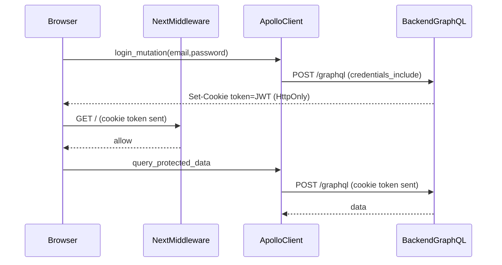

# Make auth enterprise-grade (basic for now)

## Goal

Deliver a **robust, production-style auth/session foundation** (email/password + JWT) that:

- Works end-to-end (frontend ↔ backend) with consistent session state.
- Uses **HttpOnly cookies** (secure-by-default; compatible with Next middleware).
- Keeps the code structured so we can later swap in **AWS Cognito/external IdP** with minimal churn.

You selected:

- **Token transport**: Backend sets **HttpOnly cookie**.
- **Refresh tokens**: **Later** (access token only for now).

## Key issues found

- **Auth mismatch**: Next middleware checks `token` cookie, but frontend stores JWT in localStorage → inconsistent auth UI vs API.
  - Frontend middleware: [`/home/amansharma/Desktop/DevOPS/MailZen-Smart-Email-Management/frontend/_middleware.ts`](/home/amansharma/Desktop/DevOPS/MailZen-Smart-Email-Management/frontend/_middleware.ts)
  - Frontend login stores localStorage token: [`/home/amansharma/Desktop/DevOPS/MailZen-Smart-Email-Management/frontend/components/auth/LoginForm.tsx`](/home/amansharma/Desktop/DevOPS/MailZen-Smart-Email-Management/frontend/components/auth/LoginForm.tsx)
- **JWT secret footgun**: `JwtModule` uses `'default-secret'`, but `AuthService` rejects it. This can break auth in surprising ways.
  - [`/home/amansharma/Desktop/DevOPS/MailZen-Smart-Email-Management/backend/src/auth/auth.module.ts`](/home/amansharma/Desktop/DevOPS/MailZen-Smart-Email-Management/backend/src/auth/auth.module.ts)
  - [`/home/amansharma/Desktop/DevOPS/MailZen-Smart-Email-Management/backend/src/auth/auth.service.ts`](/home/amansharma/Desktop/DevOPS/MailZen-Smart-Email-Management/backend/src/auth/auth.service.ts)

## Design (enterprise-grade now, Cognito-ready later)

### Session model

- **Access token** stored in **HttpOnly cookie** named `token` (to match existing middleware).
- **Backend auth guard** accepts token from:
  - cookie `token` (primary)
  - fallback `Authorization: Bearer ...` (useful for tooling / future mobile).

### Separation for future Cognito

- Introduce small “port” layer (interfaces) in backend:
  - `SessionCookieService` (set/clear cookie)
  - `TokenVerifier` (verify JWT now; swap to Cognito/JWKS later)

This keeps the rest of the app (resolvers/services) unchanged when migrating.

## Implementation steps

### 1) Backend: make GraphQL context expose `req/res`

- Update GraphQL module config to include `context: ({ req, res }) => ({ req, res })`.
- Files:
  - [`/home/amansharma/Desktop/DevOPS/MailZen-Smart-Email-Management/backend/src/app.module.ts`](/home/amansharma/Desktop/DevOPS/MailZen-Smart-Email-Management/backend/src/app.module.ts)

### 2) Backend: cookie parsing + cookie session helpers

- Add `cookie-parser` middleware (or equivalent robust parsing) so `req.cookies.token` is available.
- Add centralized helpers:
  - `setAuthCookie(res, token)`
  - `clearAuthCookie(res)`
  - secure flags: `httpOnly: true`, `sameSite: 'lax'`, `secure: true only in production`, `path: '/'`.
- Files:
  - [`/home/amansharma/Desktop/DevOPS/MailZen-Smart-Email-Management/backend/src/main.ts`](/home/amansharma/Desktop/DevOPS/MailZen-Smart-Email-Management/backend/src/main.ts)
  - new `backend/src/auth/session-cookie.service.ts`

### 3) Backend: set/clear cookie during login/register/logout

- In `login` + `register` mutations:
  - continue returning `AuthResponse` (no breaking API)
  - additionally **Set-Cookie** for `token`.
- Add a simple `logout` mutation that clears cookie (and optionally still supports refresh-token revocation later).
- Files:
  - [`/home/amansharma/Desktop/DevOPS/MailZen-Smart-Email-Management/backend/src/auth/auth.resolver.ts`](/home/amansharma/Desktop/DevOPS/MailZen-Smart-Email-Management/backend/src/auth/auth.resolver.ts)
  - [`/home/amansharma/Desktop/DevOPS/MailZen-Smart-Email-Management/backend/src/auth/auth.service.ts`](/home/amansharma/Desktop/DevOPS/MailZen-Smart-Email-Management/backend/src/auth/auth.service.ts)

### 4) Backend: make `JwtAuthGuard` accept cookie token

- Update guard to read:
  - cookie `token`
  - else header `Authorization`
- Add robust error messages + debug logs (dev-only).
- Files:
  - [`/home/amansharma/Desktop/DevOPS/MailZen-Smart-Email-Management/backend/src/common/guards/jwt-auth.guard.ts`](/home/amansharma/Desktop/DevOPS/MailZen-Smart-Email-Management/backend/src/common/guards/jwt-auth.guard.ts)

### 5) Backend: enterprise config hygiene (no default secret)

- Remove `default-secret` fallback.
- Add Config validation (e.g., `@nestjs/config` + schema validation) so startup fails fast if `JWT_SECRET` missing.
- Files:
  - [`/home/amansharma/Desktop/DevOPS/MailZen-Smart-Email-Management/backend/src/auth/auth.module.ts`](/home/amansharma/Desktop/DevOPS/MailZen-Smart-Email-Management/backend/src/auth/auth.module.ts)
  - (optional) new `backend/src/config/env.validation.ts`

### 6) Frontend: stop storing token in localStorage; rely on cookie session

- Update login/register/signup components to **not** write `localStorage.setItem('token', ...)`.
- Keep `credentials: 'include'` in Apollo.
- Update Apollo auth link to avoid reading localStorage token (cookie session is sent automatically).
- Files:
  - [`/home/amansharma/Desktop/DevOPS/MailZen-Smart-Email-Management/frontend/lib/apollo/client.ts`](/home/amansharma/Desktop/DevOPS/MailZen-Smart-Email-Management/frontend/lib/apollo/client.ts)
  - [`/home/amansharma/Desktop/DevOPS/MailZen-Smart-Email-Management/frontend/components/auth/LoginForm.tsx`](/home/amansharma/Desktop/DevOPS/MailZen-Smart-Email-Management/frontend/components/auth/LoginForm.tsx)
  - [`/home/amansharma/Desktop/DevOPS/MailZen-Smart-Email-Management/frontend/components/auth/RegisterForm.tsx`](/home/amansharma/Desktop/DevOPS/MailZen-Smart-Email-Management/frontend/components/auth/RegisterForm.tsx)
  - [`/home/amansharma/Desktop/DevOPS/MailZen-Smart-Email-Management/frontend/components/auth/SignupPhone.tsx`](/home/amansharma/Desktop/DevOPS/MailZen-Smart-Email-Management/frontend/components/auth/SignupPhone.tsx)

### 7) Frontend: add a real logout that clears cookie

- Add a small logout action that calls backend logout mutation (clears cookie), then redirects.

### 8) Fix the GraphQL mismatch in shared auth utils

- Correct `FORGOT_PASSWORD_MUTATION` signature to `forgotPassword(input: { email })`.
- File:
  - [`/home/amansharma/Desktop/DevOPS/MailZen-Smart-Email-Management/frontend/lib/auth/auth-utils.ts`](/home/amansharma/Desktop/DevOPS/MailZen-Smart-Email-Management/frontend/lib/auth/auth-utils.ts)

### 9) Docs + flowcharts (module-local)

- `frontend/lib/auth/README.md`: how cookie session works, middleware expectations, Apollo credentials.
- `backend/src/auth/README.md`: cookie session, guard behavior, env requirements, future Cognito swap points.

Mermaid flow (auth):

## Verification (dev)

- Login sets HttpOnly cookie `token`.
- Frontend middleware sees cookie and allows dashboard.
- GraphQL calls succeed without localStorage token.
- Logout clears cookie and middleware redirects to `/auth/login`.

## Later (Cognito)

When you’re ready, we replace `TokenVerifier` implementation to validate Cognito JWT (JWKS) and keep the cookie/session shape the same, so frontend + middleware don’t need a rewrite.