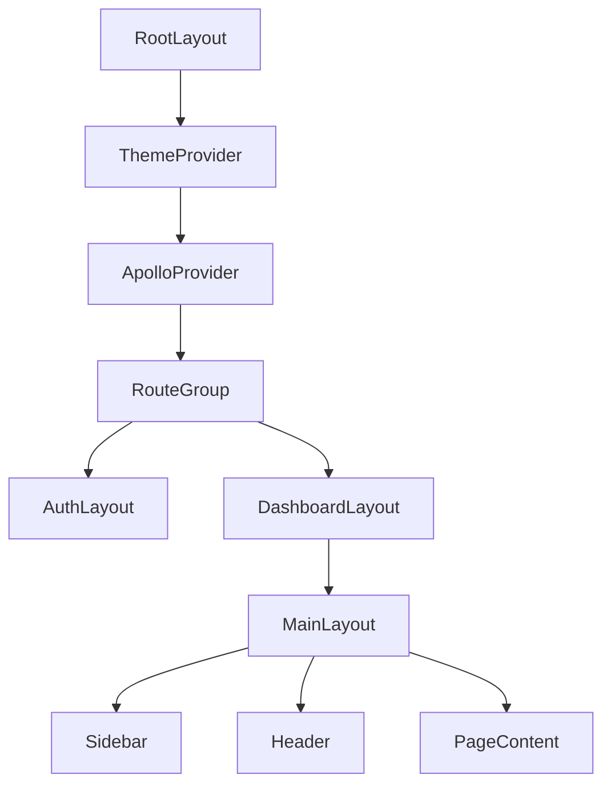

# Frontend premium polish (no redesign)

## Goals

- Make the frontend feel **consistently premium + modern** while **keeping the current visual direction**.
- Fix **UI correctness issues** (e.g., props used that UI primitives don’t support), improve **dark mode**, and smooth key interactions.
- Add **module-local docs + flowcharts** so future work stays consistent.

## What I found (high-signal)

- **Font token mismatch**: `frontend/app/layout.tsx` sets `--font-sans` using **Inter**, but `frontend/app/globals.css` defines `--font-sans` as **Geist** vars (not set). This can lead to inconsistent typography and hard-to-debug styling.
- **Duplicated global styles**: `frontend/app/globals.css` duplicates `.premium-card` definitions and repeats keyframes/utility blocks, which makes behavior unpredictable and harder to maintain.
- **UI primitive API mismatch**: pages use `<Input prefix={...} />` (e.g. `frontend/app/(dashboard)/contacts/page.tsx`, `frontend/app/(dashboard)/filters/page.tsx`), but `frontend/components/ui/input.tsx` doesn’t support `prefix` at all—so icons won’t render and invalid attributes get passed to the DOM.
- **Dark-mode leaks**: some pages hardcode light colors (example: success alert background in `frontend/app/(dashboard)/email-providers/page.tsx`, OAuth buttons in `frontend/components/auth/LoginForm.tsx`).
- **Interaction polish gaps**: Sidebar has a close icon button that is not wired (`frontend/components/layout/Sidebar.tsx`), and the header search input animates width in a way that can cause layout shift (`frontend/components/layout/Header.tsx`).

## Plan (implementation)

### 1) Foundation consistency (tokens, fonts, globals)

- **Unify typography**:
  - Decide single source of truth for `--font-sans` and align `frontend/app/layout.tsx` + `frontend/app/globals.css`.
  - Ensure the chosen font is applied consistently and documented.
- **De-duplicate and clean `globals.css`**:
  - Remove duplicate `.premium-card` + repeated keyframes/utilities.
  - Keep premium utility classes but make them single-definition and predictable.

### 2) Fix UI primitives so pages render as intended

- **Upgrade `Input` API**:
  - Implement supported `prefix`/`suffix` rendering (or introduce a dedicated `InputWithIcon` primitive) and update call sites.
  - Add comments explaining the prop contract and accessibility expectations.
- **Audit other custom props** (e.g., `Progress` already supports `indicatorColor`) to ensure they’re consistently used.

### 3) Page-level polish pass (keep look, fix rough edges)

- **Dark mode correctness**:
  - Replace hardcoded light-only classes with token-based or `dark:` equivalents for:
    - `frontend/app/(dashboard)/email-providers/page.tsx`
    - `frontend/components/auth/LoginForm.tsx`
    - Any other pages found during pass.
- **Layout/spacing consistency**:
  - Standardize page scaffolding so “container + padding + max-width” behaves consistently across dashboard pages (some rely on `MainLayout` padding, others use `container`).
  - Introduce a small reusable pattern (e.g., `PageHeader`) and apply across top-level pages.
- **Interaction polish**:
  - Wire sidebar close/open behavior correctly (mobile + accessibility) in `frontend/components/layout/Sidebar.tsx` and `frontend/components/layout/Header.tsx`.
  - Adjust header search animation to avoid width layout shift; keep subtle motion.

### 4) Accessibility + UX guardrails

- Ensure focus states, keyboard navigation, and aria labels are consistent on:
  - Sidebar nav items, icon-only buttons, dialogs.
- Add a lightweight “UX checklist” doc so future pages stay consistent.

### 5) Documentation + flowcharts (module-local)

- Add/refresh docs inside the relevant modules:
  - `frontend/components/layout/README.md` (layout structure, sidebar/header interactions)
  - `frontend/components/ui/README.md` (design tokens, component contracts like `Input` prefix/suffix)
  - `frontend/app/(dashboard)/README.md` (page scaffolding conventions)
- Include mermaid flowcharts that show key UI flows:

## Files I expect to touch (core)

- `frontend/app/layout.tsx`
- `frontend/app/globals.css`
- `frontend/components/ui/input.tsx`
- `frontend/components/layout/Sidebar.tsx`
- `frontend/components/layout/Header.tsx`
- `frontend/components/auth/LoginForm.tsx`
- `frontend/app/(dashboard)/email-providers/page.tsx`
- `frontend/app/(dashboard)/filters/page.tsx`
- `frontend/app/(dashboard)/contacts/page.tsx`
- Plus module-local docs mentioned above.

## Deliverables

- Visually consistent “premium” feel across pages (spacing, typography, shadows, motion).
- Correct rendering of input icons and dark-mode-safe surfaces.
- Better interaction behavior for sidebar/header.
- Updated docs + flowcharts colocated with their modules.