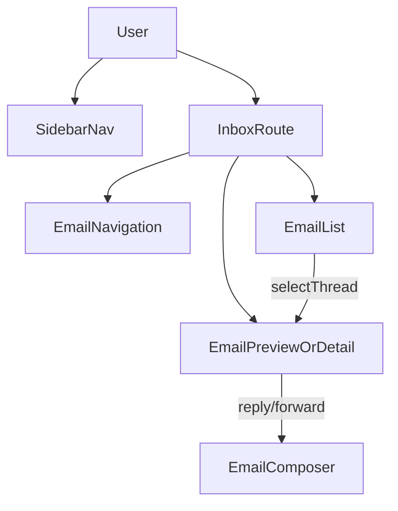

# Premium Apple-Glass UI Upgrade Plan

## Goals (what you’ll get)

- **Cohesive premium “Apple-glass” look** across shell + inbox + composer: unified surfaces, borders, shadows, blur, and motion.
- **Smoother micro-interactions** (hover/press/selection states, list transitions, panel toggles) without feeling “gamey”.
- **Consistency + maintainability**: shared motion presets + shared “surface” components (instead of one-off Tailwind strings everywhere).
- **Debuggability**: dev-only `console.debug(...)` at key UX state transitions (panel toggles, selection, composer lifecycle).
- **Module docs + flowcharts** updated in their respective folders.

## What I’ll change (targeted scope)

### Dashboard shell polish

- Refine `MainLayout` route transitions using `AnimatePresence` keyed by `pathname` (so page changes feel premium, not just initial mount).
  - Files: [`apps/frontend/components/layout/MainLayout.tsx`](apps/frontend/components/layout/MainLayout.tsx), [`apps/frontend/components/layout/Sidebar.tsx`](apps/frontend/components/layout/Sidebar.tsx), [`apps/frontend/components/layout/Header.tsx`](apps/frontend/components/layout/Header.tsx)
- Add a reusable **glass surface wrapper** (e.g. `GlassPanel` / `Surface`) to standardize:
  - blur + border opacity + shadow + gradient overlay
  - interactive hover states
  - Files: new under [`apps/frontend/components/ui/`](apps/frontend/components/ui/)

### Inbox “best mail client” experience

- Convert inbox left navigation + list + preview/detail to a consistent **3-panel glass layout**:
  - Left: `EmailNavigation` becomes a glass panel (consistent with main sidebar style)
  - Middle: `EmailList` becomes a “premium list” with better density controls, selection polish, and subtle motion
  - Right: `EmailPreviewPane` / `EmailDetail` become a consistent reading surface (typography, message cards, attachments)
  - Files: [`apps/frontend/app/(dashboard)/inbox/page.tsx`](apps/frontend/app/\(dashboard)/inbox/page.tsx),

[`apps/frontend/components/email/EmailNavigation.tsx`](apps/frontend/components/email/EmailNavigation.tsx),

[`apps/frontend/components/email/EmailList.tsx`](apps/frontend/components/email/EmailList.tsx),

[`apps/frontend/components/email/EmailThreadItem.tsx`](apps/frontend/components/email/EmailThreadItem.tsx),

[`apps/frontend/components/email/EmailPreviewPane.tsx`](apps/frontend/components/email/EmailPreviewPane.tsx),

[`apps/frontend/components/email/EmailDetail.tsx`](apps/frontend/components/email/EmailDetail.tsx)

- Add consistent **motion presets** (spring params, fade/slide variants) so inbox animations match the shell.
  - File: new helper (e.g. `apps/frontend/lib/motion.ts`)

### Composer upgrade (modal feels “native premium”)

- Rebuild the composer to use the existing shadcn/Radix `Dialog` primitives for accessibility (focus trap, ESC, overlay) with premium motion.
  - Replace the current fixed overlay div with `Dialog` + `DialogContent`.
  - Files: [`apps/frontend/components/email/EmailComposer.tsx`](apps/frontend/components/email/EmailComposer.tsx), relevant `components/ui/dialog` usage.
- UX polish:
  - clearer header hierarchy, better field spacing, attachment area as “cards”, schedule UI feels integrated
  - dev-only logs for open/close, send start/end, schedule set/cleared

### Global styling (tokens + utilities)

- Keep Tailwind v4 token approach already present in `globals.css`, and formalize a few missing utilities for consistency:
  - `surface-*` utilities (glass, elevated, subtle)
  - `focus-ring` standard
  - scrollbars (subtle, optional)
  - Files: [`apps/frontend/app/globals.css`](apps/frontend/app/globals.css), [`apps/frontend/tailwind.config.js`](apps/frontend/tailwind.config.js)

## Documentation deliverables (per your rules)

- Update module docs:
  - [`apps/frontend/components/layout/README.md`](apps/frontend/components/layout/README.md)
  - Add/refresh `apps/frontend/components/email/README.md` (inbox + composer architecture)
  - Ensure docs match code after refactor.

### Flowcharts

I’ll include/refresh mermaid flowcharts showing the UI composition and interactions.

## Guardrails

- Keep dark mode working (using `next-themes` + your CSS variables).
- Keep a11y intact (keyboard navigation, focus outlines, Dialog semantics).
- Keep performance sane (avoid heavy animations; prefer transforms/opacity).

## Acceptance checks (manual)

- Sidebar open/close feels smooth on mobile and desktop.
- Inbox: selecting thread, switching preview/full, batch select mode all feel visually consistent.
- Composer: open/close, attachments, schedule send all look premium and behave predictably.