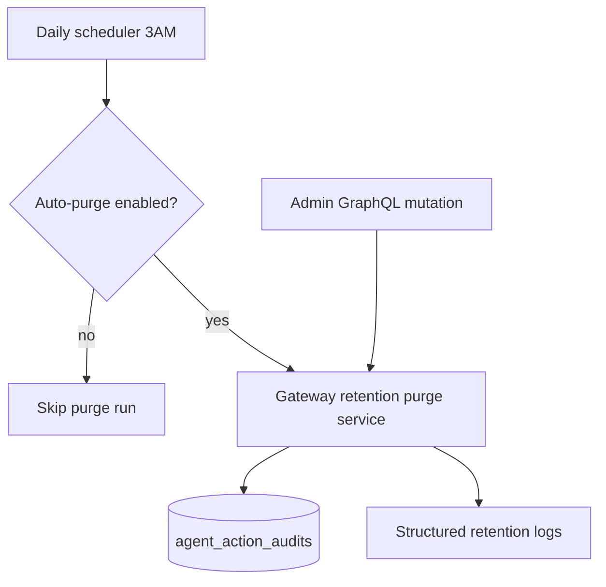
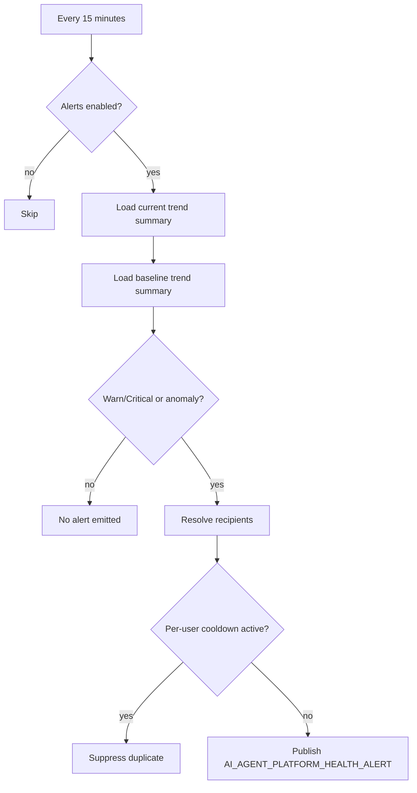

# AI Agent Gateway Module

Backend gateway that exposes `agentAssist` GraphQL mutation and connects to the Python AI Agent Platform service.

## Responsibilities

- Validate and sanitize inbound assistant requests.
- Enforce skill and action policy boundaries.
- Propagate request IDs and service auth headers to Python runtime.
- Execute approved privileged actions safely in backend:
  - `auth.forgot_password`
  - `inbox.summarize_thread` (authenticated, ownership-scoped thread summary)
  - `inbox.extract_action_items` (authenticated heuristic action-item extraction)
  - `inbox.open_thread` (authenticated thread open/context snapshot)
  - `inbox.classify_thread` (authenticated heuristic thread classification)
  - `inbox.prioritize_thread` (authenticated urgency scoring and priority level)
  - `inbox.compose_reply_draft` (authenticated, ownership-scoped draft generation)
  - `inbox.schedule_followup` (authenticated follow-up reminder notification via `NotificationEventBusService`)
- Enforce human-in-the-loop approval token flow for risky agent actions:
  - `inbox.compose_reply_draft`
  - `inbox.schedule_followup`
- Enforce monthly AI credit entitlements for authenticated assist requests
  through billing usage consumption.
- Persist executed agent-action audits (`agent_action_audits`) for compliance and debugging.
- Build runtime memory context for authenticated inbox skills:
  - thread summary snippets from recent synced messages
  - user style profile heuristics (`avgWords/questionRatio`)
  - workspace role policy hints (`standard-review` / `elevated-review`)
- Provide `agentPlatformHealth` GraphQL probe with gateway metrics snapshot.
  - includes `configuredServiceUrls`, `probedServiceUrls`, and per-endpoint
    runtime counters via `endpointStats` for failover diagnostics.
  - includes per-skill runtime counters via `skillStats` for traffic/error analysis.
  - runtime counters are persisted in Postgres and hydrated on service startup
    to preserve observability continuity across backend restarts.
- Expose `myAgentActionAudits(limit?)` query for authenticated audit review.
- Expose admin observability history query:
  - `agentPlatformHealthHistory(limit?, windowHours?)`
  - returns persisted health snapshots for trend analysis.
  - `agentPlatformHealthSampleDataExport(limit?, windowHours?)`
  - returns JSON export payload for external observability ingestion.
  - `agentPlatformHealthTrendSummary(windowHours?)`
  - returns aggregate health state/error/latency rollups over a time window.
  - `agentPlatformHealthTrendSeries(windowHours?, bucketMinutes?)`
  - returns bucketed trend points for charts and dashboard visualization.
  - `agentPlatformHealthIncidentStats(windowHours?)`
  - returns warn/critical incident totals for the rolling window.
  - `agentPlatformHealthIncidentSeries(windowHours?, bucketMinutes?)`
  - returns warn/critical incident trend buckets for alert analytics.
  - `agentPlatformHealthIncidentDataExport(windowHours?, bucketMinutes?)`
  - returns JSON incident analytics payload for external pipelines.
  - `agentPlatformHealthAlertDeliveryStats(windowHours?)`
  - returns delivered AI health alert notification counts by severity.
  - `agentPlatformHealthAlertDeliverySeries(windowHours?, bucketMinutes?)`
  - returns bucketed delivered AI health alert trend points by severity/recipient spread.
  - `agentPlatformHealthAlertDeliveryDataExport(windowHours?, bucketMinutes?)`
  - returns JSON export payload for alert-delivery analytics pipelines.
  - `runAgentPlatformHealthAlertCheck(windowHours?, baselineWindowHours?, cooldownMinutes?, minSampleCount?)`
  - runs anomaly detection on-demand and returns publish diagnostics.
- Expose `myAgentActionDataExport(limit?)` for authenticated JSON export of
  agent action audit history.
- Expose admin retention control:
  - `purgeAgentActionRetentionData(retentionDays?, userId?)`
  - `purgeAgentPlatformHealthSampleRetentionData(retentionDays?)`
  - `resetAgentPlatformRuntimeStats(endpointUrl?)`
  - `resetAgentPlatformSkillRuntimeStats(skill?)`
- Run daily retention scheduler for stale audit rows.
- Run 15-minute AI platform health anomaly scheduler that:
  - compares current trend summary with historical baseline window.
  - detects warn/critical states and anomaly deviations.
  - emits `AI_AGENT_PLATFORM_HEALTH_ALERT` notifications to admin users / configured recipients.
- Include current-period AI credit balance (`aiCreditsMonthlyLimit`,
  `aiCreditsUsed`, `aiCreditsRemaining`) in authenticated `agentAssist` responses.
- Include platform execution diagnostics in `agentAssist` responses:
  - `platformEndpointUsed`
  - `platformAttemptCount`

## Env Variables

- `AI_AGENT_PLATFORM_URL` (default `http://localhost:8100`)
- `AI_AGENT_PLATFORM_URLS` (optional comma-separated failover endpoints; if set, gateway probes/calls in order)
- `AI_AGENT_PLATFORM_LOAD_BALANCE_ENABLED` (default `false`; when true, assist calls use request-id-based endpoint rotation before failover)
- `AI_AGENT_PLATFORM_KEY` (optional shared secret)
- `AI_AGENT_PLATFORM_TIMEOUT_MS` (default `4000`)
- `AI_AGENT_PLATFORM_RETRIES` (default `1`)
- `AI_AGENT_PLATFORM_CHECK_ON_STARTUP` (default `true`)
- `AI_AGENT_PLATFORM_REQUIRED` (default `false`)
- `AI_AGENT_GATEWAY_RATE_LIMIT` (default `40` requests/minute/IP)
- `AI_AGENT_GATEWAY_USE_REDIS` (default `true`)
- `AI_AGENT_GATEWAY_REDIS_URL` (fallback to `REDIS_URL`)
- `AI_AGENT_ACTION_APPROVAL_TTL_SECONDS` (default `600`)
- `AI_AGENT_THREAD_CONTEXT_CACHE_TTL_MS` (default `300000`, clamp `10000..3600000`)
- `AI_AGENT_CREDIT_COST` (default `1`)
- `AI_AGENT_CREDIT_COST_<SKILL>` optional per-skill override, e.g.
  `AI_AGENT_CREDIT_COST_INBOX=2`
- `AI_AGENT_ALERT_LATENCY_MS` (default `1500`)
- `AI_AGENT_ALERT_ERROR_RATE_PERCENT` (default `5`)
- `AI_AGENT_HEALTH_SAMPLE_PERSIST_ENABLED` (default `true`)
- `AI_AGENT_HEALTH_SAMPLE_AUTOPURGE_ENABLED` (default `true`)
- `AI_AGENT_HEALTH_SAMPLE_RETENTION_DAYS` (default `30`, clamp `1..3650`)
- `AI_AGENT_ACTION_AUDIT_AUTOPURGE_ENABLED` (default `true`)
- `AI_AGENT_ACTION_AUDIT_RETENTION_DAYS` (default `365`, clamp `7..3650`)
- `AI_AGENT_HEALTH_ALERTS_ENABLED` (default `true`)
- `AI_AGENT_HEALTH_ALERT_WINDOW_HOURS` (default `6`, clamp `1..336`)
- `AI_AGENT_HEALTH_ALERT_BASELINE_WINDOW_HOURS` (default `72`, clamp `window..2160`)
- `AI_AGENT_HEALTH_ALERT_COOLDOWN_MINUTES` (default `60`, clamp `1..10080`)
- `AI_AGENT_HEALTH_ALERT_MIN_SAMPLE_COUNT` (default `4`, clamp `1..1000`)
- `AI_AGENT_HEALTH_ALERT_ANOMALY_MULTIPLIER` (default `2.0`, clamp `1.1..10`)
- `AI_AGENT_HEALTH_ALERT_ANOMALY_MIN_ERROR_RATE_DELTA_PERCENT` (default `1`, clamp `0..100`)
- `AI_AGENT_HEALTH_ALERT_ANOMALY_MIN_LATENCY_DELTA_MS` (default `150`, clamp `0..60000`)
- `AI_AGENT_HEALTH_ALERT_SCAN_ADMIN_USERS` (default `true`)
- `AI_AGENT_HEALTH_ALERT_RECIPIENT_USER_IDS` (optional CSV user IDs)

## Retention flow

## Health alerting flow

## Changelog

- 2026-02-14: Added initial GraphQL gateway, policy enforcement, retries, and request-ID propagation.
- 2026-02-15: Added skill access policy map, Redis-backed rate limiting, and health metrics query.
- 2026-02-15: Added executable inbox actions:
  - `inbox.summarize_thread`
  - `inbox.compose_reply_draft`
  - `inbox.schedule_followup`
    with thread-aware summary/draft generation from synced messages.
- 2026-02-15: Enriched follow-up action notifications with workspace/provider
  context metadata (`workspaceId`, `providerId`) for workspace-aware UX.
- 2026-02-15: Added approval-token controls for non-trivial inbox actions.
- 2026-02-15: Added agent action audit persistence with request correlation IDs.
- 2026-02-16: Added billing-backed AI credit consumption enforcement.
- 2026-02-16: Added user-scoped agent action audit data export query.
- 2026-02-16: Added agent action audit retention purge API + scheduler.
- 2026-02-16: Added runtime memory-context retrieval for inbox agent payloads.
- 2026-02-16: Added executable inbox classify/prioritize actions.
- 2026-02-16: Added executable inbox open-thread action for contextual preview.
- 2026-02-16: Added multi-endpoint AI platform failover support (`AI_AGENT_PLATFORM_URLS`) for assist and health probes.
- 2026-02-16: Added executable inbox action-item extraction action.
- 2026-02-16: Added optional request-id-based endpoint rotation for platform calls (`AI_AGENT_PLATFORM_LOAD_BALANCE_ENABLED`).
- 2026-02-16: Added admin runtime reset mutation for endpoint health counters.
- 2026-02-16: Added persistent endpoint/skill runtime metrics hydration from Postgres.
- 2026-02-16: Added admin runtime reset mutation for per-skill health counters.
- 2026-02-16: Added persisted health snapshot history query for AI platform trends.
- 2026-02-16: Added health-sample retention purge mutation + daily auto-purge scheduler.
- 2026-02-16: Added health-sample JSON data export query for observability pipelines.
- 2026-02-16: Added health trend summary query for executive monitoring rollups.
- 2026-02-16: Added bucketed health trend series query for observability dashboards.
- 2026-02-16: Added warn/critical incident stats + trend series queries for AI platform health.
- 2026-02-16: Added warn/critical incident analytics data export query.
- 2026-02-16: Added trend-baseline anomaly alert scheduler with admin notification emission.
- 2026-02-16: Added admin mutation to trigger AI health anomaly alert checks on demand.
- 2026-02-16: Added delivered AI health alert stats/series queries for alert-ops observability.
- 2026-02-16: Added delivered AI health alert data export query.
