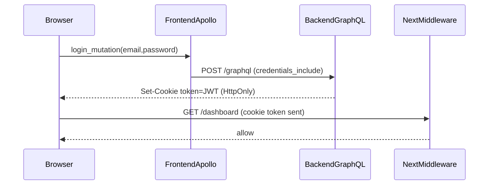
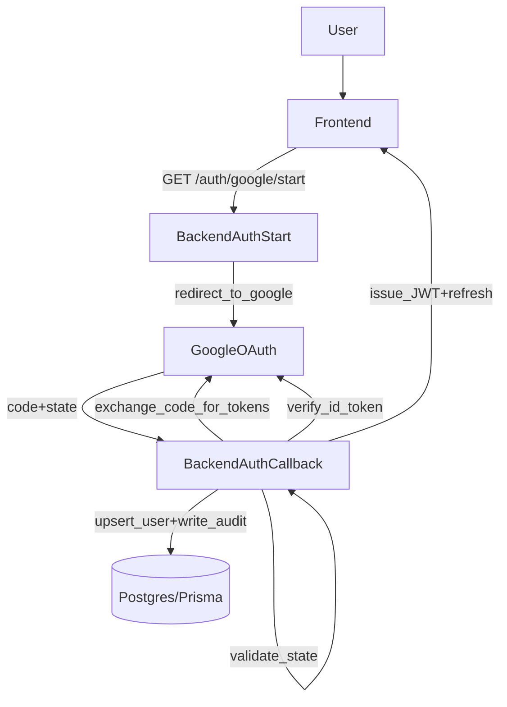

# Backend Auth (JWT + HttpOnly Cookie Session)

MailZen backend auth is implemented as **JWT access tokens** issued by GraphQL mutations and stored in a **HttpOnly cookie** for browser sessions.

## Goals (enterprise-grade baseline)
- Keep auth **secure-by-default** for web clients (HttpOnly cookie).
- Keep the app core **IdP-agnostic** (easy Cognito/JWKS swap later).
- Provide predictable observability: clear errors + safe debug logs in non-prod.

## Key components
- **JWT issuing / verification**: `apps/backend/src/auth/auth.service.ts`
- **Cookie management**: `apps/backend/src/auth/session-cookie.service.ts`
- **GraphQL mutations** set/clear cookie:
  - `login`
  - `register`
  - `signupVerify`
  - `logout` (clears cookie; refresh-token revocation is optional/backward compatible)
  - `apps/backend/src/auth/auth.resolver.ts`
- **Guard** reads token primarily from cookie, fallback from `Authorization: Bearer ...`:
  - `apps/backend/src/common/guards/jwt-auth.guard.ts`

## Environment requirements (fail-fast)
- `JWT_SECRET` must be configured and strong (>= 32 chars recommended).
  - Enforced during bootstrap in `apps/backend/src/main.ts`.

## GraphQL context
GraphQL is configured to expose `req/res`:
- `apps/backend/src/app.module.ts` includes `context: ({ req, res }) => ({ req, res })`

This enables setting cookies inside resolvers.

## Flow (login)

## Notes / limitations
- There is refresh-token storage + rotation implemented (`UserSession` in Prisma), but the current frontend flow is **access-token-only** for simplicity.
- Google OAuth controller currently returns tokens in query params as MVP; hardening would switch that flow to HttpOnly cookies too.

# Auth Module (Backend)

## Google OAuth Login (code flow)

MailZen supports **Google OAuth login** via redirect-based endpoints:

- `GET /auth/google/start`
- `GET /auth/google/callback`

### Environment variables

Required:
- `GOOGLE_CLIENT_ID`
- `GOOGLE_CLIENT_SECRET`
- `GOOGLE_REDIRECT_URI` (must match the Google OAuth app)
- `JWT_SECRET` (used to sign our app JWT)

Recommended:
- `OAUTH_STATE_SECRET` (HMAC secret to sign OAuth `state`)
- `GOOGLE_OAUTH_SCOPES` (defaults to `openid email profile`)

### Flow

### Notes / security

- OAuth `state` is **signed and time-limited** (see `oauth-state.util.ts`) to prevent CSRF and code injection.\n+- Tokens are currently returned to frontend via **redirect query params** for MVP compatibility with the existing localStorage auth pattern.\n+  - For production hardening, prefer **HttpOnly cookies** to avoid token leakage via browser history/logs.\n+
