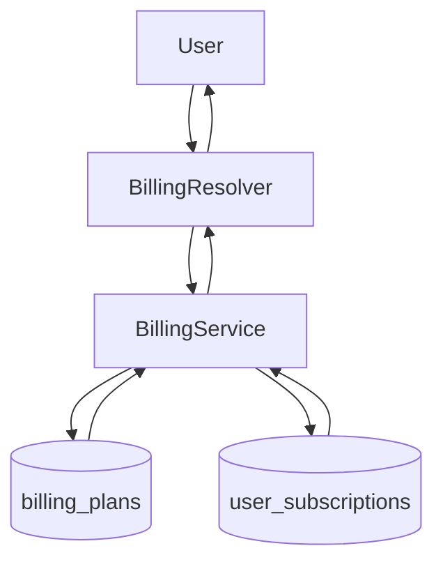

# Billing Module (Backend)

## Goal

Provide a persistent SaaS foundation for plan catalog and user subscription
state, enabling entitlement-aware product rollouts.

## Responsibilities

- Maintain active billing plan catalog (`billing_plans`)
- Maintain user subscription state (`user_subscriptions`)
- Seed default plans when catalog is empty
- Expose GraphQL operations for:
  - listing plans
  - reading current subscription
  - selecting active plan
  - recording upgrade intent (`requestMyPlanUpgrade`)

## GraphQL API

- `billingPlans`: list active plans
- `mySubscription`: get current user subscription (auto-provisions FREE plan)
- `selectMyPlan(planCode)`: switch current user subscription to active plan
- `requestMyPlanUpgrade(targetPlanCode, note?)`: records upgrade intent notification

## Flow

## Notes

- This module is intentionally payment-provider agnostic in its first iteration.
- Stripe/webhook/invoice synchronization can be layered on top of this data model.
- Current integrations:
  - `EmailProviderService` enforces `providerLimit`
  - `MailboxService` enforces `mailboxLimit`
  - `NotificationService` stores `BILLING_UPGRADE_INTENT` intents

