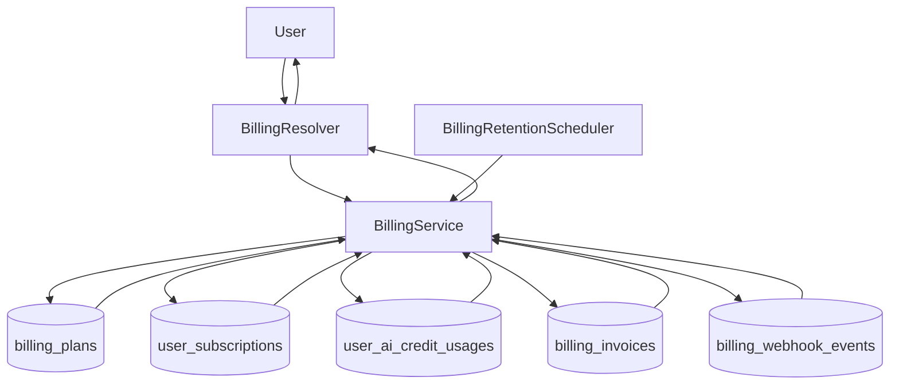

# Billing Module (Backend)

## Goal

Provide a persistent SaaS foundation for plan catalog and user subscription
state, enabling entitlement-aware product rollouts.

## Responsibilities

- Maintain active billing plan catalog (`billing_plans`)
- Maintain user subscription state (`user_subscriptions`)
- Track monthly AI credit usage (`user_ai_credit_usages`)
- Persist billing invoices (`billing_invoices`)
- Persist webhook replay/audit events (`billing_webhook_events`)
- Seed default plans when catalog is empty
- Expose GraphQL operations for:
  - listing plans
  - reading current subscription
  - reading current AI credit balance
  - listing invoices
  - exporting billing data (`myBillingDataExport`)
  - starting plan trial
  - selecting active plan
  - recording upgrade intent (`requestMyPlanUpgrade`)
  - ingesting provider webhook events (`ingestBillingWebhook`, admin-only)
  - purging retention-scoped records (`purgeBillingRetentionData`, admin-only)
- Expose REST webhook endpoint:
  - `POST /billing/webhooks/:provider` with optional shared-secret validation

## GraphQL API

- `billingPlans`: list active plans
- `mySubscription`: get current user subscription (auto-provisions FREE plan)
- `myAiCreditBalance`: get current month AI credit usage + remaining credits
- `myEntitlementUsage(workspaceId?)`: get entitlement usage/remaining snapshot
  across providers, mailboxes, workspaces, workspace seats, storage, and AI credits
- `myBillingInvoices(limit?)`: list authenticated user invoices (newest first)
- `myBillingDataExport`: returns legal/compliance-ready billing JSON export snapshot
- `selectMyPlan(planCode)`: switch current user subscription to active plan
- `startMyPlanTrial(planCode, trialDays?)`: start bounded trial for paid plans
- `requestMyPlanUpgrade(targetPlanCode, note?)`: records upgrade intent notification
- `ingestBillingWebhook(provider, eventType, externalEventId, payloadJson?)`: admin-only webhook replay/ingest mutation
- `purgeBillingRetentionData(webhookRetentionDays?, aiUsageRetentionMonths?)`:
  admin-only retention purge utility
- `POST /billing/webhooks/:provider`: webhook ingestion endpoint supporting
  payload key aliases:
  - event type: `type` or `eventType`
  - event id: `id`, `eventId`, or `externalEventId`
  - optional header `x-billing-webhook-secret` (validated when `BILLING_WEBHOOK_SHARED_SECRET` is configured)

## Flow

## Notes

- This module is intentionally payment-provider agnostic in its first iteration.
- Stripe/webhook/invoice synchronization is now scaffolded with provider-agnostic
  invoice and webhook event storage.
- Trial workflow supports 1-30 day trials for paid plans and publishes
  `BILLING_TRIAL_STARTED` notification events.
- `BillingService` structured observability events:
  - `billing_plan_catalog_seed_start`
  - `billing_default_subscription_create_start`
  - `billing_plan_switch_start`
  - `billing_ai_credits_exhausted`
  - `billing_retention_purge_completed`
  - `billing_trial_started`
  - `billing_webhook_event_ignored`
  - `billing_webhook_processing_failed`
  - `billing_upgrade_intent_recorded`
  - `billing_audit_log_write_failed`
- Compliance/audit actions persisted in `audit_logs`:
  - `billing_plan_selected`
  - `billing_trial_started`
  - `billing_upgrade_intent_requested`
  - `billing_webhook_subscription_updated`
  - `billing_data_export_requested`
  - `billing_retention_purged`
- `BillingWebhookController` structured observability events:
  - `billing_webhook_secret_missing`
  - `billing_webhook_secret_mismatch`
  - `billing_webhook_ingested`
- Retention controls:
  - Daily auto-purge via `BillingRetentionScheduler`
  - Configurable windows:
    - `BILLING_WEBHOOK_RETENTION_DAYS` (default `120`)
    - `BILLING_AI_USAGE_RETENTION_MONTHS` (default `36`)
    - `BILLING_RETENTION_AUTOPURGE_ENABLED` (default `true`)
  - Structured retention scheduler events:
    - `billing_retention_autopurge_disabled`
    - `billing_retention_autopurge_start`
    - `billing_retention_autopurge_completed`
    - `billing_retention_autopurge_failed`
- Current integrations:
  - `EmailProviderService` enforces `providerLimit`
  - `MailboxService` enforces `mailboxLimit`
  - `MailboxService` applies plan-based `mailboxStorageLimitMb` to new aliases
  - `MailboxInboundService` enforces effective mailbox storage ceiling using
    `min(mailbox.quotaLimitMb, entitlement.mailboxStorageLimitMb)`
  - `WorkspaceService` enforces:
    - `workspaceLimit` (owned workspace count)
    - `workspaceMemberLimit` (active members per workspace)
  - `AiAgentGatewayService` consumes monthly AI credits via billing service
  - `NotificationEventBusService` stores `BILLING_UPGRADE_INTENT` intents
- Webhook secret verification now uses timing-safe comparison semantics when
  `BILLING_WEBHOOK_SHARED_SECRET` is configured.
