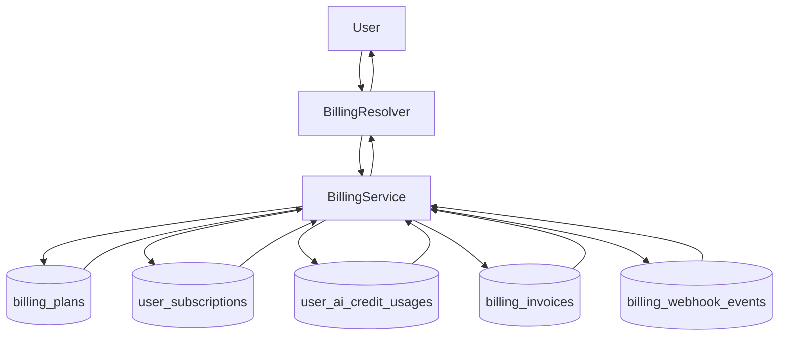

# Billing Module (Backend)

## Goal

Provide a persistent SaaS foundation for plan catalog and user subscription
state, enabling entitlement-aware product rollouts.

## Responsibilities

- Maintain active billing plan catalog (`billing_plans`)
- Maintain user subscription state (`user_subscriptions`)
- Track monthly AI credit usage (`user_ai_credit_usages`)
- Persist billing invoices (`billing_invoices`)
- Persist webhook replay/audit events (`billing_webhook_events`)
- Seed default plans when catalog is empty
- Expose GraphQL operations for:
  - listing plans
  - reading current subscription
  - reading current AI credit balance
  - listing invoices
  - starting plan trial
  - selecting active plan
  - recording upgrade intent (`requestMyPlanUpgrade`)
  - ingesting provider webhook events (`ingestBillingWebhook`, admin-only)

## GraphQL API

- `billingPlans`: list active plans
- `mySubscription`: get current user subscription (auto-provisions FREE plan)
- `myAiCreditBalance`: get current month AI credit usage + remaining credits
- `myBillingInvoices(limit?)`: list authenticated user invoices (newest first)
- `selectMyPlan(planCode)`: switch current user subscription to active plan
- `startMyPlanTrial(planCode, trialDays?)`: start bounded trial for paid plans
- `requestMyPlanUpgrade(targetPlanCode, note?)`: records upgrade intent notification
- `ingestBillingWebhook(provider, eventType, externalEventId, payloadJson?)`: admin-only webhook replay/ingest mutation

## Flow

## Notes

- This module is intentionally payment-provider agnostic in its first iteration.
- Stripe/webhook/invoice synchronization is now scaffolded with provider-agnostic
  invoice and webhook event storage.
- Trial workflow supports 1-30 day trials for paid plans and publishes
  `BILLING_TRIAL_STARTED` notification events.
- Current integrations:
  - `EmailProviderService` enforces `providerLimit`
  - `MailboxService` enforces `mailboxLimit`
  - `WorkspaceService` enforces `workspaceLimit`
  - `AiAgentGatewayService` consumes monthly AI credits via billing service
  - `NotificationEventBusService` stores `BILLING_UPGRADE_INTENT` intents

