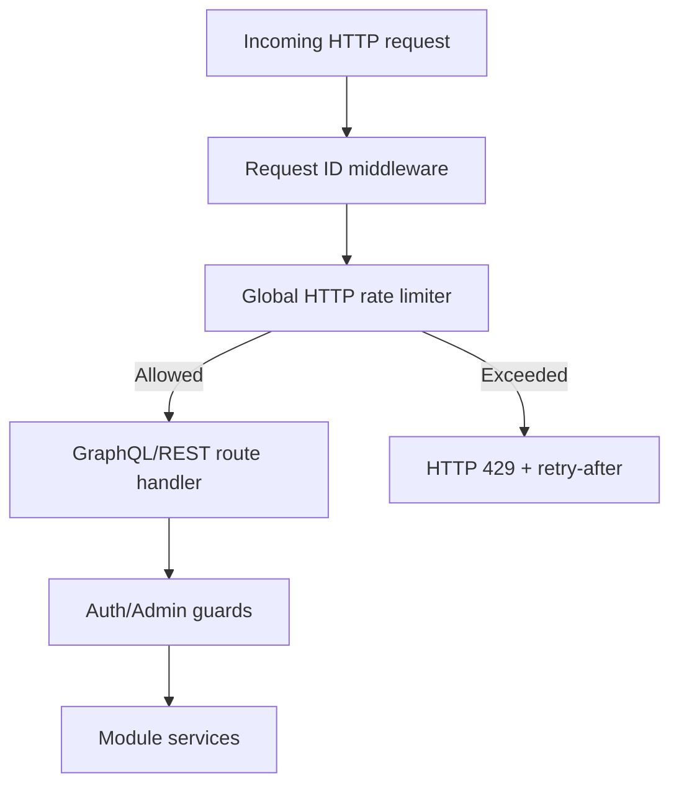

# Common Module Utilities (Backend)

## Goal

Provide shared cross-cutting backend utilities used by multiple modules
(security guards, secret handling, and request-level protection primitives).

## Current shared components

- `guards/jwt-auth.guard.ts` — GraphQL/HTTP authentication enforcement.
- `guards/admin.guard.ts` — role-based admin access guardrails.
- `provider-secrets.util.ts` — AES-256-GCM encryption/decryption utilities for
  provider/mailbox secrets at rest.
- `rate-limit/request-rate-limiter.ts` — in-memory windowed request counter with
  bounded key-compaction.
- `rate-limit/http-rate-limit.middleware.ts` — global HTTP rate-limit middleware
  that returns HTTP `429` with `retry-after` semantics.

## Global HTTP rate limiting

Configured in `main.ts` and applied to all HTTP routes (including GraphQL):

- `GLOBAL_RATE_LIMIT_ENABLED` (default `true`)
- `GLOBAL_RATE_LIMIT_WINDOW_MS` (default `60000`)
- `GLOBAL_RATE_LIMIT_MAX_REQUESTS` (default `300`)
- `GLOBAL_RATE_LIMIT_EXCLUDED_PATHS` (default OAuth callback routes)

Behavior:
- keying priority: authenticated user id → forwarded IP → socket IP
- per-path counters to prevent one endpoint from starving all traffic
- emits structured warning log event `http_rate_limited`
- includes `x-rate-limit-limit`, `x-rate-limit-remaining`, and `retry-after` headers

## Request protection flow

