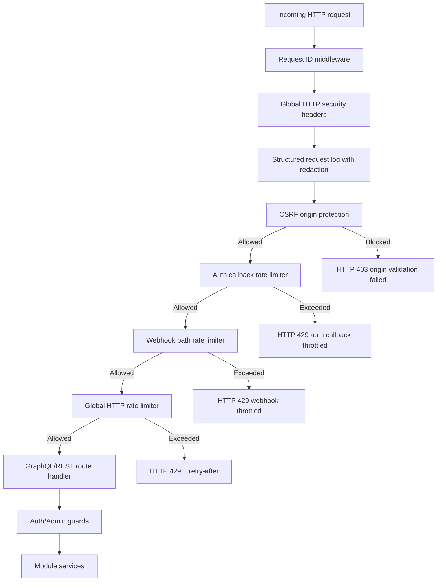

# Common Module Utilities (Backend)

## Goal

Provide shared cross-cutting backend utilities used by multiple modules
(security guards, secret handling, and request-level protection primitives).

## Current shared components

- `guards/jwt-auth.guard.ts` — GraphQL/HTTP authentication enforcement.
- `guards/admin.guard.ts` — role-based admin access guardrails.
- `provider-secrets.util.ts` — AES-256-GCM encryption/decryption utilities for
  provider/mailbox secrets at rest, including keyring-based rotation support.
- `logging/structured-log.util.ts` — structured JSON logging helpers with
  recursive PII redaction, request correlation ID normalization, and
  privacy-preserving identifier fingerprints.
- `rate-limit/request-rate-limiter.ts` — in-memory windowed request counter with
  bounded key-compaction.
- `rate-limit/http-auth-callback-rate-limit.middleware.ts` — scoped
  callback-path throttling middleware for OAuth callback endpoints.
- `rate-limit/http-webhook-rate-limit.middleware.ts` — scoped webhook-path
  throttling middleware for high-risk inbound webhook endpoints.
- `rate-limit/http-rate-limit.middleware.ts` — global HTTP rate-limit middleware
  that returns HTTP `429` with `retry-after` semantics.
- `security/http-csrf-origin.middleware.ts` — cookie-session CSRF origin
  validation middleware for state-changing HTTP requests.
- `security/http-security-headers.middleware.ts` — global HTTP security-header
  middleware (HSTS, frame/referrer/policy headers).

## Global HTTP rate limiting

Configured in `main.ts` and applied to all HTTP routes (including GraphQL):

- `GLOBAL_RATE_LIMIT_ENABLED` (default `true`)
- `GLOBAL_RATE_LIMIT_WINDOW_MS` (default `60000`)
- `GLOBAL_RATE_LIMIT_MAX_REQUESTS` (default `300`)
- `GLOBAL_RATE_LIMIT_EXCLUDED_PATHS` (default OAuth callback routes)

Behavior:
- keying priority: authenticated user id → forwarded IP → socket IP
- per-path counters to prevent one endpoint from starving all traffic
- emits structured warning log event `http_rate_limited` with hashed
  `clientFingerprint` instead of raw user/IP identifier
- includes `x-rate-limit-limit`, `x-rate-limit-remaining`, and `retry-after` headers

## Auth callback scoped rate limiting

Configured in `main.ts` and applied before global rate limiting:

- `AUTH_CALLBACK_RATE_LIMIT_ENABLED` (default `true`)
- `AUTH_CALLBACK_RATE_LIMIT_WINDOW_MS` (default `60000`)
- `AUTH_CALLBACK_RATE_LIMIT_MAX_REQUESTS` (default `40`)
- `AUTH_CALLBACK_RATE_LIMIT_PATHS`
  (default Google/Microsoft auth + provider OAuth callback paths)

Behavior:
- only throttles configured callback paths
- emits structured warning event `http_auth_callback_rate_limited`
- includes callback-specific response headers:
  - `x-auth-callback-rate-limit-limit`
  - `x-auth-callback-rate-limit-remaining`

## Webhook scoped rate limiting

Configured in `main.ts` and applied before global rate limiting:

- `WEBHOOK_RATE_LIMIT_ENABLED` (default `true`)
- `WEBHOOK_RATE_LIMIT_WINDOW_MS` (default `60000`)
- `WEBHOOK_RATE_LIMIT_MAX_REQUESTS` (default `120`)
- `WEBHOOK_RATE_LIMIT_PATHS`
  (default Gmail/Outlook push, billing webhook ingest, mailbox inbound ingest)

Behavior:
- throttles only configured webhook routes (supports nested provider paths like
  `/billing/webhooks/:provider`)
- emits structured warning event `http_webhook_rate_limited`
- includes webhook-specific response headers:
  - `x-webhook-rate-limit-limit`
  - `x-webhook-rate-limit-remaining`

## Global CSRF origin protection (cookie sessions)

Configured in `main.ts` and applied before global rate limiting:

- `GLOBAL_CSRF_PROTECTION_ENABLED` (default `true`)
- `GLOBAL_CSRF_TRUSTED_ORIGINS` (default `FRONTEND_URL`)
- `GLOBAL_CSRF_EXCLUDED_PATHS` (default empty)
- `GLOBAL_CSRF_ENFORCED_METHODS` (default `POST,PUT,PATCH,DELETE`)
- `MAILZEN_SESSION_COOKIE_NAME` (default `token`; shared with auth guard/cookie service)

Behavior:
- protects only requests that carry authenticated session cookie (`token`)
- skips protection for bearer-token requests (non-browser/service clients)
- accepts trusted `Origin`/`Referer` entries and same-host origins
- blocks untrusted/missing origins with `403` and emits structured warning
  event `http_csrf_origin_blocked`

## Global HTTP security headers

Configured in `main.ts` and applied to every request:

- `GLOBAL_SECURITY_HEADERS_ENABLED` (default `true`)
- `GLOBAL_SECURITY_HEADERS_CONTENT_TYPE_NOSNIFF_ENABLED` (default `true`)
- `GLOBAL_SECURITY_HEADERS_FRAME_OPTIONS` (`DENY|SAMEORIGIN`, default `DENY`)
- `GLOBAL_SECURITY_HEADERS_REFERRER_POLICY`
  (default `strict-origin-when-cross-origin`)
- `GLOBAL_SECURITY_HEADERS_PERMISSIONS_POLICY`
  (default `camera=(), microphone=(), geolocation=()`)
- `GLOBAL_SECURITY_HEADERS_COOP`
  (`same-origin|same-origin-allow-popups|unsafe-none`, default `same-origin`)
- `GLOBAL_SECURITY_HEADERS_HSTS_ENABLED`
  (default `true` in production, otherwise `false`)
- `GLOBAL_SECURITY_HEADERS_HSTS_MAX_AGE_SECONDS` (default `31536000`)
- `GLOBAL_SECURITY_HEADERS_HSTS_INCLUDE_SUBDOMAINS` (default `true`)
- `GLOBAL_SECURITY_HEADERS_HSTS_PRELOAD` (default `false`)

Behavior:
- sets hardening headers before route execution
- allows strict transport security tuning without code changes
- keeps defaults safe for production while preserving local-dev usability

## Structured request logging + PII redaction

- `main.ts` uses request-correlation middleware to always attach/return `x-request-id`.
- request start/finish logs are serialized via `serializeStructuredLog(...)`.
- query/body/token-like keys are recursively redacted (`[REDACTED]`) before output.
- long string values are truncated to keep log events bounded and safe for ingestion.
- CI guard `npm run check:no-console-usage` fails when raw runtime
  `console.log/info/warn/error/debug/trace` calls are introduced in source
  files, preserving structured logging consistency.
- CI guard `npm run check:structured-logger-usage` fails when raw
  `logger.log/warn/error/debug` string literals or `logger.*(JSON.stringify())`
  payloads are introduced in runtime source files.
- CI guard `npm run check:doc:flowcharts` verifies module-local README
  flowcharts are present for critical backend modules.

## Request protection flow

## Provider secret key rotation

Provider/mailbox secret encryption supports keyring-based rotation:

- `PROVIDER_SECRETS_KEYRING` format: `keyId:secret,keyId2:secret`
- `PROVIDER_SECRETS_ACTIVE_KEY_ID` selects which key encrypts new writes
- decrypt path can read both:
  - legacy `enc:v1` payloads
  - key-id tagged `enc:v2` payloads
  across all configured keys in the keyring.
- read paths in `EmailProviderService` lazily rewrite stale/plaintext secrets to
  the active key and emit `provider_secret_rotated_to_active_key`.

Rotation runbook:
1. Add new key to `PROVIDER_SECRETS_KEYRING` (keep old keys temporarily).
2. Switch `PROVIDER_SECRETS_ACTIVE_KEY_ID` to the new key.
3. Roll restart backend.
4. Watch logs for `provider_secret_rotated_to_active_key`.
5. Remove old keys after rotation coverage is complete.
