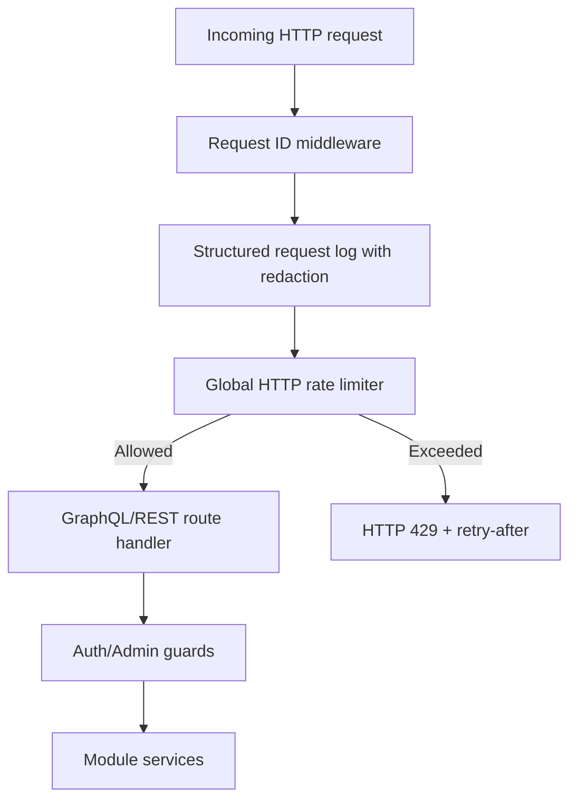

# Common Module Utilities (Backend)

## Goal

Provide shared cross-cutting backend utilities used by multiple modules
(security guards, secret handling, and request-level protection primitives).

## Current shared components

- `guards/jwt-auth.guard.ts` — GraphQL/HTTP authentication enforcement.
- `guards/admin.guard.ts` — role-based admin access guardrails.
- `provider-secrets.util.ts` — AES-256-GCM encryption/decryption utilities for
  provider/mailbox secrets at rest, including keyring-based rotation support.
- `logging/structured-log.util.ts` — structured JSON logging helpers with
  recursive PII redaction, request correlation ID normalization, and
  privacy-preserving identifier fingerprints.
- `rate-limit/request-rate-limiter.ts` — in-memory windowed request counter with
  bounded key-compaction.
- `rate-limit/http-rate-limit.middleware.ts` — global HTTP rate-limit middleware
  that returns HTTP `429` with `retry-after` semantics.

## Global HTTP rate limiting

Configured in `main.ts` and applied to all HTTP routes (including GraphQL):

- `GLOBAL_RATE_LIMIT_ENABLED` (default `true`)
- `GLOBAL_RATE_LIMIT_WINDOW_MS` (default `60000`)
- `GLOBAL_RATE_LIMIT_MAX_REQUESTS` (default `300`)
- `GLOBAL_RATE_LIMIT_EXCLUDED_PATHS` (default OAuth callback routes)

Behavior:
- keying priority: authenticated user id → forwarded IP → socket IP
- per-path counters to prevent one endpoint from starving all traffic
- emits structured warning log event `http_rate_limited` with hashed
  `clientFingerprint` instead of raw user/IP identifier
- includes `x-rate-limit-limit`, `x-rate-limit-remaining`, and `retry-after` headers

## Structured request logging + PII redaction

- `main.ts` uses request-correlation middleware to always attach/return `x-request-id`.
- request start/finish logs are serialized via `serializeStructuredLog(...)`.
- query/body/token-like keys are recursively redacted (`[REDACTED]`) before output.
- long string values are truncated to keep log events bounded and safe for ingestion.

## Request protection flow

## Provider secret key rotation

Provider/mailbox secret encryption supports keyring-based rotation:

- `PROVIDER_SECRETS_KEYRING` format: `keyId:secret,keyId2:secret`
- `PROVIDER_SECRETS_ACTIVE_KEY_ID` selects which key encrypts new writes
- decrypt path can read both:
  - legacy `enc:v1` payloads
  - key-id tagged `enc:v2` payloads
  across all configured keys in the keyring.
