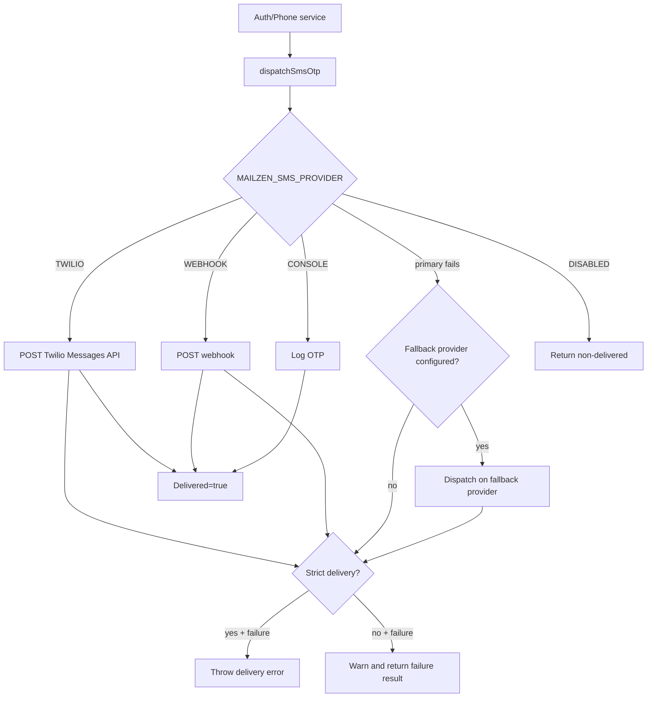

# SMS Dispatcher Utility

## Goal

Provide resilient OTP delivery with provider-level failover behavior and strict/non-strict delivery modes.

## Supported providers

- `CONSOLE` (default local-development logger provider)
- `WEBHOOK` (generic outbound HTTP webhook provider)
- `TWILIO` (direct Twilio REST API provider)
- `DISABLED` (explicit no-delivery mode)

## Environment variables

- `MAILZEN_SMS_PROVIDER` (`CONSOLE|WEBHOOK|TWILIO|DISABLED`)
- `MAILZEN_SMS_FALLBACK_PROVIDER` (`CONSOLE|WEBHOOK|TWILIO`, optional secondary provider)
- `MAILZEN_SMS_STRICT_DELIVERY`
  - production default: strict (`true`)
  - non-production default: non-strict (`false`)
- Webhook provider:
  - `MAILZEN_SMS_WEBHOOK_URL`
  - `MAILZEN_SMS_WEBHOOK_TOKEN` (optional bearer)
  - `MAILZEN_SMS_WEBHOOK_TIMEOUT_MS` (default `5000`)
  - `MAILZEN_SMS_WEBHOOK_SIGNING_KEY` (optional HMAC signing key)
- Twilio provider:
  - `MAILZEN_SMS_TWILIO_ACCOUNT_SID`
  - `MAILZEN_SMS_TWILIO_AUTH_TOKEN`
  - `MAILZEN_SMS_TWILIO_FROM_NUMBER`
  - `MAILZEN_SMS_TWILIO_API_BASE_URL` (default `https://api.twilio.com`)
  - `MAILZEN_SMS_TWILIO_TIMEOUT_MS` (default `5000`)
  - `MAILZEN_SMS_TWILIO_STATUS_CALLBACK_URL` (optional)

## Webhook signing contract

When `MAILZEN_SMS_WEBHOOK_SIGNING_KEY` is configured:

- Header `x-mailzen-sms-timestamp` is added with current epoch ms.
- Header `x-mailzen-sms-signature` is added with:
  - `hex(HMAC_SHA256(signingKey, "<timestamp>.<payloadJson>"))`

Payload JSON:

```json
{
  "phoneNumber": "+15550000000",
  "code": "123456",
  "purpose": "SIGNUP_OTP"
}
```

## Delivery flow



## Operational notes

- Strict mode should be enabled in production to prevent unverifiable OTP issuance.
- Non-strict mode is useful for local/dev/staging bring-up when SMS infrastructure is not yet available.
- If `MAILZEN_SMS_FALLBACK_PROVIDER` is set and different from primary provider,
  dispatcher retries OTP delivery once on fallback provider before final failure.
- Webhook integrations should verify signing headers before accepting OTP dispatch payloads.
