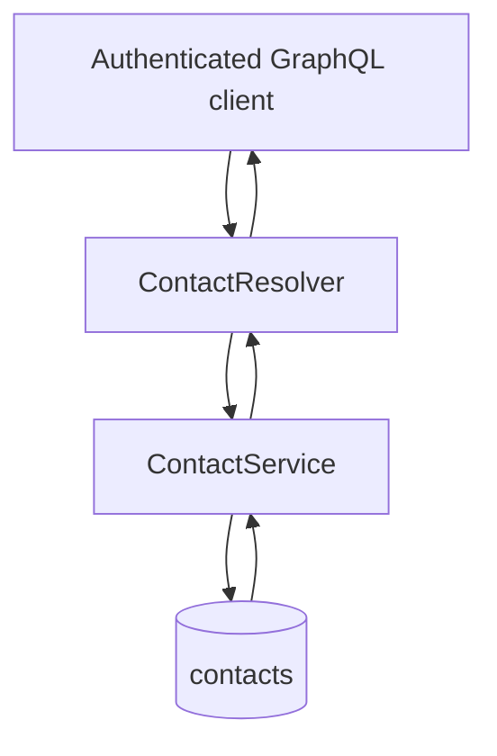

# Contacts Module

## Overview

The Contacts module provides functionality for managing user contacts within the MailZen application. It allows users to create, retrieve, update, and delete contacts, with each contact being associated with a specific user.

## Features

- **Contact Management**: Create, read, update, and delete contacts
- **User-Specific Contacts**: Each contact is associated with a specific user
- **GraphQL API**: Expose contact operations through GraphQL
- **Data Validation**: Validate contact data using class-validator
- **TypeORM Integration**: Store contacts in the database using TypeORM

## Architecture

The Contacts module follows a clean architecture pattern with the following components:

- **ContactService**: Core business logic for contact operations
- **ContactResolver**: GraphQL API for exposing contact functionality
- **DTOs**: Data Transfer Objects for input validation
- **Entity**: GraphQL object type representing a contact
- **TypeORM Integration**: Database access for storing contact data

## Flow



## API

### GraphQL Queries

#### Get All Contacts

```graphql
query {
  getAllContacts {
    id
    name
    email
    phone
    createdAt
    updatedAt
  }
}
```

Returns an array of contacts for the authenticated user.

#### Get Contact by ID

```graphql
query {
  getContact(id: "contact-id") {
    id
    name
    email
    phone
    createdAt
    updatedAt
  }
}
```

Returns a single contact by ID.

### GraphQL Mutations

#### Create Contact

```graphql
mutation {
  createContact(createContactInput: {
    name: "John Doe",
    email: "john@example.com",
    phone: "+1234567890"
  }) {
    id
    name
    email
    phone
  }
}
```

Creates a new contact and returns the created contact.

#### Update Contact

```graphql
mutation {
  updateContact(updateContactInput: {
    id: "contact-id",
    name: "John Smith",
    email: "john.smith@example.com"
  }) {
    id
    name
    email
    phone
  }
}
```

Updates an existing contact and returns the updated contact.

#### Delete Contact

```graphql
mutation {
  deleteContact(id: "contact-id") {
    id
    name
    email
  }
}
```

Deletes a contact and returns the deleted contact.

## Usage

1. Import the `ContactModule` in your application module:

```typescript
import { Module } from '@nestjs/common';
import { ContactModule } from './contacts/contact.module';

@Module({
  imports: [ContactModule],
})
export class AppModule {}
```

2. Inject the `ContactService` in your service or controller:

```typescript
import { Injectable } from '@nestjs/common';
import { ContactService } from '../contacts/contact.service';

@Injectable()
export class EmailService {
  constructor(private readonly contactService: ContactService) {}

  async sendEmailToContact(contactId: string, userId: string, content: string) {
    const contact = await this.contactService.getContactById(userId, contactId);
    // Send email to contact.email
  }
}
```

## Database Entity

The contact persistence model is implemented as a TypeORM entity:

```typescript
@Entity('contacts')
export class Contact {
  @PrimaryGeneratedColumn('uuid')
  id: string;

  @Column()
  name: string;

  @Column()
  email: string;

  @Column({ nullable: true })
  phone?: string;

  @Column()
  userId: string;
}
```

## Dependencies

- NestJS framework
- TypeORM
- GraphQL
- Class Validator 