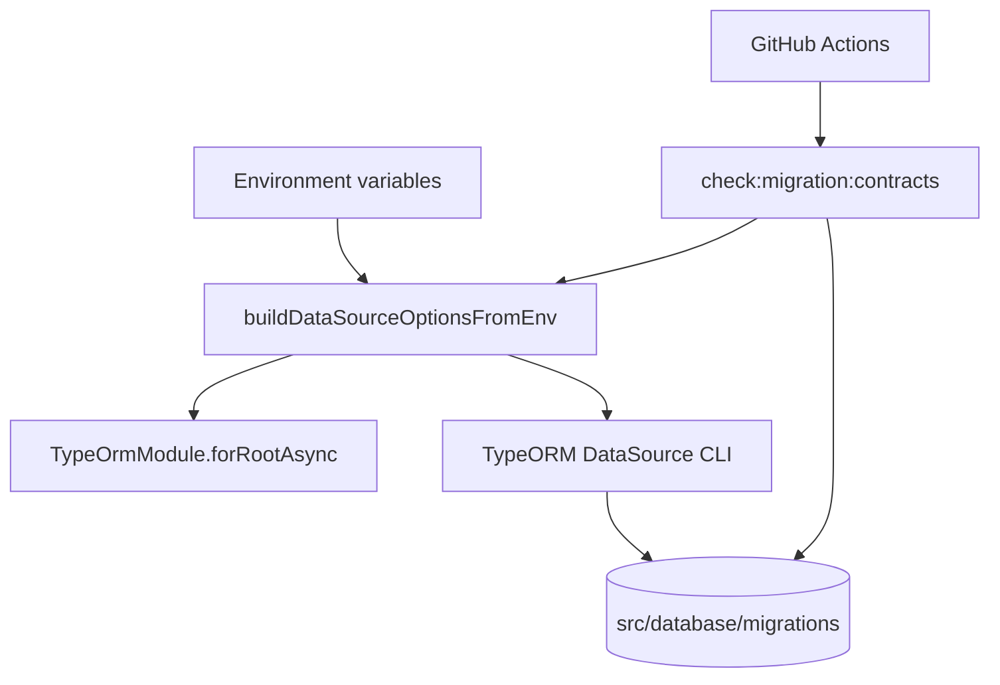

# Database Module (TypeORM + Migrations)

## Goal

Provide a safe, migration-first persistence foundation for MailZen backend.

## Responsibilities

- Build runtime TypeORM options from environment (`typeorm.config.ts`)
- Expose TypeORM CLI DataSource entrypoint (`data-source.ts`)
- Maintain ordered SQL/TypeORM migrations in `src/database/migrations`
- Enforce migration wiring contracts in CI (`check:migration:contracts`)

## Runtime and CLI architecture

## Safety contracts

- `synchronize` must remain `false` for CLI migration DataSource.
- Migration files must be present and discoverable from
  `src/database/migrations`.
- DataSource driver must remain `postgres`.

## Commands

From `apps/backend`:

- `npm run migration:show`
- `npm run migration:run`
- `npm run migration:revert`
- `npm run check:migration:contracts`

## Environment

- `DATABASE_URL` (required)
- `TYPEORM_SYNCHRONIZE` (local-only safeguard)
- `TYPEORM_RUN_MIGRATIONS`
- `TYPEORM_POOL_MAX`
- `TYPEORM_IDLE_TIMEOUT_MS`

## Notes

- `buildDataSourceOptionsFromEnv(...)` centralizes both runtime + CLI options
  so migration and app boot behavior do not drift.
- CI runs migration contract checks to catch broken DataSource wiring early,
  before deployment.
