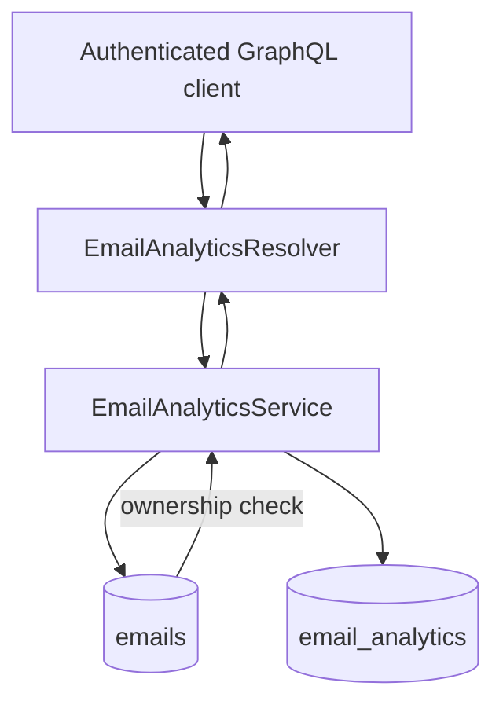

# Email Analytics Module

## Goal

Provide user-scoped open/click analytics records for emails and expose them via GraphQL.

## Responsibilities

- Upsert email analytics rows (`email_analytics`) by `emailId`
- Enforce email ownership before analytics writes
- Return analytics only for emails owned by authenticated user

## GraphQL API

- `getAllEmailAnalytics`: list analytics rows for authenticated user
- `createEmailAnalytics(createEmailAnalyticsInput)`: create/update analytics row for owned email

## Flow

## Notes

- Write path uses `upsert` on `emailId` to keep one analytics record per email.
- Missing/foreign email IDs are rejected with `NotFoundException`.
- Structured observability events:
  - `email_analytics_create_start`
  - `email_analytics_create_email_missing`
  - `email_analytics_create_completed`
  - `email_analytics_list_start`
  - `email_analytics_list_completed`
  - `email_analytics_audit_log_write_failed`

## Compliance / Audit Trail

- Persisted audit actions:
  - `email_analytics_upserted`
