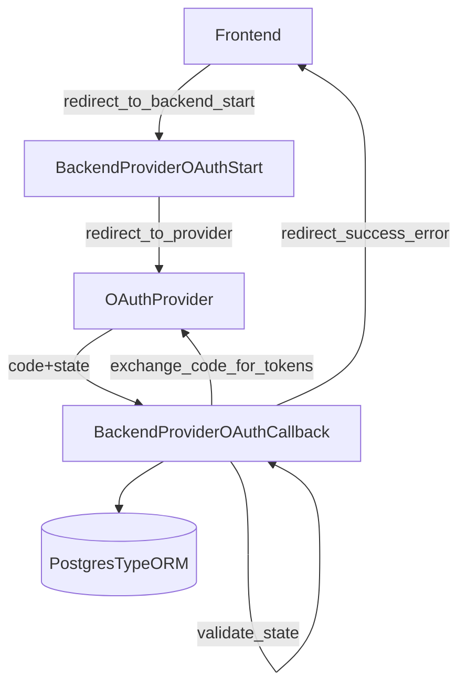

# Email Integration Module

## Overview

The Email Integration Module is responsible for managing email providers within the MailZen application. It enables users to configure and manage different types of email providers including Gmail, Outlook, and custom SMTP servers.

## Features

- **Provider Configuration**: Set up different email providers with appropriate credentials
- **Provider Management**: List, retrieve, update, and delete email providers
- **Connection Validation**: Validate provider connections to ensure they're properly configured
- **Multi-Provider Support**: Support for Gmail, Outlook, and custom SMTP servers
- **Security**: Secure handling of authentication credentials
- **Credential Encryption at Rest**: OAuth/SMTP secrets are encrypted before persistence
- **Credential Key Rotation**: Keyring-based decrypt fallback with active-key writes
- **OAuth Token Management**: Automatic refresh of OAuth tokens for Gmail and Outlook
- **Provider Sync Lease Coordination**: Provider-level DB leases prevent duplicate scheduler workers
- **Sync Error Telemetry**: Providers persist `lastSyncError` + `lastSyncErrorAt` for debugging and support workflows
- **Automatic Provider Detection**: Auto-detect provider type based on email address domain
- **Connection Pooling**: Efficient SMTP connection management for improved performance
- **Plan Entitlements**: Enforces provider count limits from user subscription plan
- **Workspace Assignment**: New providers are assigned to the user default workspace for future scoped access control

## Implementation Status

All features have been implemented and tested:

- ✅ OAuth refresh token handling for Gmail/Outlook providers
- ✅ Connection pooling for SMTP providers
- ✅ Automatic email provider detection based on email address
- ✅ Comprehensive test coverage for all components
- ✅ Detailed documentation

## Architecture

This module follows NestJS best practices and consists of:

- **Service**: Handles business logic and interacts with database through TypeORM
- **Resolver**: Exposes GraphQL endpoints for client interaction
- **DTOs**: Define input data structures with validation
- **Entities**: Define GraphQL return types

## GraphQL API

### Queries

- `getAllProviders`: Get all email providers for the authenticated user (legacy admin-ish shape)
- `getProviderById(id: String!)`: Get a specific provider by ID (legacy admin-ish shape)
- `getProviderEmails(providerId: String!)`: Get all emails for a specific provider
- `validateProvider(id: String!)`: Validate connection to a provider
- `providers`: Frontend-facing provider list (UI shape)
- `getEmailProviders`: Backwards-compatible alias for `providers`
  - both now accept optional `workspaceId` for scoped listing

### Mutations

- `configureEmailProvider(providerInput: EmailProviderInput!)`: Configure a new email provider
- `updateProviderCredentials(id: String!, input: EmailProviderInput!)`: Update provider credentials
- `deleteProvider(input: DeleteProviderInput!)`: Delete an email provider

Frontend-facing (matches `apps/frontend/lib/providers/provider-utils.ts`):

- `connectGmail(code: String!): Provider`
- `connectOutlook(code: String!): Provider`
- `connectSmtp(settings: SmtpSettingsInput!): Provider`
- `disconnectProvider(id: ID!): ProviderActionResult`
- `updateProvider(id: ID!, isActive: Boolean): Provider`
- `updateProviderStatus(id: String!, isActive: Boolean): Provider` (alias for older frontend clients)
- `syncProvider(id: ID!): Provider`
  - Gmail providers: triggers real Gmail metadata sync through `GmailSyncService`
  - Outlook providers: triggers real Microsoft Graph sync through `OutlookSyncService`
  - SMTP providers: validates SMTP connectivity and updates sync status/error telemetry
  - Errors are persisted as provider state (`status=error`, `lastSyncError`, `lastSyncErrorAt`) for support/debug visibility
- `syncMyProviders(workspaceId?: String, providerId?: String): ProviderSyncRunResponse!`
  - batch/manual provider sync trigger for authenticated user
  - optional `providerId` scopes to a single owned provider
  - optional `workspaceId` enforces workspace ownership/scope
  - returns aggregate counters (`requested/synced/failed/skipped`) and per-provider results
  - skips providers with active lease/status indicating in-flight sync

## OAuth Redirect URI notes (important)

OAuth `code` exchange requires that the **redirect URI used during authorization** matches the one used during token exchange.

Provider linking (Gmail/Outlook connect) is **backend-only** (recommended).

- Provider linking start endpoints (frontend redirects the browser here):
  - `GET /email-integration/google/start`
  - `GET /email-integration/microsoft/start`
- Provider linking callback endpoints (OAuth apps must point here):
  - `GOOGLE_PROVIDER_REDIRECT_URI=http://localhost:4000/email-integration/google/callback`
  - `OUTLOOK_PROVIDER_REDIRECT_URI=http://localhost:4000/email-integration/microsoft/callback`

Login OAuth (backend redirect) uses:

- `GOOGLE_REDIRECT_URI=http://localhost:4000/auth/google/callback`

## Mermaid: connect provider via OAuth code



## Data Transfer Objects

### EmailProviderInput

```typescript
@InputType()
export class EmailProviderInput {
  @Field()
  @IsNotEmpty()
  @IsString()
  @IsIn(['GMAIL', 'OUTLOOK', 'CUSTOM_SMTP'])
  providerType: string;

  @Field()
  @IsNotEmpty()
  @IsEmail()
  email: string;

  @Field({ nullable: true })
  @IsOptional()
  @IsString()
  password?: string;

  @Field({ nullable: true })
  @IsOptional()
  @IsString()
  host?: string;

  @Field(() => Int, { nullable: true })
  @IsOptional()
  @IsNumber()
  port?: number;

  @Field({ nullable: true })
  @IsOptional()
  @IsString()
  accessToken?: string;

  @Field({ nullable: true })
  @IsOptional()
  @IsString()
  refreshToken?: string;

  @Field({ nullable: true })
  @IsOptional()
  @IsNumber()
  tokenExpiry?: number;

  @Field({ nullable: true })
  @IsOptional()
  @IsBoolean()
  autoDetect?: boolean;
}
```

### DeleteProviderInput

```typescript
{
  id: string;
}
```

## Usage Examples

### Configuring a Gmail Provider with OAuth

```graphql
mutation {
  configureEmailProvider(
    providerInput: {
      providerType: "GMAIL"
      email: "user@gmail.com"
      accessToken: "your-oauth-access-token"
      refreshToken: "your-oauth-refresh-token"
      tokenExpiry: 3600
    }
  ) {
    id
    type
    email
    createdAt
  }
}
```

### Auto-detecting Provider Type

```graphql
mutation {
  configureEmailProvider(
    providerInput: {
      email: "user@gmail.com"
      accessToken: "your-oauth-access-token"
      refreshToken: "your-oauth-refresh-token"
      autoDetect: true
    }
  ) {
    id
    type
    email
    createdAt
  }
}
```

### Configuring a Custom SMTP Provider

```graphql
mutation {
  configureEmailProvider(
    providerInput: {
      providerType: "CUSTOM_SMTP"
      email: "user@example.com"
      host: "smtp.example.com"
      port: 587
      password: "your-password"
    }
  ) {
    id
    type
    email
    host
    port
    createdAt
  }
}
```

## OAuth Token Management

The module automatically handles OAuth token refresh for Gmail and Outlook providers:

- Tokens are refreshed when they are about to expire (within 5 minutes of expiry)
- New access tokens are stored in the database
- If a refresh token is returned, it is also updated

## Provider sync lease coordination

- `ProviderSyncLeaseService` acquires provider-level leases by atomically updating:
  - `status=syncing`
  - `syncLeaseExpiresAt=now()+lease_ttl`
- Lease TTL is configurable via `PROVIDER_SYNC_LEASE_TTL_MS`.
- Gmail/Outlook schedulers skip providers with active leases and retry later.

## Provider sync error telemetry

- `EmailProvider` now tracks:
  - `lastSyncErrorAt` (timestamp of last failure)
  - `lastSyncError` (trimmed failure reason)
- Sync services clear these fields when starting and when completing successfully.
- Scheduler fallback failures also write these fields when retries are exhausted.

## Connection Pooling

For SMTP providers, the module implements connection pooling to improve performance:

- Connections are reused across multiple email operations
- Idle connections are automatically closed after 30 minutes
- A maximum of 5 connections per provider is maintained
- Each connection handles up to a maximum of 100 messages

## Error Handling

The module provides detailed error responses with appropriate HTTP status codes:

- `400 Bad Request`: Invalid input data (e.g., missing required fields)
- `401 Unauthorized`: Authentication failed
- `403 Forbidden`: User doesn't have permission to access the provider
- `404 Not Found`: Provider not found
- `409 Conflict`: Provider already exists
- `500 Internal Server Error`: Unexpected server error

## Security Considerations

- OAuth credentials are never exposed in GraphQL responses
- Passwords are securely stored in the database
- Provider secret encryption supports rotation via:
  - `PROVIDER_SECRETS_KEYRING`
  - `PROVIDER_SECRETS_ACTIVE_KEY_ID`
    while maintaining backward compatibility for legacy `enc:v1` encrypted rows.
- All endpoints are protected with JWT authentication
- User-based access control ensures users can only access their own providers

## Integration with Other Modules

This module integrates with:

- **Email Module**: For sending emails through configured providers
- **Email Warmup Module**: For warming up email providers to improve deliverability
- **Email Analytics Module**: For tracking email performance metrics

## Future Enhancements

- Support for additional OAuth providers
- Enhanced credential encryption
- Rate limiting and quota management
- Advanced connection pooling strategies
- Support for proxy configurations
