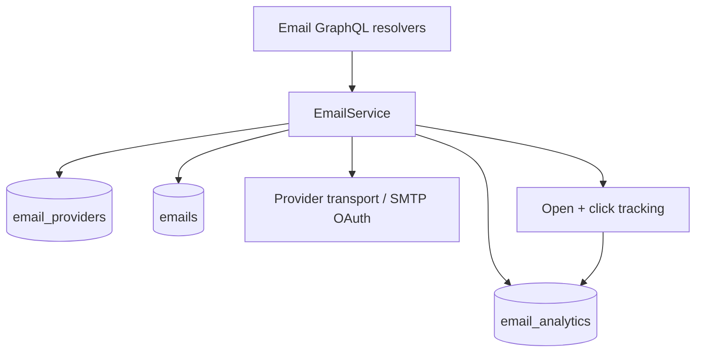

# Email Module Documentation

## Overview

The Email Module is a comprehensive solution for managing email operations within the MailZen application. It provides functionality for sending, receiving, filtering, templating, scheduling, and warming up emails. This module integrates with various email providers (Gmail, Outlook, Custom SMTP) and offers a robust set of features for email management.

## Core Components

## Flow



### Services

1. **EmailService**
   - Core service for sending and managing emails
   - Handles email tracking (opens, clicks)
   - Supports different email providers
   - Manages email analytics

2. **EmailFilterService**
   - Creates and manages email filters
   - Applies filtering rules to incoming emails
   - Supports conditions like CONTAINS, EQUALS, STARTS_WITH, ENDS_WITH
   - Executes actions like MARK_READ, MARK_IMPORTANT, MOVE_TO_FOLDER, APPLY_LABEL, FORWARD_TO

3. **EmailTemplateService**
   - Creates and manages email templates
   - Renders templates with variable substitution
   - Supports HTML templates

4. **EmailSchedulerService**
   - Schedules emails for future delivery
   - Manages scheduled email queue using Bull
   - Provides functionality to cancel scheduled emails

5. **EmailWarmupService**
   - Gradually increases email sending volume to improve deliverability
   - Monitors open rates and adjusts strategy accordingly
   - Provides performance metrics and analytics
   - Supports pausing and resuming warmup process

6. **AttachmentService**
   - Handles file attachments for emails
   - Uploads attachments to Google Cloud Storage
   - Manages attachment metadata

### Resolvers

1. **EmailResolver**
   - GraphQL resolver for core email operations
   - Exposes mutations for sending emails
   - Provides queries for retrieving emails

2. **EmailFilterResolver**
   - GraphQL resolver for email filter operations
   - Exposes mutations for creating and deleting filters
   - Provides queries for retrieving filters

3. **EmailTemplateResolver**
   - GraphQL resolver for email template operations
   - Exposes mutations for creating, updating, and deleting templates
   - Provides queries for retrieving templates

4. **EmailWarmupResolver**
   - GraphQL resolver for email warmup operations
   - Exposes mutations for starting and pausing warmup
   - Provides queries for retrieving warmup status and metrics

5. **AttachmentResolver**
   - GraphQL resolver for attachment operations
   - Exposes mutations for uploading and deleting attachments
   - Provides queries for retrieving attachments

### Models and DTOs

1. **Email Models**
   - Defines GraphQL object types for emails and related entities
   - Includes types for email analytics, filters, templates, etc.

2. **Input DTOs**
   - Defines input types for GraphQL mutations
   - Includes validation using class-validator
   - Provides default values and constraints

## Features

### Email Sending and Tracking

- Send emails through various providers (Gmail, Outlook, Custom SMTP)
- Track email opens and clicks
- Support for HTML content
- Attachment handling
  - attachment storage cleanup warning event:
    - `attachment_storage_delete_failed`
- Structured observability logs in `EmailService`:
  - send lifecycle:
    - `email_send_start`
    - `email_send_record_persisted`
    - `email_send_analytics_initialized`
    - `email_send_scheduled`
    - `email_send_provider_missing`
    - `email_send_provider_selected`
    - `email_send_completed`
    - `email_send_failed`
  - template lifecycle:
    - `email_template_send_start`
    - `email_template_send_completed`
  - tracking/query lifecycle:
    - `email_track_open_start`
    - `email_track_click_start`
    - `email_list_by_user_start`
    - `email_list_by_user_completed`
    - `email_get_by_id_start`
    - `email_mark_read_start`

### Email Filtering

- Create custom filters with multiple rules
- Apply filters to incoming emails
- Execute actions based on filter matches
- Manage filters through GraphQL API

### Email Templates

- Create reusable email templates
- Support for variable substitution
- Render templates with custom data
- Manage templates through GraphQL API

### Email Scheduling

- Schedule emails for future delivery
- Manage scheduled email queue
- Cancel scheduled emails
- Process scheduled emails using Bull queue

### Email Warmup

- Gradually increase email sending volume
- Monitor open rates and adjust strategy
- Track warmup performance metrics
- Pause and resume warmup process
- Structured observability logs in `EmailWarmupService`:
  - lifecycle:
    - `email_warmup_start_requested`
    - `email_warmup_start_config_resolved`
    - `email_warmup_start_completed`
    - `email_warmup_start_failed`
    - `email_warmup_pause_requested`
    - `email_warmup_pause_processing`
    - `email_warmup_pause_completed`
    - `email_warmup_pause_failed`
  - daily strategy processing:
    - `email_warmup_daily_processing_start`
    - `email_warmup_daily_processing_loaded`
    - `email_warmup_daily_limit_increased`
    - `email_warmup_daily_limit_maintained`
    - `email_warmup_daily_processing_item_failed`
    - `email_warmup_daily_processing_completed`
    - `email_warmup_daily_processing_failed`
  - send cycle:
    - `email_warmup_send_cycle_start`
    - `email_warmup_send_cycle_loaded`
    - `email_warmup_send_cycle_missing_activity`
    - `email_warmup_send_cycle_daily_limit_reached`
    - `email_warmup_send_cycle_dispatching`
    - `email_warmup_send_cycle_dispatch_completed`
    - `email_warmup_send_cycle_dispatch_failed`
    - `email_warmup_send_cycle_completed`
    - `email_warmup_send_cycle_failed`
  - queries/strategy adjustment:
    - `email_warmup_status_query_start`
    - `email_warmup_status_query_completed`
    - `email_warmup_status_query_failed`
    - `email_warmup_metrics_query_start`
    - `email_warmup_metrics_query_completed`
    - `email_warmup_metrics_query_failed`
    - `email_warmup_strategy_adjust_start`
    - `email_warmup_strategy_adjust_slow_down`
    - `email_warmup_strategy_adjust_speed_up`
    - `email_warmup_strategy_adjust_maintain`
    - `email_warmup_strategy_adjust_completed`
    - `email_warmup_strategy_adjust_failed`

### Attachment Handling

- Upload attachments to Google Cloud Storage
- Associate attachments with emails
- Retrieve attachments for emails
- Delete attachments

## Usage Examples

### Sending an Email

```typescript
// Inject EmailService
constructor(private emailService: EmailService) {}

// Send an email
await this.emailService.sendEmail({
  subject: 'Hello World',
  body: '<p>This is a test email</p>',
  from: 'sender@example.com',
  to: ['recipient@example.com'],
  providerId: 'provider-id',
}, 'user-id');
```

### Creating an Email Filter

```typescript
// Inject EmailFilterService
constructor(private emailFilterService: EmailFilterService) {}

// Create a filter
await this.emailFilterService.createFilter({
  name: 'Important Emails',
  rules: [{
    field: 'subject',
    condition: FilterCondition.CONTAINS,
    value: 'important',
    action: FilterAction.MARK_IMPORTANT,
  }],
}, 'user-id');
```

### Creating an Email Template

```typescript
// Inject EmailTemplateService
constructor(private emailTemplateService: EmailTemplateService) {}

// Create a template
await this.emailTemplateService.createTemplate({
  name: 'Welcome Email',
  subject: 'Welcome to MailZen',
  body: '<p>Hello {{name}},</p><p>Welcome to MailZen!</p>',
}, 'user-id');
```

### Scheduling an Email

```typescript
// Inject EmailSchedulerService
constructor(private emailSchedulerService: EmailSchedulerService) {}

// Schedule an email
await this.emailSchedulerService.scheduleEmail({
  subject: 'Scheduled Email',
  body: '<p>This is a scheduled email</p>',
  from: 'sender@example.com',
  to: ['recipient@example.com'],
  providerId: 'provider-id',
  scheduledAt: new Date(Date.now() + 3600000), // 1 hour from now
}, 'user-id');
```

### Starting Email Warmup

```typescript
// Inject EmailWarmupService
constructor(private emailWarmupService: EmailWarmupService) {}

// Start warmup
await this.emailWarmupService.startWarmup({
  providerId: 'provider-id',
  config: {
    dailyIncrement: 5,
    maxDailyEmails: 100,
    minimumInterval: 15,
    targetOpenRate: 80,
  },
}, 'user-id');
```

## GraphQL API

### Queries

- `getEmails`: Retrieve emails for the current user
- `getEmailById`: Retrieve a specific email by ID
- `getEmailFilters`: Retrieve email filters for the current user
- `getEmailTemplates`: Retrieve email templates for the current user
- `getEmailWarmupStatus`: Retrieve warmup status for a provider
- `getWarmupPerformanceMetrics`: Retrieve performance metrics for a warmup

### Mutations

- `sendEmail`: Send an email
- `createEmailFilter`: Create an email filter
- `deleteEmailFilter`: Delete an email filter
- `createEmailTemplate`: Create an email template
- `updateEmailTemplate`: Update an email template
- `deleteEmailTemplate`: Delete an email template
- `startEmailWarmup`: Start email warmup for a provider
- `pauseEmailWarmup`: Pause email warmup for a provider
- `adjustWarmupStrategy`: Adjust warmup strategy for a provider
- `uploadAttachment`: Upload an attachment
- `deleteAttachment`: Delete an attachment

## Configuration

The Email Module requires the following environment variables:

- `SMTP_HOST`: SMTP host for sending emails
- `SMTP_PORT`: SMTP port for sending emails
- `SMTP_USER`: SMTP username for sending emails
- `SMTP_PASS`: SMTP password for sending emails
- `REDIS_HOST`: Redis host for Bull queue
- `REDIS_PORT`: Redis port for Bull queue
- `GOOGLE_CLOUD_PROJECT_ID`: Google Cloud project ID for attachment storage
- `GOOGLE_CLOUD_CLIENT_EMAIL`: Google Cloud client email for attachment storage
- `GOOGLE_CLOUD_PRIVATE_KEY`: Google Cloud private key for attachment storage
- `GOOGLE_CLOUD_STORAGE_BUCKET`: Google Cloud storage bucket for attachment storage
- `API_URL`: API URL for tracking pixels and click tracking

## Dependencies

- `@nestjs/common`: NestJS common utilities
- `@nestjs/graphql`: NestJS GraphQL integration
- `@nestjs/schedule`: NestJS scheduling utilities
- `@nestjs/bull`: NestJS Bull queue integration
- `@nestjs-modules/mailer`: NestJS mailer module
- `@google-cloud/storage`: Google Cloud Storage client
- `bull`: Queue system for scheduled emails
- `nodemailer`: Email sending library
- `class-validator`: Input validation
- `typeorm`: Database ORM

## Observability (structured events)

- `EmailFilterService` emits resilient audit warning event:
  - `email_filter_audit_log_write_failed`
- `EmailWarmupService` emits resilient audit warning event:
  - `email_warmup_audit_log_write_failed`
- `EmailTemplateService` emits resilient audit warning event:
  - `email_template_audit_log_write_failed`
- `AttachmentService` emits resilient audit warning event:
  - `attachment_audit_log_write_failed`
- `EmailService` emits resilient audit warning event:
  - `email_audit_log_write_failed`
- `MailService` emits resilient audit warning event:
  - `mail_service_audit_log_write_failed`
- `EmailSchedulerService` emits resilient audit warning event:
  - `email_scheduler_audit_log_write_failed`

## Compliance / Audit Trail

- Persisted audit actions:
  - `email_send_requested`
  - `email_send_scheduled`
  - `email_sent`
  - `email_send_failed`
  - `email_filter_created`
  - `email_filter_deleted`
  - `email_warmup_started`
  - `email_warmup_resumed`
  - `email_warmup_paused`
  - `email_template_created`
  - `email_template_updated`
  - `email_template_deleted`
  - `email_template_sent`
  - `email_template_send_failed`
  - `email_schedule_created`
  - `email_schedule_creation_failed`
  - `email_schedule_cancelled`
  - `email_schedule_cancel_failed`
  - `email_schedule_dispatched`
  - `email_schedule_dispatch_failed`
  - `attachment_uploaded`
  - `attachment_deleted`
  - `email_marked_read`
  - `real_email_sent`
  - `real_email_send_failed`

## Best Practices

1. **Error Handling**: All services include comprehensive error handling with detailed logging.
2. **Validation**: Input DTOs include validation using class-validator.
3. **Dependency Injection**: Services are properly injected using NestJS dependency injection.
4. **Modular Design**: The module is designed with clear separation of concerns.
5. **Logging**: Comprehensive logging is implemented throughout the module.
6. **Security**: Authentication guards protect all GraphQL endpoints.
7. **Performance**: Caching and optimization techniques are used where appropriate.
8. **Testing**: Services and resolvers are designed to be testable.

## Future Enhancements

1. **Email Analytics Dashboard**: Provide more detailed analytics for email performance.
2. **Advanced Filtering**: Enhance filtering capabilities with more conditions and actions.
3. **AI-Powered Responses**: Integrate with AI services for smart reply suggestions.
4. **Bulk Email Operations**: Support for sending emails to multiple recipients efficiently.
5. **Enhanced Warmup Strategies**: More sophisticated warmup strategies based on domain reputation. 