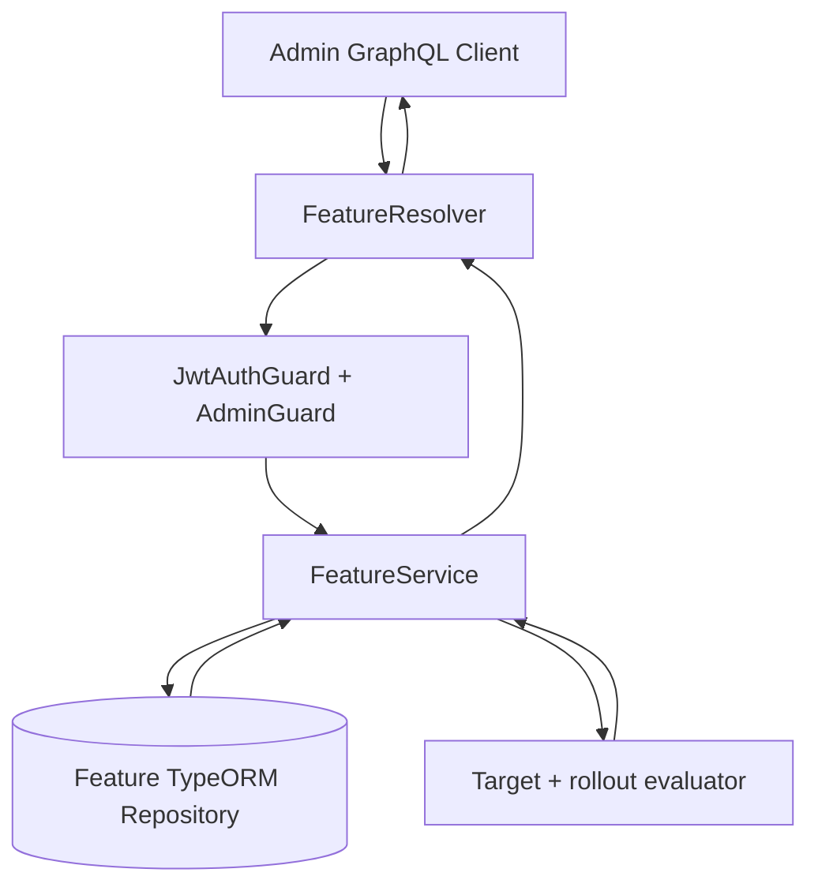

# Feature Module

## Overview

The Feature module provides functionality for managing feature flags within the MailZen application. Feature flags allow for controlled rollout of new features, A/B testing, and feature toggling based on user roles or subscription levels.

## Features

- **Feature Flag Management**: Create, read, update, and delete feature flags
- **Feature Toggling**: Enable or disable features dynamically
- **Targeted Rollouts**: Scope features by target type/value and percentage rollout
- **Admin-Only Access**: Restrict feature management to admin users
- **GraphQL API**: Expose feature operations through GraphQL
- **Authentication & Authorization**: Secure feature operations with JWT authentication and role-based access control

## Architecture

The Feature module follows a clean architecture pattern with the following components:

- **FeatureService**: Core business logic for feature operations
- **FeatureResolver**: GraphQL API for exposing feature functionality
- **DTOs**: Data Transfer Objects for input validation
- **Entity**: GraphQL object type representing a feature
- **Guards**: Role-based access control for admin-only operations
- **TypeORM Repository**: Persistent feature storage in Postgres (`features` table)
- **Context Resolver API**: Resolve effective flag state for current user/workspace

## API

### GraphQL Queries

#### Get All Features

```graphql
query {
  getAllFeatures {
    id
    name
    isActive
    targetType
    targetValue
    rolloutPercentage
  }
}
```

Returns an array of all features.

#### Resolve Feature Enablement

```graphql
query {
  isFeatureEnabled(name: "InboxAIAssist", workspaceId: "workspace-1")
}
```

Returns `true` only when the feature is active and matches current
user/workspace/environment targeting rules.

### GraphQL Mutations (Admin Only)

#### Create Feature

```graphql
mutation {
  createFeature(createFeatureInput: {
    name: "EmailTemplates",
    isActive: true,
    targetType: "WORKSPACE",
    targetValue: "workspace-1",
    rolloutPercentage: 100
  }) {
    id
    name
    isActive
    targetType
    targetValue
    rolloutPercentage
  }
}
```

Creates a new feature flag and returns the created feature.

#### Update Feature

```graphql
mutation {
  updateFeature(updateFeatureInput: {
    id: "feature-id",
    isActive: false,
    rolloutPercentage: 20
  }) {
    id
    name
    isActive
    rolloutPercentage
  }
}
```

Updates an existing feature flag and returns the updated feature.

#### Delete Feature

```graphql
mutation {
  deleteFeature(id: "feature-id") {
    id
    name
    isActive
  }
}
```

Deletes a feature flag and returns the deleted feature.

## Usage

1. Import the `FeatureModule` in your application module:

```typescript
import { Module } from '@nestjs/common';
import { FeatureModule } from './feature/feature.module';

@Module({
  imports: [FeatureModule],
})
export class AppModule {}
```

2. Inject the `FeatureService` in your service or controller to read feature flags:

```typescript
import { Injectable } from '@nestjs/common';
import { FeatureService } from '../feature/feature.service';

@Injectable()
export class EmailService {
  constructor(private readonly featureService: FeatureService) {}

  async sendEmail(emailData: any) {
    const isEnabled = await this.featureService.isFeatureEnabledForContext({
      name: 'EmailTemplates',
      userId: user.id,
      workspaceId: workspace.id,
    });

    if (isEnabled) {
      // Use email templates functionality
    } else {
      // Use basic email sending
    }

    // Send the email
  }
}
```

## Flow



## Future Enhancements

- **User-Specific Features**: Enable features for specific users or user groups
- **Percentage Rollout**: Gradually roll out features to a percentage of users
- **Time-Based Activation**: Schedule feature activation and deactivation
- **Metrics Collection**: Track feature usage and performance

## Database Entity

Feature flags are stored as a TypeORM entity:

```typescript
@Entity('features')
export class Feature {
  @PrimaryGeneratedColumn('uuid')
  id: string;

  @Column({ unique: true })
  name: string;

  @Column({ default: false })
  isActive: boolean;

  @Column({ default: 'GLOBAL' })
  targetType: string;

  @Column({ nullable: true })
  targetValue?: string | null;

  @Column({ type: 'integer', default: 100 })
  rolloutPercentage: number;
}
```

## Dependencies

- NestJS framework
- GraphQL
- JWT Authentication
- Role-based Authorization 