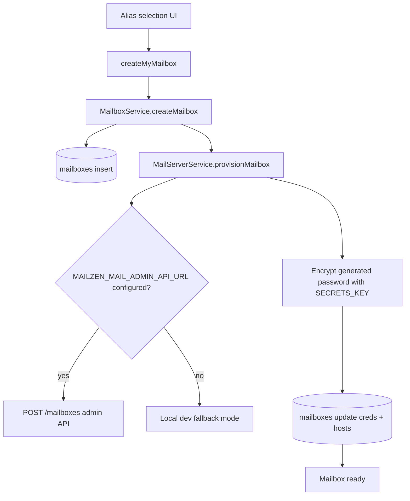
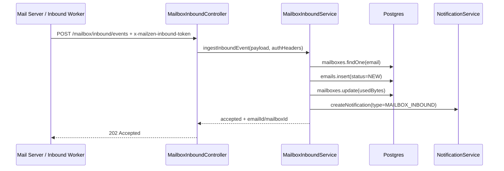

# Mailbox Module (Backend)

## Goal

Manage user-owned `@mailzen.com` aliases and provision mailbox credentials for the MailZen mail stack.

This module covers:
- alias handle validation + creation
- plan entitlement enforcement for mailbox count
- default workspace assignment for each new mailbox
- mailbox persistence in Postgres (`mailboxes` table)
- credential generation + encryption
- optional external mail-server provisioning API call
- inbound webhook ingestion for `@mailzen.com` mailbox delivery events

## Key files

- `mailbox.service.ts`
  - validates desired local part
  - enforces uniqueness for `localPart@mailzen.com`
  - creates mailbox row and triggers provisioning
- `mail-server.service.ts`
  - generates mailbox password
  - optionally calls external admin API (`MAILZEN_MAIL_ADMIN_API_URL`)
  - encrypts password using `SECRETS_KEY`
  - stores SMTP/IMAP connection fields on mailbox row
- `mailbox.resolver.ts`
  - GraphQL:
    - `createMyMailbox(desiredLocalPart?: String): String!`
    - `myMailboxes(workspaceId?: String): [String!]!`
- `mailbox-inbound.controller.ts`
  - REST:
    - `POST /mailbox/inbound/events`
  - validates webhook auth token + payload and stores inbound message rows
- `mailbox-inbound.service.ts`
  - resolves mailbox owner/workspace
  - persists inbound payload in `emails` table with `status=NEW`
  - updates mailbox `usedBytes`
  - emits `MAILBOX_INBOUND` notification metadata context

## Provisioning flow

## Environment variables

### Required for secure production
- `SECRETS_KEY`
  - minimum 32 chars
  - used for AES-256-GCM mailbox credential encryption
  - production boot should provide strong key material

### Optional external mailbox provisioning
- `MAILZEN_MAIL_ADMIN_API_URL`
  - when set, service calls `${MAILZEN_MAIL_ADMIN_API_URL}/mailboxes`
- `MAILZEN_MAIL_ADMIN_API_TOKEN`
  - optional bearer token for admin API
- `MAILZEN_MAIL_ADMIN_API_TIMEOUT_MS` (default `5000`)

### Inbound webhook authentication
- `MAILZEN_INBOUND_WEBHOOK_TOKEN`
  - shared secret expected in `x-mailzen-inbound-token` header
  - production requires this to be configured
  - non-production allows local bypass with warning logs

### Mail connection defaults persisted on mailbox rows
- `MAILZEN_SMTP_HOST` (default `smtp.mailzen.local`)
- `MAILZEN_SMTP_PORT` (default `587`)
- `MAILZEN_IMAP_HOST` (default `imap.mailzen.local`)
- `MAILZEN_IMAP_PORT` (default `993`)

## Error handling behavior

- If external admin API is configured and provisioning call fails:
  - throws `InternalServerErrorException`
  - mailbox credential persistence is skipped
- If mailbox row update fails (`affected=0`):
  - throws `InternalServerErrorException`
- If `SECRETS_KEY` is missing/short:
  - production: throws `InternalServerErrorException`
  - non-production: logs warning and uses local fallback key

## Notes

- This module provisions credentials and metadata; full inbound mailbox ingestion pipeline is handled by inbox/sync modules.
- Keep `SECRETS_KEY` managed via secure secret store in production.

## Inbound ingestion flow

