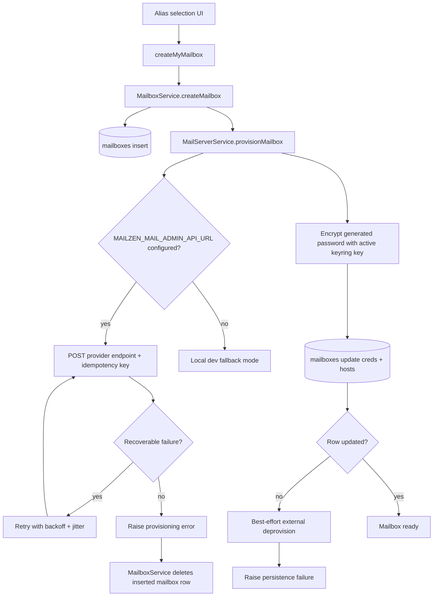
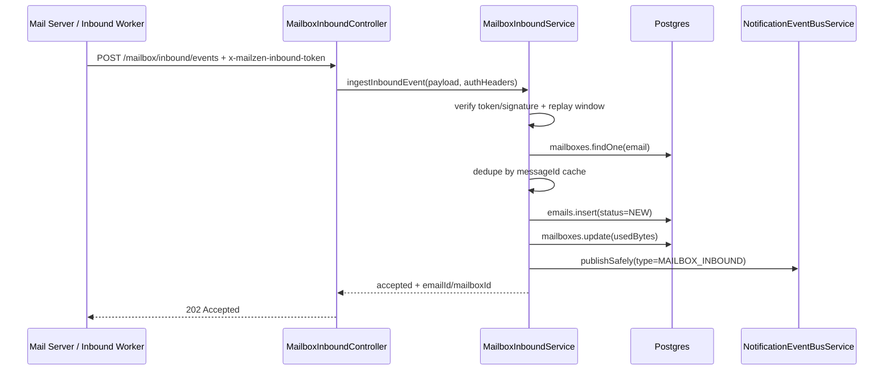

# Mailbox Module (Backend)

## Goal

Manage user-owned `@mailzen.com` aliases and provision mailbox credentials for the MailZen mail stack.

This module covers:

- alias handle validation + creation
- plan entitlement enforcement for mailbox count
- default workspace assignment for each new mailbox
- mailbox persistence in Postgres (`mailboxes` table)
- credential generation + encryption
- optional external mail-server provisioning API call
- inbound webhook ingestion for `@mailzen.com` mailbox delivery events

## Key files

- `mailbox.service.ts`
  - validates desired local part
  - enforces uniqueness for `localPart@mailzen.com`
  - creates mailbox row and triggers provisioning
- `mail-server.service.ts`
  - generates mailbox password
  - optionally calls external admin API (`MAILZEN_MAIL_ADMIN_API_URL`)
  - supports provider adapters (`GENERIC`, `MAILCOW`, `MAILU`)
  - applies retry/backoff/jitter for recoverable admin API failures
  - sends deterministic idempotency key header for safe replays
  - treats provider duplicate/conflict responses as idempotent success
  - performs best-effort external rollback if local credential persistence fails
  - encrypts password using provider-secrets keyring rotation support
  - stores SMTP/IMAP connection fields on mailbox row
- `mailbox.resolver.ts`
  - GraphQL:
    - `createMyMailbox(desiredLocalPart?: String): String!`
    - `myMailboxes(workspaceId?: String): [String!]!`
    - `myMailboxInboundEvents(mailboxId?: String, workspaceId?: String, status?: String, limit?: Int): [MailboxInboundEventObservabilityResponse!]!`
    - `myMailboxInboundEventStats(mailboxId?: String, workspaceId?: String, windowHours?: Int): MailboxInboundEventStatsResponse!`
    - `myMailboxInboundEventSeries(mailboxId?: String, workspaceId?: String, windowHours?: Int, bucketMinutes?: Int): [MailboxInboundEventTrendPointResponse!]!`
    - `myMailboxInboundDataExport(mailboxId?: String, workspaceId?: String, limit?: Int, windowHours?: Int, bucketMinutes?: Int): MailboxInboundDataExportResponse!`
    - `myMailboxSyncStates(workspaceId?: String): [MailboxSyncStateResponse!]!`
    - `purgeMyMailboxInboundRetentionData(retentionDays?: Int): MailboxInboundRetentionPurgeResponse!`
    - `syncMyMailboxPull(mailboxId?: String, workspaceId?: String): MailboxSyncRunResponse!`
- `mailbox-inbound.controller.ts`
  - REST:
    - `POST /mailbox/inbound/events`
  - validates webhook auth token + payload and stores inbound message rows
- `mailbox-inbound.service.ts`
  - resolves mailbox owner/workspace
  - enforces mailbox status/quota guardrails before persisting
  - persists inbound payload in `emails` table with `status=NEW`, `inboundMessageId`, `inboundThreadKey`
  - links inbox rows to mailbox source via `emails.mailboxId` for strict mailbox scoping
  - upserts idempotency/observability records in `mailbox_inbound_events`
  - updates mailbox `usedBytes`
  - emits `MAILBOX_INBOUND` notification metadata context with `inboundStatus`
    (`ACCEPTED`/`DEDUPLICATED`/`REJECTED`)
  - derives thread key from `inReplyTo` / `messageId` for unified inbox mailbox threading
- `mailbox-sync.service.ts`
  - polls optional mailbox-sync API endpoint for each active mailbox
  - converts pulled messages into trusted inbound ingest calls (`skipAuth=true`)
  - persists mailbox sync cursor/error state on mailbox row
  - exposes authenticated manual poll trigger APIs (single mailbox or all active user mailboxes)
  - exposes authenticated mailbox sync state query mapping
  - tracks accepted/deduplicated/rejected counters per poll run
- `mailbox-sync.scheduler.ts`
  - cron (`*/10 * * * *`) for active mailbox polling
  - env-gated via `MAILZEN_MAILBOX_SYNC_ENABLED`

## Provisioning flow



## Environment variables

### Required for secure production

- `PROVIDER_SECRETS_KEYRING` (recommended)
  - format: `keyId:32+charSecret,keyId2:32+charSecret`
  - enables key rotation with decrypt fallback across configured keys
- `PROVIDER_SECRETS_ACTIVE_KEY_ID`
  - selects which key encrypts new mailbox credentials
- `SECRETS_KEY` / `PROVIDER_SECRETS_KEY` (legacy fallback)
  - minimum 32 chars
  - used when keyring env is not configured

### Optional external mailbox provisioning

- `MAILZEN_MAIL_ADMIN_API_URL`
  - when set, service calls provider-specific mailbox provisioning endpoint
- `MAILZEN_MAIL_ADMIN_API_TOKEN`
  - optional bearer token for admin API
- `MAILZEN_MAIL_ADMIN_API_TIMEOUT_MS` (default `5000`)
- `MAILZEN_MAIL_ADMIN_API_TOKEN_HEADER` (default `authorization`)
  - supports `authorization` or `x-api-key` auth header mapping
- `MAILZEN_MAIL_ADMIN_PROVIDER` (default `GENERIC`)
  - supported values: `GENERIC`, `MAILCOW`, `MAILU`
- `MAILZEN_MAIL_ADMIN_API_RETRIES` (default `2`)
- `MAILZEN_MAIL_ADMIN_API_RETRY_BACKOFF_MS` (default `300`)
- `MAILZEN_MAIL_ADMIN_API_RETRY_JITTER_MS` (default `150`)
- `MAILZEN_MAIL_ADMIN_MAILCOW_QUOTA_MB` (default `51200`)
  - used when provider is `MAILCOW` to set mailbox quota at create time

### Optional mailbox pull sync pipeline

- `MAILZEN_MAILBOX_SYNC_ENABLED` (default `false`)
  - enables scheduler-driven mailbox polling
- `MAILZEN_MAIL_SYNC_API_URL`
  - base URL for mailbox sync API used for pull ingestion
  - expected endpoint shape:
    - `GET {MAILZEN_MAIL_SYNC_API_URL}/mailboxes/{mailboxEmail}/messages`
- `MAILZEN_MAIL_SYNC_API_TOKEN`
  - optional token for sync API authentication
- `MAILZEN_MAIL_SYNC_API_TOKEN_HEADER` (default `authorization`)
  - supports `authorization` or `x-api-key`
- `MAILZEN_MAIL_SYNC_TIMEOUT_MS` (default `5000`)
- `MAILZEN_MAIL_SYNC_RETRIES` (default `2`)
- `MAILZEN_MAIL_SYNC_RETRY_BACKOFF_MS` (default `250`)
- `MAILZEN_MAIL_SYNC_RETRY_JITTER_MS` (default `125`)
- `MAILZEN_MAIL_SYNC_FAIL_FAST` (default `true`)
  - when `true`, poll run aborts on first message ingest failure
  - when `false`, poll run continues remaining messages and advances cursor
- `MAILZEN_MAIL_SYNC_LEASE_TTL_SECONDS` (default `180`)
  - mailbox-level poll lease TTL used to avoid duplicate workers polling same mailbox
- `MAILZEN_MAIL_SYNC_BATCH_LIMIT` (default `25`)
- `MAILZEN_MAIL_SYNC_MAX_MAILBOXES_PER_RUN` (default `250`)
- `MAILZEN_MAIL_SYNC_CURSOR_PARAM` (default `cursor`)
  - request query param used for incremental cursor progression

### Inbound webhook authentication

- `MAILZEN_INBOUND_WEBHOOK_TOKEN`
  - shared secret expected in `x-mailzen-inbound-token` header
  - production requires this to be configured
  - non-production allows local bypass with warning logs
- optional `x-request-id` header
  - when present, propagated into structured inbound logs for correlation
  - when absent, backend generates a UUID correlation id
- `MAILZEN_INBOUND_WEBHOOK_SIGNING_KEY`
  - optional HMAC-SHA256 signing key
  - when configured, request must include:
    - `x-mailzen-inbound-timestamp`
    - `x-mailzen-inbound-signature`
- `MAILZEN_INBOUND_WEBHOOK_SIGNATURE_TOLERANCE_MS` (default `300000`)
  - allowed timestamp drift window for signed webhook replay protection
- `MAILZEN_INBOUND_IDEMPOTENCY_TTL_MS` (default `86400000`)
  - in-memory deduplication retention window for repeated `messageId` events
- `MAILZEN_INBOUND_SLA_TARGET_SUCCESS_PERCENT` (default `99`)
  - default target success threshold used in observability SLA indicators
- `MAILZEN_INBOUND_SLA_WARNING_REJECTION_PERCENT` (default `1`)
  - default rejection-rate threshold that triggers `WARNING` SLA status
- `MAILZEN_INBOUND_SLA_CRITICAL_REJECTION_PERCENT` (default `5`)
  - default rejection-rate threshold that triggers `CRITICAL` SLA status
  - persisted per-user notification preference thresholds override these defaults
- `MAILZEN_INBOUND_SLA_ALERT_WINDOW_HOURS` (default `24`)
  - rolling window used by SLA alert scheduler to evaluate user health
- `MAILZEN_INBOUND_SLA_ALERT_COOLDOWN_MINUTES` (default `60`)
  - minimum delay before re-emitting same-status SLA alert for a user
  - per-user notification preference `mailboxInboundSlaAlertCooldownMinutes`
    overrides this fallback
- `MAILZEN_INBOUND_SLA_ALERT_MAX_USERS_PER_RUN` (default `500`)
  - safety cap for monitored users in each scheduler cycle
- `MAILZEN_MAILBOX_INBOUND_RETENTION_AUTOPURGE_ENABLED` (default `true`)
  - enables daily inbound-event retention purge scheduler
- `MAILZEN_MAILBOX_INBOUND_RETENTION_DAYS` (default `180`)
  - retention horizon for mailbox inbound observability events

### Mail connection defaults persisted on mailbox rows

- `MAILZEN_SMTP_HOST` (default `smtp.mailzen.local`)
- `MAILZEN_SMTP_PORT` (default `587`)
- `MAILZEN_IMAP_HOST` (default `imap.mailzen.local`)
- `MAILZEN_IMAP_PORT` (default `993`)

## Error handling behavior

- If external admin API is configured and provisioning call fails:
  - throws `InternalServerErrorException`
  - mailbox credential persistence is skipped
- If mailbox row exists but provisioning fails during `createMailbox`:
  - mailbox service performs compensation by deleting the just-created mailbox row
  - prevents alias namespace from being polluted by partially provisioned rows
- If mailbox row update fails (`affected=0`):
  - throws `InternalServerErrorException`
  - provisioning service attempts best-effort external mailbox deprovision rollback
- If mailbox sync pull request fails:
  - mailbox row stores:
    - `inboundSyncStatus='error'`
    - `inboundSyncLastError`
    - `inboundSyncLastErrorAt`
    - `inboundSyncLastPolledAt`
  - scheduler continues polling other mailboxes (failure isolation)
  - emits `SYNC_FAILED` notification event when error signature changes
    (prevents duplicate notification spam for repeated identical failures)
- If mailbox sync pull request succeeds:
  - mailbox row stores:
    - `inboundSyncStatus='connected'`
    - `inboundSyncLastPolledAt`
    - clears `inboundSyncLastError` + `inboundSyncLastErrorAt`
  - emits `SYNC_RECOVERED` event when mailbox had prior sync error state
- Sync API pull retries:
  - transient failures (`429`, `5xx`, network timeouts/resets) use retry with backoff + jitter
  - non-retryable failures (e.g. `4xx` validation/auth issues) fail fast
- Poll lease semantics:
  - each mailbox poll acquires atomic DB lease token (`inboundSyncLeaseToken`)
  - lease expires automatically using `inboundSyncLeaseExpiresAt`
  - scheduler skips leased mailboxes and continues with others
- If mailbox sync ingest of a pulled message fails:
  - with `MAILZEN_MAIL_SYNC_FAIL_FAST=true`:
    - current mailbox poll run fails fast (cursor is not advanced)
  - with `MAILZEN_MAIL_SYNC_FAIL_FAST=false`:
    - run continues and reports rejected message count
    - cursor is advanced to avoid replay storms
  - safe retries rely on idempotent inbound dedupe (`mailboxId + messageId`)
- If keyring/secret encryption config is missing or invalid:
  - production: mailbox provisioning throws `InternalServerErrorException`
  - non-production: utility fallback key is used only for local development
- If inbound target mailbox is suspended or exceeds quota:
  - throws `BadRequestException`
  - inbound email is not persisted
- If webhook signature is configured and invalid/expired:
  - throws `UnauthorizedException`
- If duplicate `messageId` arrives inside idempotency cache window:
  - request is accepted and marked deduplicated without writing duplicate email row
- If process restarts and duplicate `messageId` arrives:
  - service checks `mailbox_inbound_events` and `emails.inboundMessageId` before insert
  - request remains idempotent across cache misses
- For mailbox-resolved failures (quota/suspension/payload errors), service records
  `REJECTED` status in `mailbox_inbound_events` for post-incident analysis.
- Mailbox inbound notifications are emitted with status metadata and can be
  filtered via notification preferences (`mailboxInbound*Enabled` fields).
- `MailboxInboundSlaScheduler` evaluates `myMailboxInboundEventStats`-equivalent
  SLA status every 15 minutes and emits `MAILBOX_INBOUND_SLA_ALERT` notifications
  when warning/critical thresholds are breached (with per-user cooldown suppression).
  Scheduler monitors both recently active users and users with persisted
  prior-alert state so recovered/no-data periods can clear stale alert flags.
- `MailboxInboundRetentionScheduler` runs daily and purges stale inbound-event
  observability rows according to retention policy env controls.

## Inbound observability GraphQL queries

- `myMailboxInboundEvents`
  - scoped to authenticated user ownership
  - supports optional `workspaceId`, `mailboxId`, `status`, and `limit`
  - includes mailbox email, signature validation flag, dedupe/reject status, and error reason
- `myMailboxInboundEventStats`
  - returns accepted/deduplicated/rejected totals for a rolling window
  - supports optional workspace/mailbox scoping and configurable `windowHours` (clamped server-side)
  - includes SLA indicators:
    - `successRatePercent`
    - `rejectionRatePercent`
    - `slaTargetSuccessPercent`
    - `slaWarningRejectedPercent`
    - `slaCriticalRejectedPercent`
    - `slaStatus`, `meetsSla`
  - SLA thresholds are resolved from per-user notification preferences when present,
    with env defaults as fallback
- `myMailboxInboundEventSeries`
  - returns trend buckets for accepted/deduplicated/rejected counts
  - supports optional workspace/mailbox scoping + rolling window and bucket granularity controls
- `myMailboxInboundDataExport`
  - exports mailbox inbound observability as JSON snapshot (events, stats, trend, retention policy)
- `purgeMyMailboxInboundRetentionData`
  - purges authenticated user inbound observability rows older than retention cutoff
- `myMailboxSyncStates`
  - lists mailbox sync cursor, sync lifecycle status, last-polled timestamp,
    last error/error timestamp, and lease expiry
  - supports optional workspace filtering with strict user ownership
- `syncMyMailboxPull`
  - manually triggers pull sync for one mailbox or all active mailboxes for authenticated user
  - result reports aggregate poll counters (polled/skipped/failed/fetched/accepted/deduplicated/rejected)

## Notes

- This module provisions credentials and metadata; full inbound mailbox ingestion pipeline is handled by inbox/sync modules.
- Keep provider/mailbox encryption keys managed via secure secret store in production.
- Each inbound request emits structured log events (`mailbox_inbound_*`) through
  common structured logging utilities, with recursive PII redaction and request correlation id propagation.

## Inbound ingestion flow



## Mailbox pull sync flow

```mermaid
flowchart TD
  Cron[MailboxSyncScheduler] --> Enabled{MAILZEN_MAILBOX_SYNC_ENABLED?}
  Enabled -->|no| Skip[Skip run]
  Enabled -->|yes| Poll[MailboxSyncService.pollActiveMailboxes]
  Poll --> List[Find active mailboxes]
  List --> Pull[GET /mailboxes/{email}/messages?cursor=...]
  Pull --> Ingest[MailboxInboundService.ingestInboundEvent skipAuth]
  Ingest --> Persist[Persist emails + dedupe + events + notifications]
  Persist --> Cursor[Update mailbox inboundSyncCursor]
  Pull --> Error[Persist inboundSyncLastError]
  Error --> Next[Continue with next mailbox]
```

## Operational runbook: signed webhook test (curl)

1. Generate signature payload:

```bash
npm run mailbox:inbound:signature -- \
  --mailboxEmail "sales@mailzen.com" \
  --from "lead@example.com" \
  --messageId "<lead-1001@example.com>" \
  --subject "New lead"
```

2. Use generated `timestamp` + `signature`:

```bash
curl -i -X POST "http://localhost:4000/mailbox/inbound/events" \
  -H "content-type: application/json" \
  -H "x-mailzen-inbound-token: ${MAILZEN_INBOUND_WEBHOOK_TOKEN}" \
  -H "x-mailzen-inbound-timestamp: <timestamp>" \
  -H "x-mailzen-inbound-signature: <signature>" \
  -d '{
    "mailboxEmail": "sales@mailzen.com",
    "from": "lead@example.com",
    "subject": "New lead",
    "textBody": "Hello from signed webhook",
    "messageId": "<lead-1001@example.com>"
  }'
```

## Staging verification checklist (inbound rollout)

- [ ] `MAILZEN_INBOUND_WEBHOOK_TOKEN` configured and rotated in secret store.
- [ ] `MAILZEN_INBOUND_WEBHOOK_SIGNING_KEY` configured in backend + upstream sender.
- [ ] Positive test: signed inbound webhook returns `202` and creates one `NEW` email.
- [ ] Replay test: same `messageId` returns `202` with `deduplicated=true`, without new email row.
- [ ] Negative test: invalid signature returns `401`.
- [ ] Negative test: stale timestamp beyond tolerance returns `401`.
- [ ] Notification feed shows `MAILBOX_INBOUND` entry with mailbox/workspace metadata.
