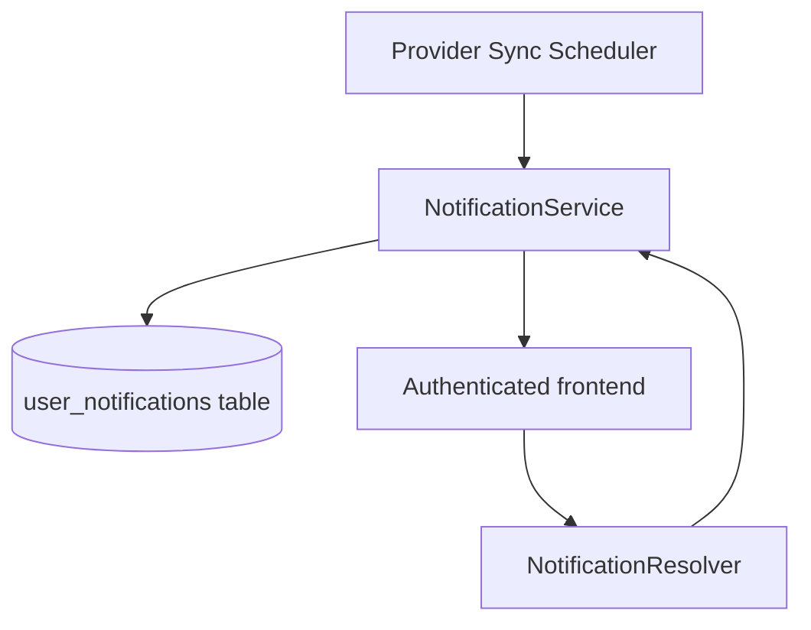

# Notification Module (Backend)

## Goal

Provide a persistent notification foundation for user-visible product events
(starting with provider sync failures).

## Responsibilities

- Persist user notifications in Postgres (`user_notifications`)
- Persist user notification preferences (`user_notification_preferences`)
- Query notifications for current user
- Track unread notification count
- Mark notifications as read
- Provide reusable `createNotification` API for other backend modules

## GraphQL API

- `myNotifications(limit, unreadOnly)` → list recent notifications
- `myUnreadNotificationCount` → unread badge count
- `myNotificationPreferences` → get per-user notification channel settings
- `markNotificationRead(id)` → marks one notification as read
- `updateMyNotificationPreferences(input)` → update channel + event preferences

## Initial event producers

- `GmailSyncScheduler` emits `SYNC_FAILED` notification on cron sync failure
- `OutlookSyncScheduler` emits `SYNC_FAILED` notification on cron sync failure
- `AiAgentGatewayService` emits `AGENT_ACTION_REQUIRED` for follow-up reminders
- Emission respects stored user preferences:
  - `inAppEnabled`
  - `syncFailureEnabled`
  - `mailboxInboundAcceptedEnabled`
  - `mailboxInboundDeduplicatedEnabled`
  - `mailboxInboundRejectedEnabled`

### Metadata conventions

Notification metadata is intentionally extensible. Current producers attach:
- Sync failures: `providerId`, `providerType`, `workspaceId`
- AI follow-up reminders: `threadId`, `followupAt`, `workspaceId`, `providerId`
- Mailbox inbound alerts:
  - `inboundStatus` (`ACCEPTED` | `DEDUPLICATED` | `REJECTED`)
  - `mailboxId`, `mailboxEmail`, `workspaceId`, `messageId`, `sourceIp`
  - optional `errorReason` and `emailId` for rejection/dedupe context

## Flow

