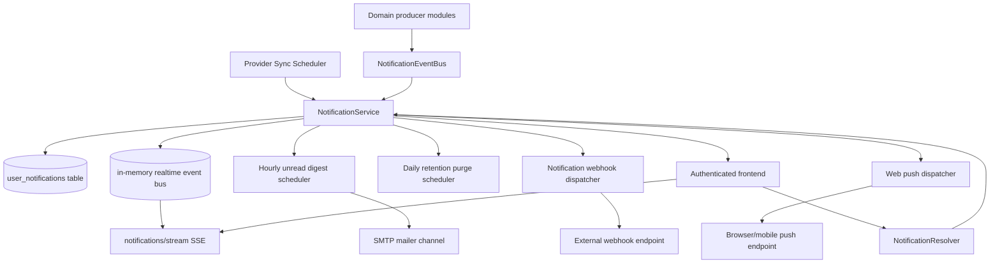

# Notification Module (Backend)

## Goal

Provide a persistent notification foundation for user-visible product events
(starting with provider sync failures).

## Responsibilities

- Persist user notifications in Postgres (`user_notifications`)
- Persist user notification preferences (`user_notification_preferences`)
- Provide domain-event abstraction (`NotificationEventBusService`) for modules
  emitting user-facing events
- Query notifications for current user
- Track unread notification count
- Mark notifications as read
- Provide reusable `createNotification` API for other backend modules
- Publish realtime notification stream events for in-app consumers
- Send periodic unread-notification digest emails for users with email channel enabled
- Deliver optional webhook callbacks for external automation consumers
- Support web-push subscription registration and delivery for browser/mobile clients
- Export user notification data snapshots for legal/compliance portability
- Auto-purge expired notification data using configurable retention policy

## GraphQL API

- `myNotifications(limit, unreadOnly, workspaceId?, sinceHours?, types?)` → list recent
  notifications (optional workspace/time-window/type filtering)
  - workspace filtering returns both matching workspace notifications and
    global (`workspaceId = null`) notifications for complete operational context.
- `myMailboxInboundSlaIncidentStats(workspaceId?, windowHours?)` → aggregated
  warning/critical incident counts and last-alert timestamp for SLA alerts
- `myMailboxInboundSlaIncidentSeries(workspaceId?, windowHours?, bucketMinutes?)` →
  bucketed warning/critical incident trend points for dashboards
- `myUnreadNotificationCount(workspaceId?)` → unread badge count (workspace + global scope)
- `myNotificationPreferences` → get per-user notification channel settings
- `myNotificationDataExport(limit?)` → export notification history/preferences JSON
- `myNotificationPushSubscriptions(workspaceId?)` → list user push subscriptions
- `markNotificationRead(id)` → marks one notification as read
- `markMyNotificationsRead(workspaceId?, sinceHours?, types?)` → marks matching
  notifications as read in bulk (used by SLA incident acknowledgement)
- `updateMyNotificationPreferences(input)` → update channel + event preferences
- `purgeNotificationRetentionData(notificationRetentionDays?, disabledPushRetentionDays?)` →
  admin-only retention purge mutation
- `registerMyNotificationPushSubscription(input)` → upsert web-push endpoint + keys
- `unregisterMyNotificationPushSubscription(endpoint)` → deactivate one endpoint

## Realtime API

- `GET /notifications/stream?workspaceId=<optional>` (Server-Sent Events)
  - authenticated via `JwtAuthGuard` (cookie or bearer token)
  - emits event type `notification` with payload:
    - `NOTIFICATION_CREATED`
    - `NOTIFICATIONS_MARKED_READ`
  - create events include title/message snippets for UI toast previews
  - emits event type `heartbeat` every 25s to keep clients connected
  - when `workspaceId` is provided, stream includes both:
    - matching workspace events
    - global events (`workspaceId = null`)

## Webhook channel

When configured, notification writes emit webhook callbacks with retries:

- `MAILZEN_NOTIFICATION_WEBHOOK_URL`
- `MAILZEN_NOTIFICATION_WEBHOOK_TOKEN` (optional bearer token)
- `MAILZEN_NOTIFICATION_WEBHOOK_TIMEOUT_MS` (default `3000`)
- `MAILZEN_NOTIFICATION_WEBHOOK_RETRIES` (default `2`)
- `MAILZEN_NOTIFICATION_WEBHOOK_SIGNING_KEY` (optional HMAC SHA256 signature)

Webhook event types:

- `NOTIFICATION_CREATED`
- `NOTIFICATIONS_MARKED_READ`

Webhook requests include:

- `x-mailzen-notification-timestamp`
- `x-mailzen-notification-signature` (optional when signing key is configured)

## Email digest scheduler

- `NotificationDigestScheduler` runs hourly (`0 * * * *`).
- For users with `emailEnabled=true`, it:
  - collects unread notifications since the last digest timestamp (or fallback window),
  - sends a concise digest email,
  - updates `notificationDigestLastSentAt` on success.
- If delivery fails, timestamp is not updated, so next scheduler run retries automatically.

Digest tuning env vars:

- `MAILZEN_NOTIFICATION_DIGEST_WINDOW_HOURS` (default `24`)
- `MAILZEN_NOTIFICATION_DIGEST_MAX_USERS_PER_RUN` (default `250`)
- `MAILZEN_NOTIFICATION_DIGEST_MAX_ITEMS` (default `8`)

## Retention controls

- `NotificationRetentionScheduler` runs daily at 03:00 server time.
- Purge targets:
  - read notifications older than retention cutoff
  - inactive push subscriptions older than retention cutoff

Retention env vars:

- `MAILZEN_NOTIFICATION_RETENTION_AUTOPURGE_ENABLED` (default `true`)
- `MAILZEN_NOTIFICATION_RETENTION_DAYS` (default `180`)
- `MAILZEN_NOTIFICATION_PUSH_RETENTION_DAYS` (default `90`)

## Web push channel

When enabled, notification create events can be delivered via web-push protocol:

- `MAILZEN_WEB_PUSH_ENABLED` (default `false`)
- `MAILZEN_WEB_PUSH_VAPID_PUBLIC_KEY`
- `MAILZEN_WEB_PUSH_VAPID_PRIVATE_KEY`
- `MAILZEN_WEB_PUSH_VAPID_SUBJECT` (default `mailto:alerts@mailzen.com`)
- `MAILZEN_WEB_PUSH_MAX_FAILURE_COUNT` (default `8`)
- `MAILZEN_WEB_PUSH_MAX_SUBSCRIPTIONS_PER_USER` (default `8`)

Delivery behavior:

- subscriptions are user-owned, optional workspace-scoped, and persisted
- workspace-scoped notifications target workspace + global subscriptions
- repeated failures increment `failureCount`; stale endpoints (404/410) are disabled
- successful deliveries reset failure counters and update `lastDeliveredAt`

## Initial event producers

- `GmailSyncScheduler` publishes `SYNC_FAILED` domain events through
  `NotificationEventBusService` on cron sync failure
- `OutlookSyncScheduler` publishes `SYNC_FAILED` domain events through
  `NotificationEventBusService` on cron sync failure
- `MailboxSyncService` publishes `SYNC_FAILED` domain events through
  `NotificationEventBusService` when mailbox pull-sync failures change error signature
- `AiAgentGatewayService` publishes `AGENT_ACTION_REQUIRED` domain events for
  follow-up reminders
- `MailboxInboundSlaScheduler` publishes `MAILBOX_INBOUND_SLA_ALERT` domain
  events when mailbox
  inbound success/rejection rates breach user-configured thresholds
  - scheduler stores last alert status/timestamp to enforce cooldown and clear
    stale alert state on SLA recovery
- `NotificationDigestScheduler` emits digest emails (mailer channel) for unread events
- `NotificationWebhookService` emits external webhook callbacks for notification lifecycle events
- `NotificationPushService` emits web-push messages for notification-created events
- Emission respects stored user preferences:
  - `inAppEnabled`
  - `syncFailureEnabled`
  - `mailboxInboundAcceptedEnabled`
  - `mailboxInboundDeduplicatedEnabled`
  - `mailboxInboundRejectedEnabled`
  - mailbox inbound SLA thresholds:
    - `mailboxInboundSlaTargetSuccessPercent`
    - `mailboxInboundSlaWarningRejectedPercent`
    - `mailboxInboundSlaCriticalRejectedPercent`
  - `mailboxInboundSlaAlertsEnabled`
  - `notificationDigestEnabled`
  - `mailboxInboundSlaAlertCooldownMinutes`

### Metadata conventions

Notification metadata is intentionally extensible. Current producers attach:

- Sync failures: `providerId`, `providerType`, `workspaceId`
- AI follow-up reminders: `threadId`, `followupAt`, `workspaceId`, `providerId`
- Mailbox inbound alerts:
  - `inboundStatus` (`ACCEPTED` | `DEDUPLICATED` | `REJECTED`)
  - `mailboxId`, `mailboxEmail`, `workspaceId`, `messageId`, `sourceIp`
  - optional `errorReason` and `emailId` for rejection/dedupe context
- Mailbox inbound SLA alerts:
  - `slaStatus` (`WARNING` | `CRITICAL`)
  - `successRatePercent`, `rejectionRatePercent`
  - `slaTargetSuccessPercent`, `slaWarningRejectedPercent`, `slaCriticalRejectedPercent`
  - `totalCount`, `acceptedCount`, `deduplicatedCount`, `rejectedCount`, `windowHours`

Notifications also persist `workspaceId` as a first-class column (derived from
metadata at write time) so workspace-scoped filtering is query-efficient.

## Flow

