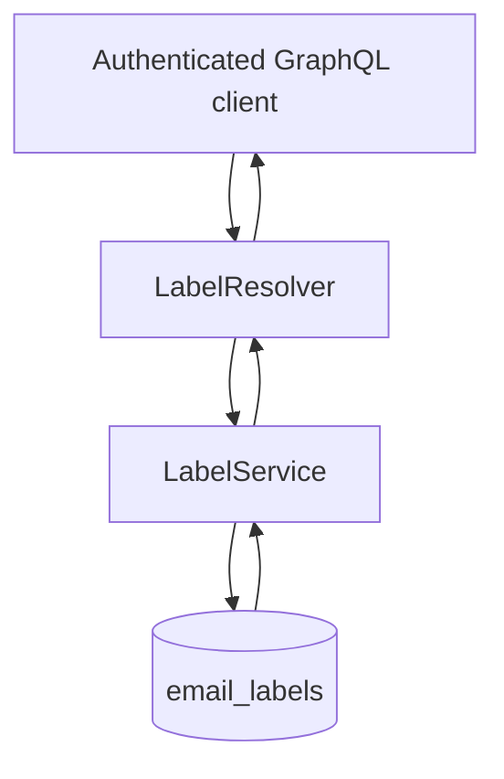

# Organization Module

## Overview

The Organization module provides functionality for managing organizational elements within the MailZen application, specifically focusing on labels. Labels help users organize and categorize their emails for better management and retrieval.

## Features

- **Label Management**: Create, read, and retrieve labels
- **Color Coding**: Assign colors to labels for visual organization
- **GraphQL API**: Expose label operations through GraphQL
- **Authentication**: Secure label operations with JWT authentication

## Architecture

The Organization module follows a clean architecture pattern with the following components:

- **LabelService**: Core business logic for label operations
- **LabelResolver**: GraphQL API for exposing label functionality
- **DTOs**: Data Transfer Objects for input validation
- **Entity**: GraphQL object type representing a label

## Flow



## API

### GraphQL Queries

#### Get All Labels

```graphql
query {
  getAllLabels {
    id
    name
    color
  }
}
```

Returns an array of all labels.

#### Get Label by ID

```graphql
query {
  getLabel(id: "label-id") {
    id
    name
    color
  }
}
```

Returns a single label by ID.

### GraphQL Mutations

#### Create Label

```graphql
mutation {
  createLabel(createLabelInput: {
    name: "Important",
    color: "#FF0000"
  }) {
    id
    name
    color
  }
}
```

Creates a new label and returns the created label.

## Future Enhancements

- **Update and Delete Operations**: Add functionality to update and delete labels
- ✅ **User-Specific Labels**: Labels are user-scoped via TypeORM (`EmailLabel.userId`)
- **Label Hierarchies**: Support for nested labels or categories
- ✅ **TypeORM Integration**: Labels are stored in Postgres via TypeORM (`EmailLabel`)
- **Bulk Operations**: Support for bulk creation, update, and deletion of labels

## Usage

1. Import the `LabelModule` in your application module:

```typescript
import { Module } from '@nestjs/common';
import { LabelModule } from './organization/label.module';

@Module({
  imports: [LabelModule],
})
export class AppModule {}
```

2. Inject the `LabelService` in your service or controller:

```typescript
import { Injectable } from '@nestjs/common';
import { LabelService } from '../organization/label.service';

@Injectable()
export class EmailService {
  constructor(private readonly labelService: LabelService) {}

  async categorizeEmail(emailId: string, labelId: string) {
    // Note: labels are user-scoped; pass userId in real usage.
    const label = await this.labelService.getLabelById('user-id', labelId);
    // Associate email with label
  }
}
```

## Database Entity

The label persistence model is implemented as a TypeORM entity:

```typescript
@Entity('email_labels')
export class EmailLabel {
  @PrimaryGeneratedColumn('uuid')
  id: string;

  @Column()
  name: string;

  @Column({ nullable: true })
  color?: string;

  @Column()
  userId: string;
}
```

## Notes for Unified Inbox

The unified inbox UI label list comes from `UnifiedInboxModule.labels`, which uses provider label metadata (`ExternalEmailLabel`) for Gmail labels and counts from `ExternalEmailMessage.labels`.

## Dependencies

- NestJS framework
- GraphQL
- JWT Authentication 

## Observability (structured events)

- `LabelService` emits resilient audit warning event:
  - `label_audit_log_write_failed`

## Compliance / Audit Trail

- Persisted audit actions:
  - `label_created`