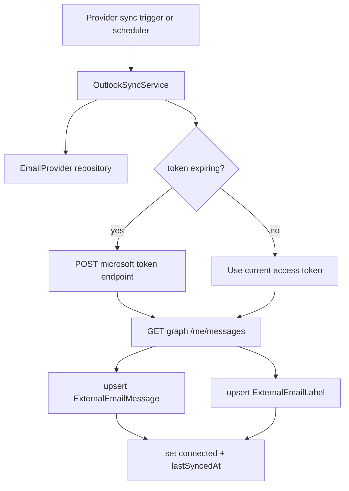

# Outlook Sync Module (Backend)

## Goal

Provide first-class Outlook ingestion into the unified inbox data store.

This module syncs Outlook provider messages into `ExternalEmailMessage` and
label metadata into `ExternalEmailLabel`, similar to Gmail sync.

## Responsibilities

- Validate provider ownership/type (`OUTLOOK` only)
- Refresh Outlook access tokens when near expiry
- Pull recent messages from Microsoft Graph
- Upsert message metadata for unified inbox rendering
- Upsert label metadata (`INBOX`, `UNREAD`, and category labels)
- Update provider sync lifecycle status (`syncing` -> `connected` / `error`)
- Run scheduled background sync for active Outlook providers

## Key files

- `outlook-sync.service.ts`
- `outlook-sync.scheduler.ts`
- `outlook-sync.module.ts`

## Graph API flow

## Environment variables

- `OUTLOOK_CLIENT_ID`
- `OUTLOOK_CLIENT_SECRET`

Used during refresh token exchange when access tokens expire.

## Notes

- Current sync strategy is recent-message pull (`$top=maxMessages`) with metadata sufficient for inbox list/detail hydration.
- Full incremental cursor strategy can be added later without changing the unified inbox contract.

