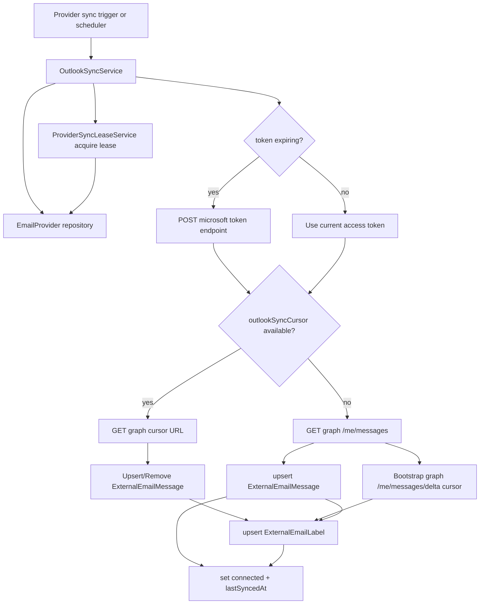

# Outlook Sync Module (Backend)

## Goal

Provide first-class Outlook ingestion into the unified inbox data store.

This module syncs Outlook provider messages into `ExternalEmailMessage` and
label metadata into `ExternalEmailLabel`, similar to Gmail sync.

## Responsibilities

- Validate provider ownership/type (`OUTLOOK` only)
- Refresh Outlook access tokens when near expiry
- Pull recent messages from Microsoft Graph
- Continue incremental sync from persisted Outlook delta cursor
- Process push webhook notifications for near-real-time sync triggers
- Upsert message metadata for unified inbox rendering
- Upsert label metadata (`INBOX`, `UNREAD`, and category labels)
- Process Outlook delta remove events by deleting stale external message rows
- Update provider sync lifecycle status (`syncing` -> `connected` / `error`)
- Run scheduled background sync for active Outlook providers

## Key files

- `outlook-sync.service.ts`
- `outlook-sync.scheduler.ts`
- `outlook-sync.module.ts`

## Scheduler hardening

`OutlookSyncScheduler` now includes provider-level lease/retry controls:

- DB lease via `email_providers.syncLeaseExpiresAt` (prevents duplicate workers)
- retry with backoff (`OUTLOOK_SYNC_SCHEDULER_RETRIES`, `OUTLOOK_SYNC_SCHEDULER_RETRY_BACKOFF_MS`)
- jitter (`OUTLOOK_SYNC_SCHEDULER_JITTER_MS`) to smooth burst traffic
- failure notifications include `attempts` and short error context
- sync lifecycle telemetry:
  - success updates `lastSyncedAt`
  - failures persist `lastSyncError` and `lastSyncErrorAt`
  - new sync attempts clear stale error state

## Graph API flow

## Environment variables

- `OUTLOOK_CLIENT_ID`
- `OUTLOOK_CLIENT_SECRET`
- `OUTLOOK_SYNC_DELTA_PAGE_LIMIT` (default `5`, clamped `1..20`)
  - limits number of delta pages processed in one sync run
- `OUTLOOK_PUSH_WEBHOOK_TOKEN` (optional shared secret query token for webhook endpoint)
- `OUTLOOK_PUSH_SYNC_MAX_MESSAGES` (default `25`, clamped `1..200`)

Used during refresh token exchange when access tokens expire.

## Notes

- Initial sync strategy remains recent-message pull (`$top=maxMessages`) for fast bootstrap.
- Incremental sync now persists `email_providers.outlookSyncCursor` and reuses it on later runs.
- Cursor may contain either `@odata.nextLink` (mid-pagination) or `@odata.deltaLink` (steady state).
- Push webhook endpoint:
  - `POST /outlook-sync/webhooks/push`
  - accepts `providerId` (query/body) or `emailAddress`/`userPrincipalName` payload hints
  - triggers lease-guarded sync for matching active Outlook providers
- Scheduler publishes `SYNC_FAILED` domain events through
  `NotificationEventBusService` with `providerId`, `providerType`, and
  `workspaceId` metadata for workspace-aware alerting.

