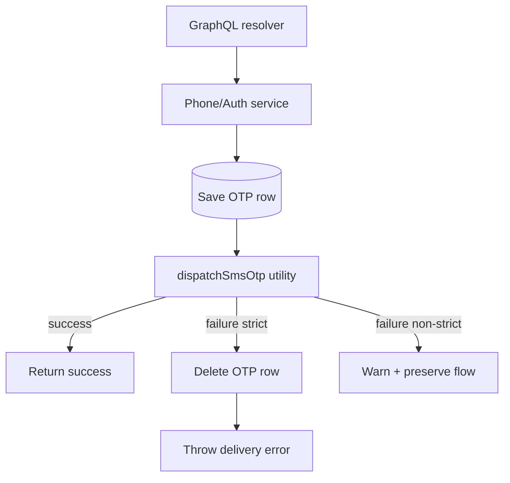

# Phone Module (Backend)

## Goal

Provide OTP-driven phone verification flows for authenticated users and phone-first signup.

## Responsibilities

- Persist phone OTP verification attempts (`phone_verifications`)
- Persist signup OTP verification attempts (`signup_verifications`)
- Dispatch OTP codes through configurable SMS providers
- Mark user phone state verified after successful OTP validation
- Apply safe failure compensation when SMS delivery fails (delete unusable OTP rows)

## GraphQL APIs

- `sendPhoneOtp(phoneNumber)` → dispatches OTP for authenticated user
- `verifyPhoneOtp(code)` → verifies OTP and marks phone verified
- `signupSendOtp(input)` (auth resolver) → phone-first signup OTP dispatch
- `signupVerify(input)` (auth resolver) → validates signup OTP and completes account creation

## Environment variables

- `MAILZEN_SMS_PROVIDER` (default `CONSOLE`)
  - supported: `CONSOLE`, `WEBHOOK`, `TWILIO`, `DISABLED`
- `MAILZEN_SMS_FALLBACK_PROVIDER` (optional)
  - supported fallback targets: `CONSOLE`, `WEBHOOK`, `TWILIO`
- `MAILZEN_SMS_STRICT_DELIVERY` (default `true` in production, otherwise `false`)
  - when `true`, SMS delivery failures reject the OTP mutation
- `MAILZEN_SMS_WEBHOOK_URL`
  - required when `MAILZEN_SMS_PROVIDER=WEBHOOK`
- `MAILZEN_SMS_WEBHOOK_TOKEN` (optional bearer token)
- `MAILZEN_SMS_WEBHOOK_TIMEOUT_MS` (default `5000`)
- `MAILZEN_SMS_WEBHOOK_SIGNING_KEY` (optional HMAC SHA256 signing key)
- `MAILZEN_SMS_TWILIO_ACCOUNT_SID`
  - required when `MAILZEN_SMS_PROVIDER=TWILIO`
- `MAILZEN_SMS_TWILIO_AUTH_TOKEN`
  - required when `MAILZEN_SMS_PROVIDER=TWILIO`
- `MAILZEN_SMS_TWILIO_FROM_NUMBER`
  - required when `MAILZEN_SMS_PROVIDER=TWILIO`
- `MAILZEN_SMS_TWILIO_API_BASE_URL` (default `https://api.twilio.com`)
- `MAILZEN_SMS_TWILIO_TIMEOUT_MS` (default `5000`)
- `MAILZEN_SMS_TWILIO_STATUS_CALLBACK_URL` (optional Twilio delivery callback)

## OTP delivery flow

