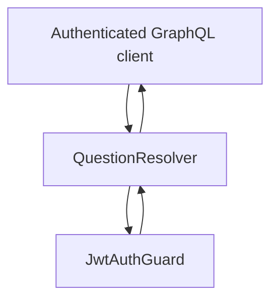

# Question Module

## Goal

Expose a guarded placeholder endpoint while Question-domain implementation is pending.

## Responsibilities

- Provide authenticated `questionModuleStatus` query
- Reserve module boundary for future Question domain services/entities

## GraphQL API

- `questionModuleStatus`: returns current module readiness status string

## Flow

## Notes

- This module is intentionally minimal and acts as a future expansion point.
