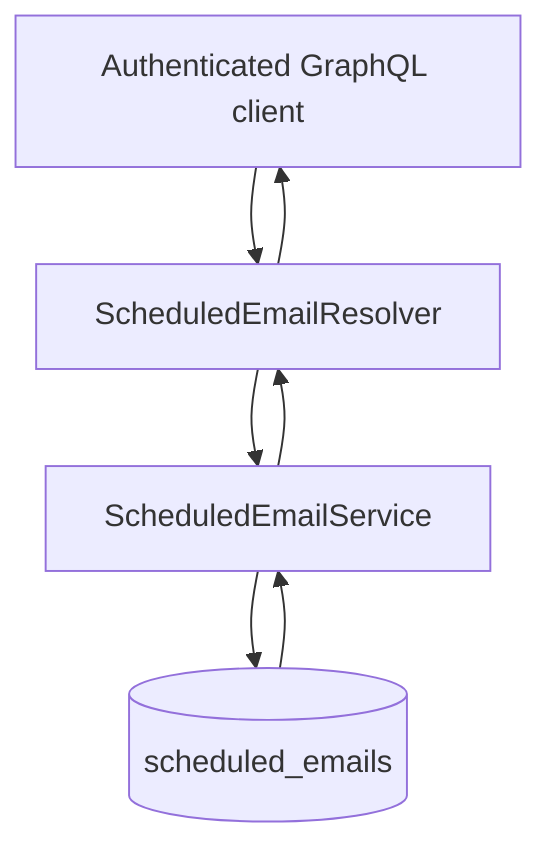

# Scheduled Email Module

## Goal

Manage authenticated users’ scheduled email records and expose create/list operations.

## Responsibilities

- Persist scheduled email rows (`scheduled_emails`)
- Scope all reads/writes by authenticated `userId`
- Store schedule metadata (`scheduledAt`, `status`, recipients)

## GraphQL API

- `getAllScheduledEmails`: list scheduled emails for authenticated user
- `createScheduledEmail(createScheduledEmailInput)`: create a scheduled email row

## Flow

## Notes

- Current module stores scheduling intent; delivery orchestration is handled elsewhere.
- `status` defaults to `PENDING` when omitted.
- Structured observability events:
  - `scheduled_email_create_start`
  - `scheduled_email_create_completed`
  - `scheduled_email_list_start`
  - `scheduled_email_list_completed`
