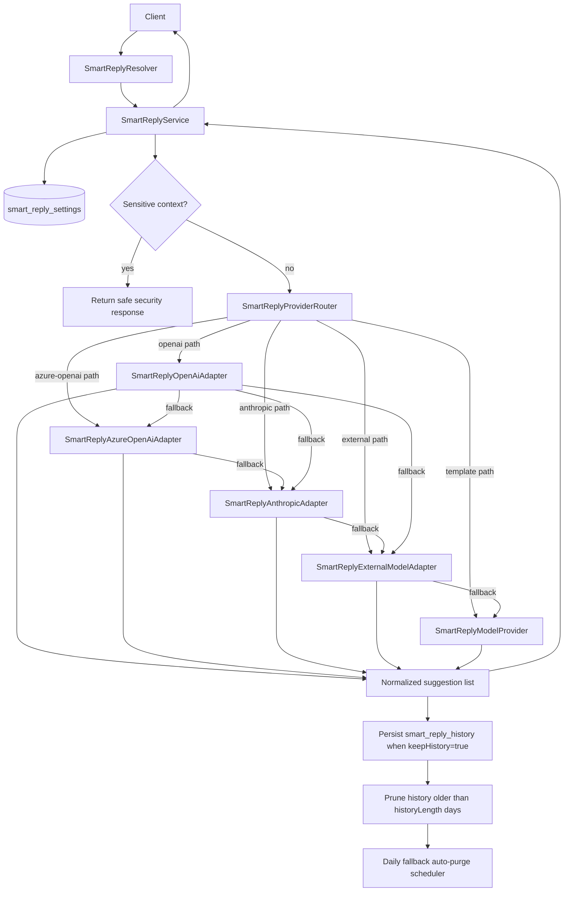

# Smart Replies Module

## Overview

The Smart Replies module provides AI-powered response suggestions for emails and conversations. It helps users respond to messages more efficiently by generating contextually relevant reply suggestions.

## Features

- **Deterministic Model-Provider Generation**: Generate stable, reproducible replies for identical inputs
- **Suggested Replies**: Get multiple suggested replies for an email
- **Context-Aware Responses**: Responses are tailored to the content of the message
- **Conversation Logging**: Store conversations for future training and improvement
- **History Persistence Controls**: Persist smart reply history per-user with retention controls (`keepHistory`, `historyLength`)
- **Safety Guardrails**: Sensitive credential-like content is blocked with a safe response

## Architecture

The Smart Replies module follows a clean architecture pattern with the following components:

- **SmartReplyService**: Core business logic for generating replies
- **SmartReplyModelProvider**: Deterministic model-provider abstraction used by service
- **SmartReplyOpenAiAdapter**: Optional OpenAI chat-completions adapter
- **SmartReplyAzureOpenAiAdapter**: Optional Azure OpenAI chat-completions adapter
- **SmartReplyAnthropicAdapter**: Optional Anthropic messages adapter
- **SmartReplyExternalModelAdapter**: Optional external LLM adapter with safe fallback
- **SmartReplyProviderRouter**: Configurable provider interface/router selecting
  template vs external generation strategy
- **SmartReplyResolver**: GraphQL API for exposing functionality
- **DTOs**: Data Transfer Objects for input validation
- **TypeORM Integration**: Database-backed settings and conversation-related persistence
  - `smart_reply_settings`
  - `smart_reply_history`

## Flow



## External adapter flags

- `SMART_REPLY_USE_AGENT_PLATFORM` (`true/false`, default `false`)
- `SMART_REPLY_USE_OPENAI` (`true/false`, default `false`)
- `SMART_REPLY_OPENAI_API_KEY` (required when `SMART_REPLY_USE_OPENAI=true`)
- `SMART_REPLY_OPENAI_MODEL` (default `gpt-4o-mini`)
- `SMART_REPLY_OPENAI_BASE_URL` (default `https://api.openai.com/v1`)
- `SMART_REPLY_OPENAI_TIMEOUT_MS` (default `4500`)
- `SMART_REPLY_USE_AZURE_OPENAI` (`true/false`, default `false`)
- `SMART_REPLY_AZURE_OPENAI_API_KEY` (required when `SMART_REPLY_USE_AZURE_OPENAI=true`)
- `SMART_REPLY_AZURE_OPENAI_ENDPOINT` (e.g. `https://<resource>.openai.azure.com`)
- `SMART_REPLY_AZURE_OPENAI_DEPLOYMENT` (deployment name for chat completions)
- `SMART_REPLY_AZURE_OPENAI_API_VERSION` (default `2024-08-01-preview`)
- `SMART_REPLY_AZURE_OPENAI_TIMEOUT_MS` (default `4500`)
- `SMART_REPLY_USE_ANTHROPIC` (`true/false`, default `false`)
- `SMART_REPLY_ANTHROPIC_API_KEY` (required when `SMART_REPLY_USE_ANTHROPIC=true`)
- `SMART_REPLY_ANTHROPIC_MODEL` (default `claude-3-5-haiku-latest`)
- `SMART_REPLY_ANTHROPIC_BASE_URL` (default `https://api.anthropic.com/v1`)
- `SMART_REPLY_ANTHROPIC_TIMEOUT_MS` (default `4500`)
- `SMART_REPLY_ANTHROPIC_MAX_TOKENS` (default `320`)
- `SMART_REPLY_HYBRID_PRIMARY` (`openai|azure_openai|anthropic|agent_platform`, default `openai`)
- `SMART_REPLY_PROVIDER_MODE` (`hybrid|template|agent_platform|openai|azure_openai|anthropic`, default `hybrid`)
- `SMART_REPLY_EXTERNAL_TIMEOUT_MS` (default `3000`)
- `MAILZEN_SMART_REPLY_HISTORY_AUTOPURGE_ENABLED` (`true/false`, default `true`)
- `MAILZEN_SMART_REPLY_HISTORY_RETENTION_DAYS` (default `365`, clamped `1..3650`)
- Reuses `AI_AGENT_PLATFORM_URL` and optional `AI_AGENT_PLATFORM_KEY`.
- Structured retention scheduler events:
  - `smart_reply_retention_autopurge_disabled`
  - `smart_reply_retention_autopurge_start`
  - `smart_reply_retention_autopurge_completed`
  - `smart_reply_retention_autopurge_failed`

## Observability events

- Smart reply service events:
  - `smart_reply_generate_started`
  - `smart_reply_generate_disabled`
  - `smart_reply_generate_sensitive_blocked`
  - `smart_reply_generate_no_suggestions`
  - `smart_reply_generate_failed`
  - `smart_reply_suggestions_disabled`
  - `smart_reply_suggestions_sensitive_blocked`
  - `smart_reply_suggestions_failed`
  - `smart_reply_history_persisted`
  - `smart_reply_history_persist_failed`
- Provider router events:
  - `smart_reply_provider_mode_invalid_fallback`
  - `smart_reply_provider_selected`
  - `smart_reply_provider_empty_response`
  - `smart_reply_provider_selected_template_fallback`
- External provider adapter events:
  - OpenAI: `smart_reply_openai_skipped_missing_api_key`,
    `smart_reply_openai_completed`, `smart_reply_openai_failed_fallback`
  - Azure OpenAI: `smart_reply_azure_openai_skipped_missing_api_key`,
    `smart_reply_azure_openai_skipped_missing_endpoint`,
    `smart_reply_azure_openai_completed`,
    `smart_reply_azure_openai_failed_fallback`
  - Anthropic: `smart_reply_anthropic_skipped_missing_api_key`,
    `smart_reply_anthropic_completed`,
    `smart_reply_anthropic_failed_fallback`
  - Agent platform: `smart_reply_external_completed`,
    `smart_reply_external_failed_fallback`
  - Template provider: `smart_reply_template_generated`

## API

### GraphQL Queries

#### Generate Smart Reply

```graphql
query {
  generateSmartReply(
    input: {
      conversation: "Hello, I'm interested in your product. Can you tell me more about pricing?"
    }
  )
}
```

Returns a single smart reply string.

#### Get Suggested Replies

```graphql
query {
  getSuggestedReplies(
    emailBody: "When can we schedule a meeting to discuss the project?"
    count: 3
  )
}
```

Returns an array of suggested reply strings.

#### My Smart Reply History

```graphql
query {
  mySmartReplyHistory(limit: 20) {
    id
    conversationPreview
    suggestions
    source
    blockedSensitive
    fallbackUsed
    createdAt
  }
}
```

Returns user-scoped smart-reply generation history rows.

#### Purge My Smart Reply History

```graphql
mutation {
  purgeMySmartReplyHistory {
    purgedRows
    executedAtIso
  }
}
```

Purges all smart-reply history records for the authenticated user.

#### My Smart Reply Data Export

```graphql
query {
  mySmartReplyDataExport(limit: 200) {
    generatedAtIso
    dataJson
  }
}
```

Returns a JSON snapshot containing settings, retention policy, and recent history rows.

#### My Smart Reply Provider Health

```graphql
query {
  mySmartReplyProviderHealth {
    mode
    hybridPrimary
    providers {
      providerId
      enabled
      configured
      priority
      note
    }
    executedAtIso
  }
}
```

Returns runtime provider-mode routing readiness for OpenAI / Azure OpenAI /
Anthropic / agent-platform / template fallback.

## Operational runbook: smart reply history

1. Validate settings via `smartReplySettings`:
   - `keepHistory=true`
   - `historyLength` set to expected retention window (days)
2. Trigger generation with `generateSmartReply` or `getSuggestedReplies`.
3. Verify persisted rows in `mySmartReplyHistory(limit)`.
4. If records exceed retention policy:
   - verify history pruning by creating test rows older than retention cutoff
   - or run `purgeMySmartReplyHistory` for user-requested data deletion.
5. Verify scheduler fallback:
   - ensure `MAILZEN_SMART_REPLY_HISTORY_AUTOPURGE_ENABLED=true`
   - check logs for `smart_reply_retention_autopurge_*` events
   - tune `MAILZEN_SMART_REPLY_HISTORY_RETENTION_DAYS` for global retention policy.

## Usage

1. Import the `SmartReplyModule` in your application module:

```typescript
import { Module } from '@nestjs/common';
import { SmartReplyModule } from './smart-replies/smart-reply.module';

@Module({
  imports: [SmartReplyModule],
})
export class AppModule {}
```

2. Inject the `SmartReplyService` in your service or controller:

```typescript
import { Injectable } from '@nestjs/common';
import { SmartReplyService } from '../smart-replies/smart-reply.service';

@Injectable()
export class EmailService {
  constructor(private readonly smartReplyService: SmartReplyService) {}

  async processEmail(emailBody: string, userId: string) {
    const suggestedReplies = await this.smartReplyService.getSuggestedReplies(
      emailBody,
      3,
      userId,
    );
    // Use the suggested replies
  }
}
```

## Future Enhancements

- Additional LLM adapters (self-hosted local models / Gemini) behind provider interface
- User feedback mechanism to improve reply quality
- Personalization based on user communication style
- Multi-language support
- Sentiment analysis for more appropriate responses

## Dependencies

- NestJS framework
- TypeORM
- GraphQL
- Class Validator
