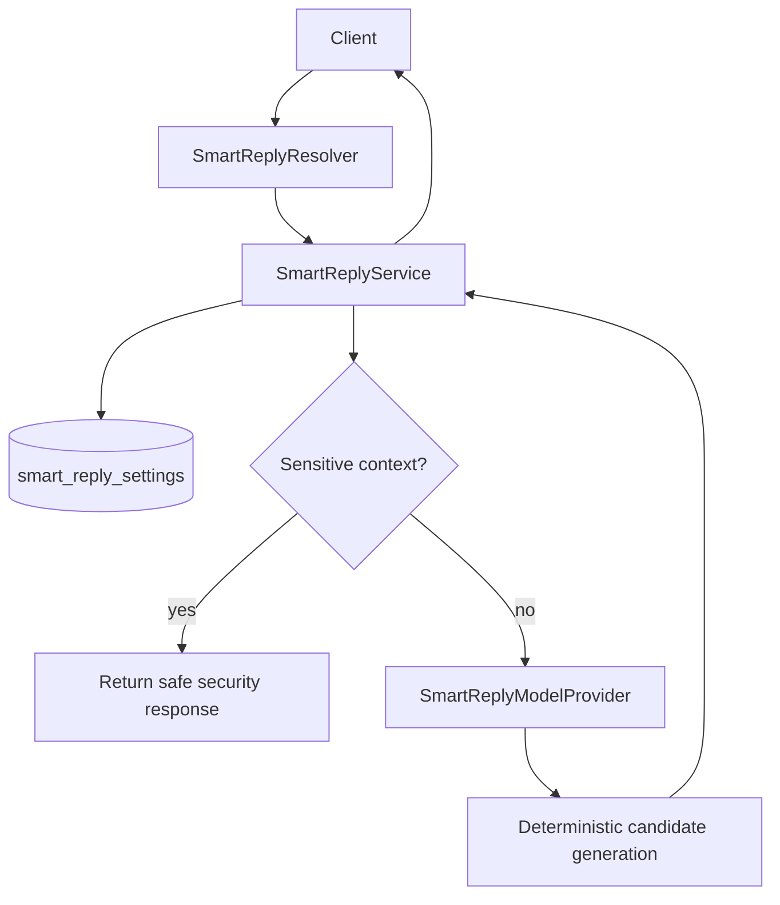

# Smart Replies Module

## Overview

The Smart Replies module provides AI-powered response suggestions for emails and conversations. It helps users respond to messages more efficiently by generating contextually relevant reply suggestions.

## Features

- **Deterministic Model-Provider Generation**: Generate stable, reproducible replies for identical inputs
- **Suggested Replies**: Get multiple suggested replies for an email
- **Context-Aware Responses**: Responses are tailored to the content of the message
- **Conversation Logging**: Store conversations for future training and improvement
- **Safety Guardrails**: Sensitive credential-like content is blocked with a safe response

## Architecture

The Smart Replies module follows a clean architecture pattern with the following components:

- **SmartReplyService**: Core business logic for generating replies
- **SmartReplyModelProvider**: Deterministic model-provider abstraction used by service
- **SmartReplyResolver**: GraphQL API for exposing functionality
- **DTOs**: Data Transfer Objects for input validation
- **TypeORM Integration**: Database-backed settings and conversation-related persistence

## Flow



## API

### GraphQL Queries

#### Generate Smart Reply

```graphql
query {
  generateSmartReply(input: {
    conversation: "Hello, I'm interested in your product. Can you tell me more about pricing?"
  })
}
```

Returns a single smart reply string.

#### Get Suggested Replies

```graphql
query {
  getSuggestedReplies(
    emailBody: "When can we schedule a meeting to discuss the project?",
    count: 3
  )
}
```

Returns an array of suggested reply strings.

## Usage

1. Import the `SmartReplyModule` in your application module:

```typescript
import { Module } from '@nestjs/common';
import { SmartReplyModule } from './smart-replies/smart-reply.module';

@Module({
  imports: [SmartReplyModule],
})
export class AppModule {}
```

2. Inject the `SmartReplyService` in your service or controller:

```typescript
import { Injectable } from '@nestjs/common';
import { SmartReplyService } from '../smart-replies/smart-reply.service';

@Injectable()
export class EmailService {
  constructor(private readonly smartReplyService: SmartReplyService) {}

  async processEmail(emailBody: string, userId: string) {
    const suggestedReplies = await this.smartReplyService.getSuggestedReplies(
      emailBody,
      3,
      userId,
    );
    // Use the suggested replies
  }
}
```

## Future Enhancements

- External LLM provider adapter (OpenAI/Anthropic/Azure OpenAI) behind provider interface
- User feedback mechanism to improve reply quality
- Personalization based on user communication style
- Multi-language support
- Sentiment analysis for more appropriate responses

## Dependencies

- NestJS framework
- TypeORM
- GraphQL
- Class Validator 