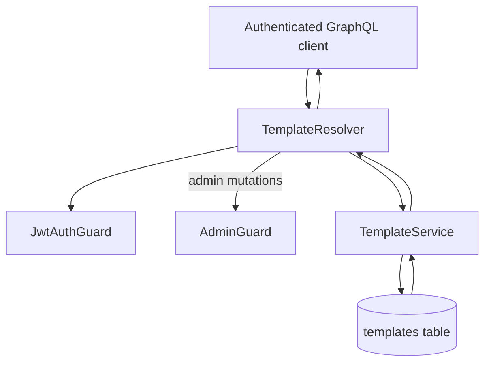

# Template Module

## Goal

Provide reusable email templates with admin-managed CRUD operations.

## Responsibilities

- Persist template catalog in Postgres (`templates` table)
- Expose authenticated read operations
- Scope template reads/mutations by authenticated actor user ownership
- Restrict create/update/delete operations to admin users

## GraphQL API

- `getAllTemplates`
- `getTemplate(id)`
- `createTemplate(createTemplateInput)` (admin-only)
- `updateTemplate(updateTemplateInput)` (admin-only)
- `deleteTemplate(id)` (admin-only)

## Flow

## Notes

- Template persistence uses TypeORM repository storage with per-user ownership scoping.
- Service rejects missing actor IDs to avoid unscoped template reads.
- Structured observability events:
  - `template_create_start`
  - `template_create_completed`
  - `template_list_completed`
  - `template_get_missing`
  - `template_update_start`
  - `template_update_completed`
  - `template_delete_start`
  - `template_delete_missing`
  - `template_delete_completed`
  - `template_audit_log_write_failed`

## Compliance / Audit Trail

- Persisted audit actions:
  - `template_created`
  - `template_updated`
  - `template_deleted`
