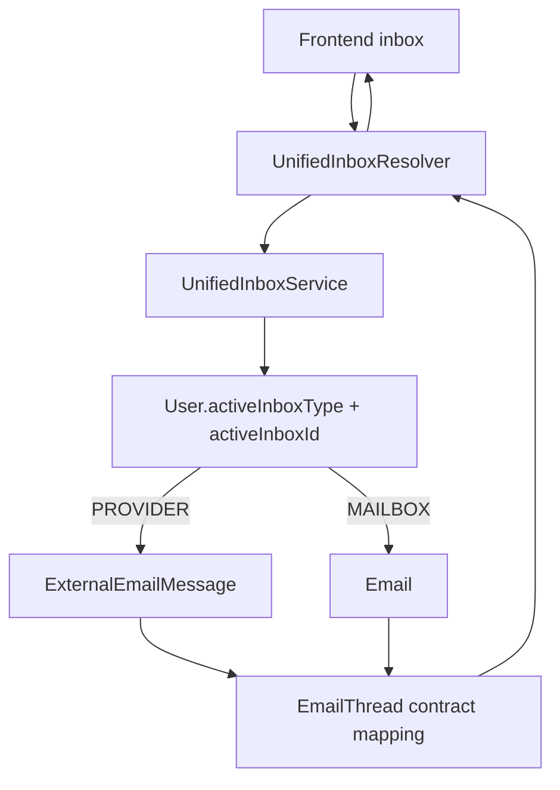
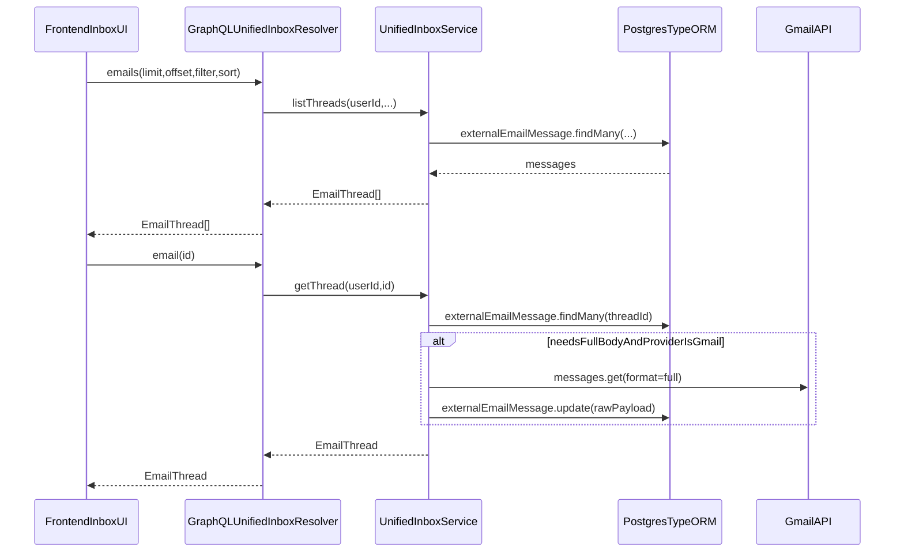
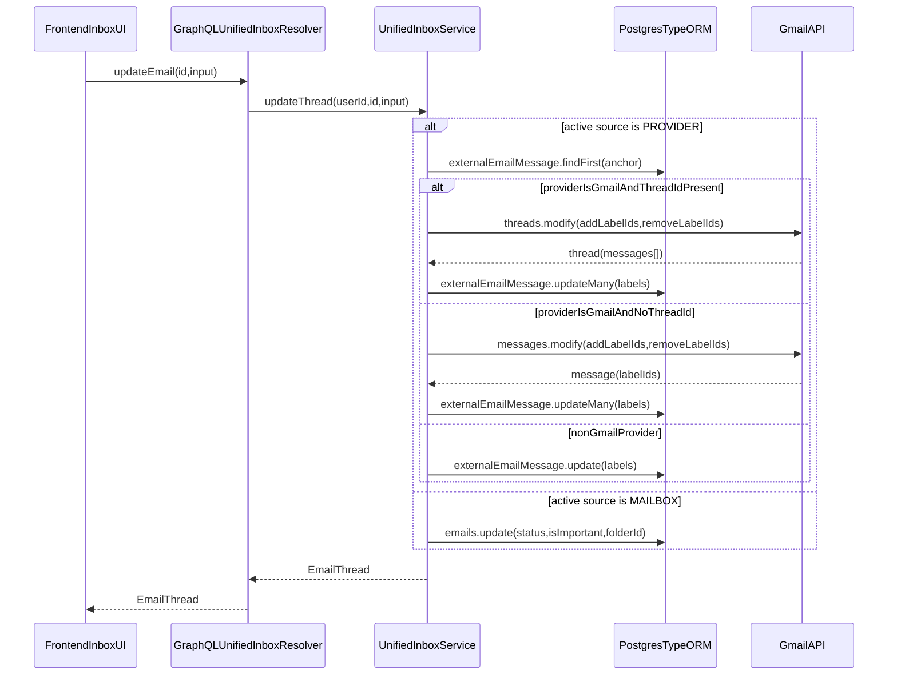

# Unified Inbox Module (Backend)

## Goal

Expose a **Gmail-like inbox contract** to the frontend while using a single, consistent backend source of truth across:

- external provider messages
- MailZen mailbox-sourced internal messages

- Provider sync stores inbound messages in **`ExternalEmailMessage`** (TypeORM entity).
- Mailbox-aware reads map internal `Email` rows (where active inbox type is `MAILBOX`) into the same `EmailThread` GraphQL contract.
- Inbox UI reads via GraphQL **`emails/email/updateEmail/folders/labels`**.
- Actions (read/star/archive/trash/labels) call **Gmail APIs** (for Gmail providers) and persist label state locally.

## GraphQL API (frontend contract)

These names intentionally match the frontend inbox UI (`apps/frontend/lib/apollo/queries/emails.ts`).

### Queries

- **`emails(limit, offset, filter, sort): [EmailThread!]!`**
  - Thread-shaped list records (what the inbox list UI needs).
  - Resolves active inbox source from `User.activeInboxType/activeInboxId`:
    - `PROVIDER` -> uses `ExternalEmailMessage`
    - `MAILBOX` -> uses internal `Email` rows filtered by mailbox address participation
  - Fallback order: active provider -> newest provider -> newest mailbox.

- **`email(id: ID!): EmailThread!`**
  - Provider mode:
    - `id` is treated as provider thread id (`threadId`) or provider message id fallback
    - lazily hydrates Gmail message bodies (`format=full`) and caches payload in `ExternalEmailMessage.rawPayload`
  - Mailbox mode:
    - `id` maps to internal `Email.id`
    - returned as one-message thread to keep frontend contract consistent.

- **`folders: [EmailFolder!]!`**
  - Provider mode: counts derived from provider labels.
  - Mailbox mode: counts derived from internal email status/from-to mapping.

- **`labels: [EmailLabel!]!`**
  - Provider mode: non-system provider labels with counts, metadata from `ExternalEmailLabel`.
  - Mailbox mode: lightweight label list derived from `Email.folderId` counts.

### Mutations

- **`updateEmail(id: ID!, input: EmailUpdateInput!): EmailThread!`**
  - Gmail providers: calls Gmail `threads.modify` / `messages.modify` with retry/backoff.
  - Non-Gmail providers: updates local labels only (best-effort / MVP).
  - Mailbox mode: updates internal `Email.status`, `Email.isImportant`, and lightweight `folderId` label mapping.

## Folder & label mapping (Gmail)

Folders are derived from Gmail system labels:
- `INBOX` → `inbox`
- `SENT` → `sent`
- `TRASH` → `trash`
- `SPAM` → `spam`
- (none of the above) → `archive`

Read/star state:
- unread = label `UNREAD`
- starred = label `STARRED`

## Mailbox folder mapping (internal email rows)

- `status=DRAFT` -> `drafts`
- `status=TRASH` -> `trash`
- `status=SPAM` -> `spam`
- `status=ARCHIVED` -> `archive`
- `from=<active-mailbox-address>` -> `sent`
- default -> `inbox`

Read/star state:
- unread = `status in [UNREAD, NEW]`
- starred = `isImportant=true`

## Security / authz

Every operation is **user-scoped**:
- active provider/mailbox must belong to the authenticated user
- provider message queries are filtered by `userId` + `providerId`
- mailbox message queries are filtered by `userId` + mailbox address participation

## Mermaid: inbox source resolution

## Mermaid: provider inbox list/detail

## Mermaid: action mutation (provider + mailbox)

## Changelog

- 2026-02-15:
  - Added mailbox-source support in `UnifiedInboxService` so active `MAILBOX` inboxes return real thread data from internal `Email` rows.
  - Added mailbox-mode folder/label/read/star mapping while preserving existing provider behavior.
  - Added unit tests for mailbox thread listing and mailbox action updates.

