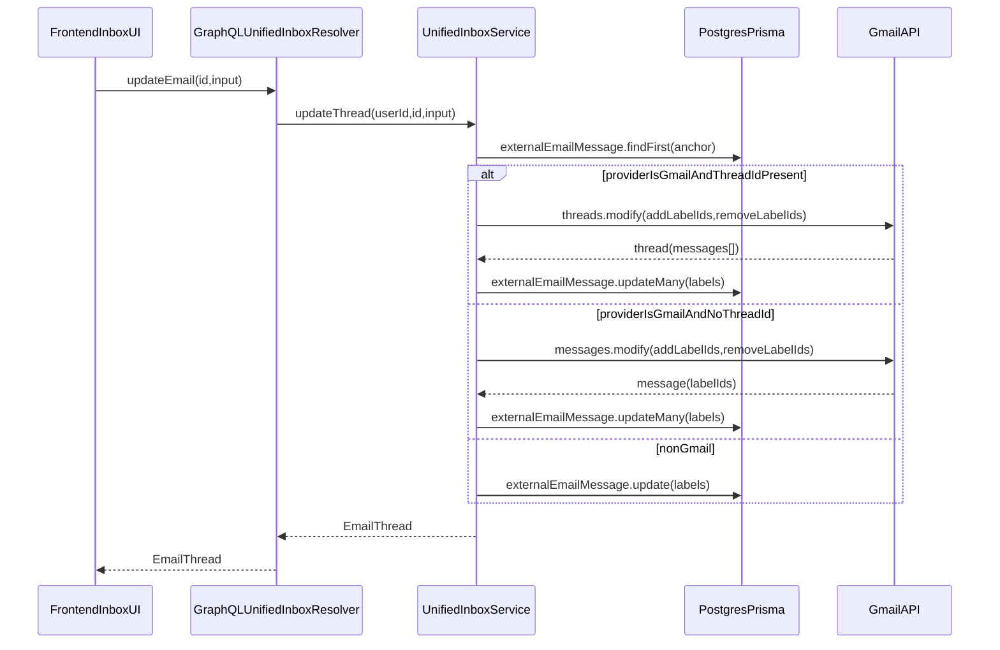

# Unified Inbox Module (Backend)

## Goal

Expose a **Gmail-like inbox contract** to the frontend while using a single, consistent backend source of truth for provider messages.

- Provider sync stores inbound messages in **`ExternalEmailMessage`** (Prisma).
- Inbox UI reads via GraphQL **`emails/email/updateEmail/folders/labels`**.
- Actions (read/star/archive/trash/labels) call **Gmail APIs** (for Gmail providers) and persist label state locally.

## GraphQL API (frontend contract)

These names intentionally match the frontend inbox UI (`apps/frontend/lib/apollo/queries/emails.ts`).

### Queries

- **`emails(limit, offset, filter, sort): [EmailThread!]!`**
  - Thread-shaped list records (what the inbox list UI needs).
  - Uses **active provider inbox** (`User.activeInboxType/activeInboxId`), with fallback to the newest provider.

- **`email(id: ID!): EmailThread!`**
  - `id` is treated as a provider thread id (Gmail `threadId`) or message id fallback.
  - Lazily hydrates Gmail message bodies (format `full`) and caches payload in `ExternalEmailMessage.rawPayload`.

- **`folders: [EmailFolder!]!`**
  - Returns folder counts derived from provider message labels.

- **`labels: [EmailLabel!]!`**
  - Returns provider labels (non-system) with counts.
  - Label metadata (name/color) comes from `ExternalEmailLabel` (synced from provider).

### Mutations

- **`updateEmail(id: ID!, input: EmailUpdateInput!): EmailThread!`**
  - Gmail providers: calls Gmail `threads.modify` / `messages.modify` with retry/backoff.
  - Non-Gmail: updates local labels only (best-effort / MVP).

## Folder & label mapping (Gmail)

Folders are derived from Gmail system labels:
- `INBOX` → `inbox`
- `SENT` → `sent`
- `TRASH` → `trash`
- `SPAM` → `spam`
- (none of the above) → `archive`

Read/star state:
- unread = label `UNREAD`
- starred = label `STARRED`

## Security / authz

Every operation is **user-scoped**:
- active provider must belong to the authenticated user
- message queries are filtered by `userId` + `providerId`

## Mermaid: inbox list/detail

## Mermaid: action mutation (read/star/archive/labels)

