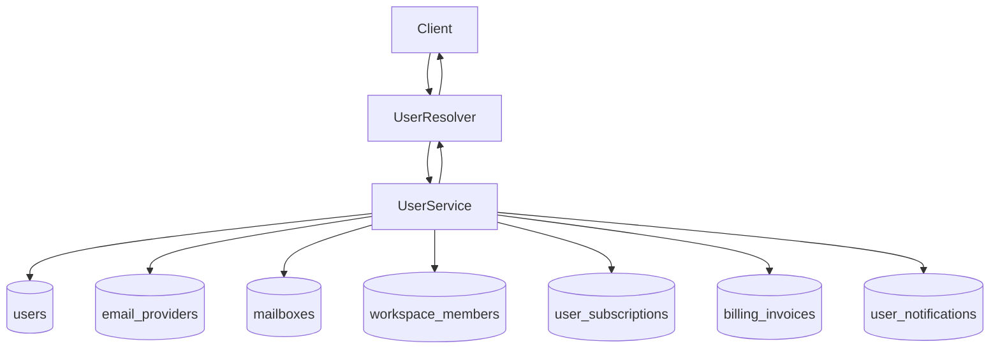

# User Module (Backend)

## Goal

Manage user identity records, profile updates, admin CRUD operations, and
compliance-friendly account data exports.

## Responsibilities

- Create users with hashed passwords
- Validate login credentials with lockout tracking
- Update user profile data with email uniqueness checks
- Provide admin-only user listing and lookup
- Export authenticated user account data snapshot for legal/compliance requests

## GraphQL API

- `users` (admin): list users
- `user(id)` (admin): get single user
- `createUser(createUserInput)` (admin): create user
- `updateUser(updateUserInput)` (admin): update user
- `myAccountDataExport`: export current user account data JSON snapshot

## Flow

## Notes

- Export payload intentionally includes metadata only (no provider tokens or
  encrypted secrets).
- Export is designed for legal portability requests and operational audits.
