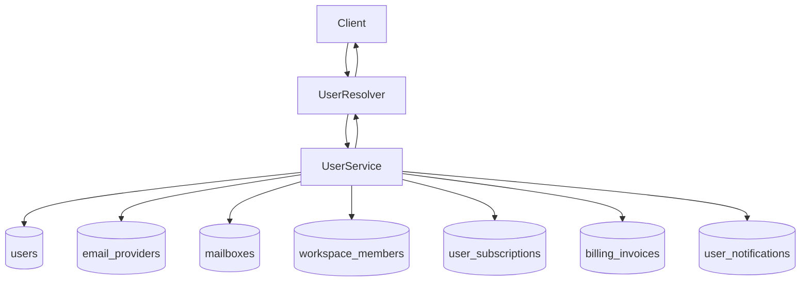

# User Module (Backend)

## Goal

Manage user identity records, profile updates, admin CRUD operations, and
compliance-friendly account data exports.

## Responsibilities

- Create users with hashed passwords
- Validate login credentials with lockout tracking
- Update user profile data with email uniqueness checks
- Provide admin-only user listing and lookup
- Export authenticated user account data snapshot for legal/compliance requests

## GraphQL API

- `users` (admin): list users
- `user(id)` (admin): get single user
- `createUser(createUserInput)` (admin): create user
- `updateUser(updateUserInput)` (admin): update user
- `myAccountDataExport`: export current user account data JSON snapshot
- `userAccountDataExport(id)` (admin): export target user account data snapshot

## Flow

## Notes

- Export payload intentionally includes metadata only (no provider tokens or
  encrypted secrets).
- Export is designed for legal portability requests and operational audits.
- `UserService` emits structured observability logs for user lifecycle actions:
  - `user_create_start`
  - `user_create_conflict_email_exists`
  - `user_create_completed`
  - `user_validate_start`
  - `user_validate_missing_or_passwordless`
  - `user_validate_locked_out`
  - `user_validate_invalid_password`
  - `user_validate_lockout_applied`
  - `user_validate_success`
  - `user_get_by_id_start`
  - `user_get_by_id_missing`
  - `user_list_start`
  - `user_list_completed`
  - `user_update_start`
  - `user_update_completed`
  - `user_data_export_start`
  - `user_data_export_completed`
  - `user_data_export_admin_start`
  - `user_data_export_admin_completed`
- Email inputs are logged as irreversible fingerprints to avoid exposing PII.

## Compliance / Audit Trail

- Uses shared `AuditLog` persistence for authentication and account lifecycle
  events.
- Structured warning event:
  - `user_audit_log_write_failed`
- Persisted audit actions:
  - `LOGIN_FAILED`
  - `LOGIN_LOCKED`
  - `LOGIN_SUCCESS`
  - `user_registered`
  - `user_profile_updated`
  - `user_data_export_requested`
  - `user_data_export_requested_by_admin`
