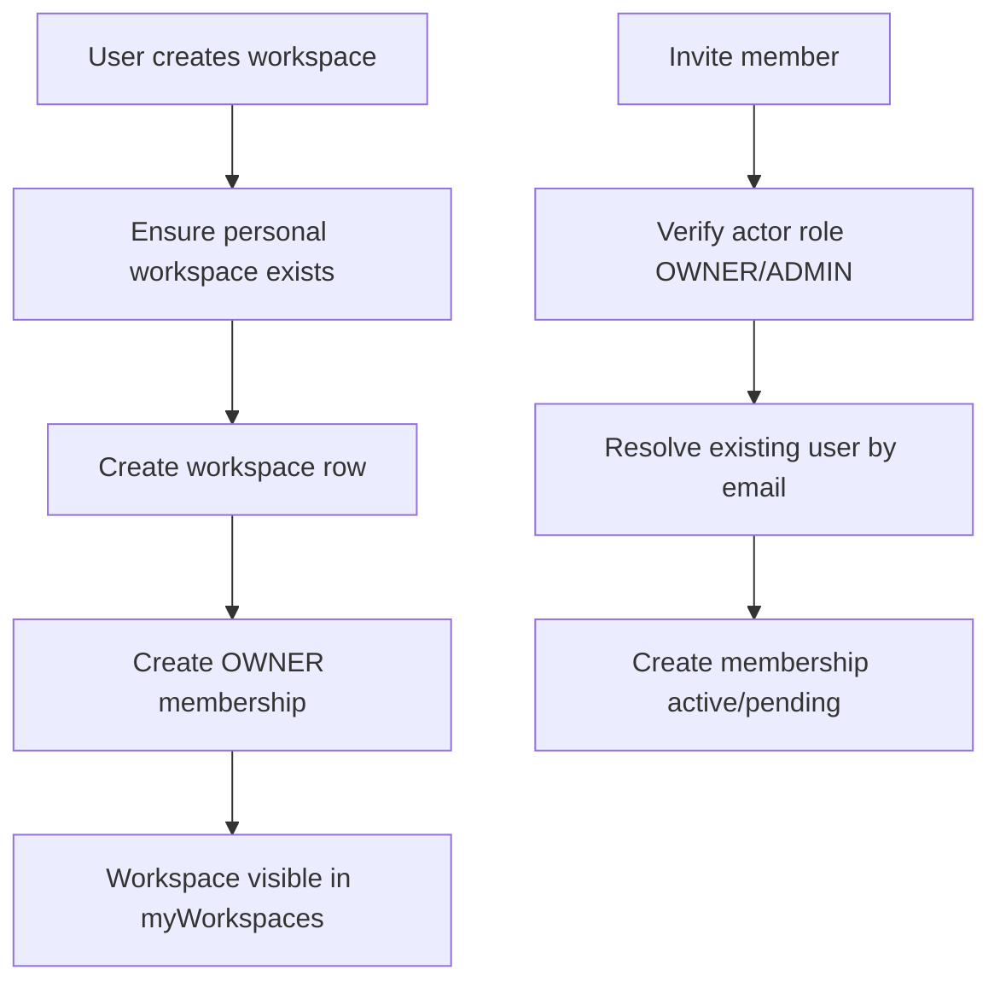

# Workspace Module

## Goal

Provide a foundational multi-tenant workspace/team model for future RBAC and
organization features.

## Responsibilities

- Create and list user workspaces
- Auto-provision personal workspace for each user
- Track workspace members with role and invitation status
- Enforce membership access checks for member listing/invites
- Enforce billing entitlement limits for workspace count

## GraphQL Surface

- `myWorkspaces`: list workspaces for authenticated user
- `createWorkspace(name)`: create team workspace
- `workspaceMembers(workspaceId)`: list members for workspace
- `inviteWorkspaceMember(workspaceId, email, role?)`: add/invite a member

## Data Model

- `workspaces`
  - owner, slug, personal/team indicator
- `workspace_members`
  - workspace membership, role, status, invited-by metadata

## Flow

