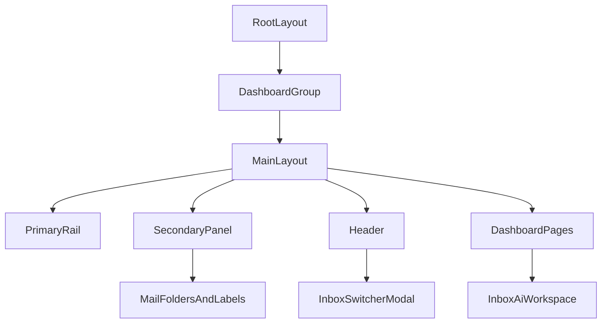

# Dashboard routes (`apps/frontend/app/(dashboard)`)

This route group contains all authenticated dashboard pages and renders inside
`apps/frontend/components/layout/MainLayout.tsx`.

## Page scaffolding convention

- Standard pages should use `DashboardPageShell` for consistent title,
  description, action, and content spacing.
- Full-height mail views (`inbox`, `sent`, `archive`, `trash`) should rely on
  `MainLayout` for shell chrome and use page space for list/detail content.

## Key routes

- `page.tsx`: Dashboard overview
- `inbox/page.tsx`: Inbox list + preview/detail
- `sent/page.tsx`: Sent list + preview/detail
- `archive/page.tsx`: Archive list + detail panels
- `trash/page.tsx`: Trash list + detail panels
- `email-providers/page.tsx`: Provider management
- `filters/page.tsx`: Filter automation
- `contacts/page.tsx`: Contacts manager
- `warmup/page.tsx`: Warmup controls and metrics
- `settings/billing/page.tsx`: Plan catalog and subscription controls
- `settings/workspaces/page.tsx`: Workspace and member management skeleton
- `settings/smart-replies/page.tsx`: Smart reply settings
- `settings/notifications/page.tsx`: Notification channel preferences
- `design-system/page.tsx`: Design system showcase

## Navigation behavior

- Global nav is now double-layered:
  - Primary icon rail
  - Secondary contextual panel
- Mail folder navigation is centralized in shell.
- `inbox` and `sent` no longer mount their own sidebar navigation component.
- Header includes an inbox switcher modal for mailbox/provider source selection.

## Inbox AI workspace

- `inbox/page.tsx` includes a docked (desktop) and sheet-based (mobile) AI
  workspace panel.
- Current connected agent capabilities (existing backend only):
  - reply suggestions (`getSuggestedReplies`)
  - generated reply draft (`generateSmartReply`)
  - smart-reply settings awareness (`smartReplySettings`)
  - template agent with graceful fallback if template query is unavailable.

## Flowchart

## Changelog

- 2026-02-15: Added mailbox inbound hourly trend visualization support on the
  dashboard health card.
- 2026-02-15: Expanded notification settings with mailbox inbound status
  toggles (accepted/deduplicated/rejected).
- 2026-02-15: Added dashboard-level mailbox inbound health snapshot card with
  24h accepted/deduplicated/rejected telemetry summary.
- 2026-02-15: Enhanced email provider management with mailbox inbound
  observability filters and event timeline telemetry.
- 2026-02-14: Migrated dashboard pages to shared scaffold patterns and removed
  duplicated page-level sidebars from mail routes.
- 2026-02-14: Hardened mail-page responsive layouts (Sent/Archive/Trash), added
  inbox switch modal, and introduced inbox AI workspace panel.
