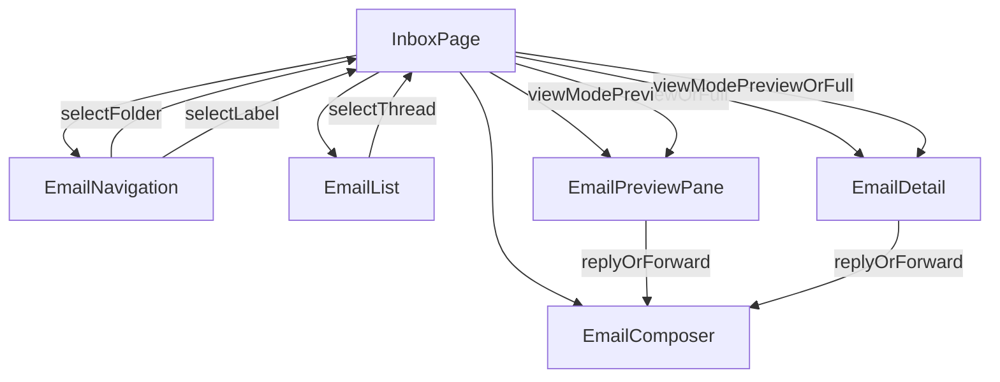

# Email module (`apps/frontend/components/email`)

This module contains the **core mail experience**: inbox navigation, thread list, preview/detail reading, and the composer.

## High-level UX goals
- **Premium glass panels**: inbox is presented as a 3-panel layout (navigation + list + content) with consistent spacing and surfaces.
- **Fast interactions**: selection, starring, batch actions, and view toggles are designed to feel snappy (subtle motion, minimal layout shift).
- **Accessibility**: keyboard shortcuts and Dialog semantics (for composer and mobile nav) are kept intact.

## Where the inbox route is composed
- **Route**: `apps/frontend/app/(dashboard)/inbox/page.tsx`
- **Panels**:
  - Left: `EmailNavigation`
  - Middle: `EmailList`
  - Right: `EmailPreviewPane` or `EmailDetail`
  - Modal: `EmailComposer`

## Key components
- **`EmailNavigation.tsx`**\n  Folder + label navigation. Exposes an optional `onCompose` handler.\n  Used in two contexts:\n  - Desktop left panel\n  - Mobile Dialog (opened from the inbox toolbar)\n
- **`EmailList.tsx`**\n  Thread list with search, batch selection mode, sorting, pagination.\n  Emits selection via `onSelectThread`.\n
- **`EmailThreadItem.tsx`**\n  Single thread row (unread styling, star toggle, labels preview).\n
- **`EmailPreviewPane.tsx`**\n  Lightweight reading view (preview) used for quick triage.\n
- **`EmailDetail.tsx`**\n  Full thread view (multi-message) with sanitized HTML rendering and attachments.\n
- **`EmailComposer.tsx`**\n  Compose / reply / forward modal.\n  Uses `Dialog` for correct focus trapping + ESC/overlay close.\n  Includes dev-only logs for send lifecycle and scheduling.\n
## Data + interaction flow

## Mobile behavior notes
- On small screens, `EmailNavigation` is opened via a `Dialog` from the inbox toolbar (folders/labels button).\n  This keeps the 3-panel layout clean on desktop while staying usable on mobile.

## Debugging
- **Development-only logs** are emitted from:\n  - `EmailComposer` (open/close, send start/end, schedule set/clear, attachment changes)\n  - `MainLayout` (route changes, sidebar toggles)\n
