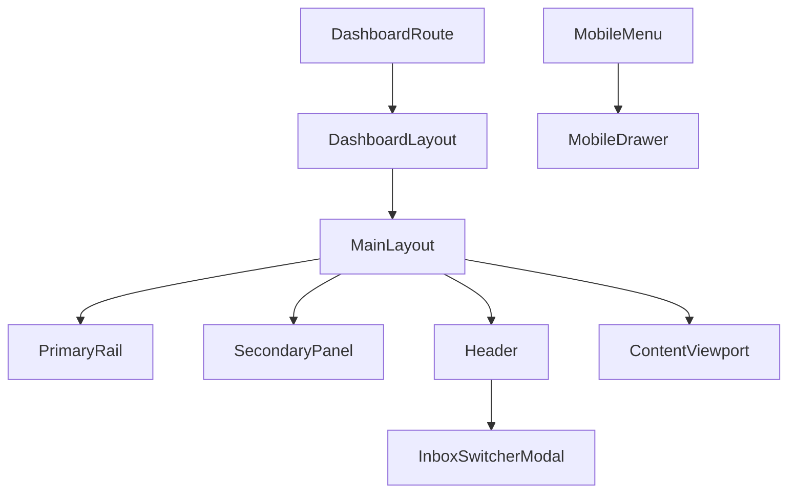

# Layout module (`apps/frontend/components/layout`)

This module contains the dashboard shell for MailZen. The shell now uses a
modern two-level navigation system:

- Primary icon rail (left)
- Contextual secondary panel (section-specific options)
- Header + route-animated content viewport
- Single mobile drawer behavior

## Components

- `MainLayout.tsx`
  - Owns mobile drawer open/close state
  - Preserves mailbox alias onboarding guard (`MY_MAILBOXES_QUERY`)
  - Renders `Sidebar`, `Header`, and route-animated page content
- `Sidebar.tsx`
  - Desktop: primary icon rail + secondary context panel
  - Mobile: unified `Sheet` drawer (no stacked sidebars)
  - Mail section renders `EmailNavigation` centrally
- `Header.tsx`
  - Top navigation bar (mobile menu toggle, search, notifications, theme, account)
  - Includes inbox switcher modal trigger for multi-address inbox selection
  - Notification bell now reads real backend notification feed (`myNotifications`)
    and unread count (`myUnreadNotificationCount`), and marks notifications
    read via `markNotificationRead`
  - Notification feed is scoped to active workspace context when selected
  - Notification dropdown renders workspace/provider context from notification
    metadata when available (e.g. sync-failure events), including safe parsing
    when metadata arrives as a JSON string
  - Mailbox inbound alerts include mailbox/source metadata context when provided
  - Mailbox inbound SLA alerts now include SLA status + success/rejection
    percentage context in the notification dropdown feed
  - Notification dropdown now includes a 24h mailbox inbound health snapshot
    (accepted/deduplicated/rejected totals) with SLA status and threshold context
  - Workspace switcher now reads backend `myWorkspaces` and keeps local active
    workspace selection, and persists active workspace via
    `setActiveWorkspace` / `myActiveWorkspace`
  - Account links route to dashboard destinations including smart-replies,
    notifications, billing, and workspace settings
- `InboxSwitcherModal.tsx`
  - Lists all user inbox sources via `myInboxes`
  - Switches active source via `setActiveInbox`
  - Refreshes inbox-related frontend queries after source switch
- `dashboard-nav.config.ts`
  - Canonical navigation matrix (primary sections + secondary links)
  - Route-to-section helpers (`getSectionFromPathname`, `isRouteActive`)
- `DashboardPageShell.tsx`
  - Reusable page header/content scaffold for dashboard routes

## Behavior notes

- Route transitions remain keyed by pathname via `AnimatePresence`.
- Mobile navigation uses one drawer flow through `Sheet`.
- Mailbox alias guard remains active in `MainLayout` and redirects to alias setup
  when required.
- Mail folders/labels navigation is centralized in shell for mail routes.
- Inbox source switching is handled in header modal and synced with live inbox
  queries.

## Flowchart

## Changelog

- 2026-02-15: Added SLA status indicators to mailbox inbound notification
  health snapshot in the header dropdown, driven by user-configured thresholds.
- 2026-02-15: Added mailbox inbound health snapshot panel to notification
  dropdown for fast operational triage.
- 2026-02-14: Reworked dashboard shell to double-sidebar architecture, added
  route-driven nav config, centralized mail navigation, and introduced shared
  `DashboardPageShell`.
- 2026-02-14: Added header-level inbox switcher modal (`myInboxes` +
  `setActiveInbox`) to manage multiple addresses/providers in-place.
- 2026-02-15: Wired header notifications bell to backend notification GraphQL
  feed and unread count.
