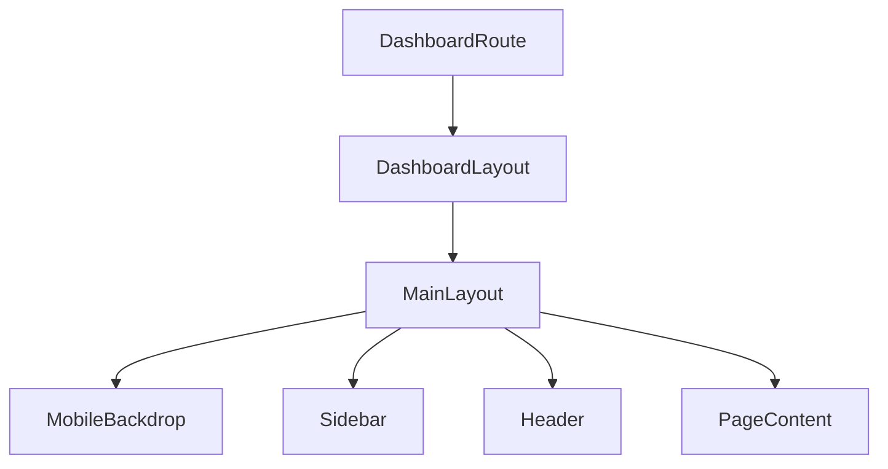

# Layout module (`apps/frontend/components/layout`)

This module contains the **dashboard shell** used across MailZen: sidebar + header + main content.

## Components

- **`MainLayout.tsx`**: Owns the sidebar open/close state and renders:\n  - Mobile backdrop (click-to-close)\n  - `Sidebar`\n  - `Header`\n  - Main content container
- **`Sidebar.tsx`**: Primary navigation and “Upgrade” promo block.\n  - Accepts `isOpen` and optional `onClose` for mobile.\n  - Calls `onClose` when a nav link is clicked (mobile UX).\n- **`Header.tsx`**: Top bar (toggle, search, notifications, theme toggle, account menu).\n  - Search uses **opacity/scale** animation (not width) to avoid layout shift.

## Behavior notes

- **Auth routes**: `MainLayout` skips rendering the shell when `pathname` includes `/auth`.\n- **Mobile sidebar**:\n  - When open, a semi-transparent backdrop is rendered.\n  - Clicking the backdrop or the “chevron” close button closes the sidebar.\n
## Flowchart

## Debugging

- In development, `MainLayout` emits `console.debug` logs for sidebar open/close transitions to help trace UI state issues.\n
