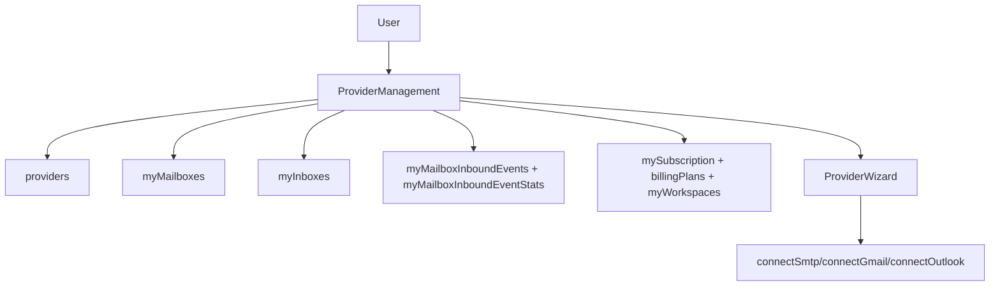

# Providers UI Module (Frontend)

## Goal

Provide provider/mailbox management surfaces for connecting inbox sources and
monitoring subscription-aware limits.

## Key components

- `ProviderManagement.tsx`
  - Lists connected external providers and MailZen mailboxes
  - Supports optional workspace-scoped listing using active workspace selection
  - Supports provider connect/sync/pause/remove actions
  - Surfaces mailbox inbound telemetry with workspace/status/mailbox/window filters
  - Shows inbound event-store outcomes (accepted/deduplicated/rejected)
  - Displays SLA indicators and threshold-aware health status from stats query
  - Shows live subscription plan usage:
    - provider usage (`used/limit`)
    - mailbox usage (`used/limit`)
    - workspace usage (`used/limit`)
    - AI credits/month snapshot
- `ProviderWizard.tsx`
  - Guided connect flow for Gmail/Outlook/SMTP

## Data dependencies

- `providers`
- `myMailboxes`
- `myInboxes`
- `myMailboxInboundEvents`
- `myMailboxInboundEventStats`
  - includes SLA rates + thresholds for warning/critical status indicators
- `mySubscription`
- `billingPlans`
- `myWorkspaces`

## Flow

