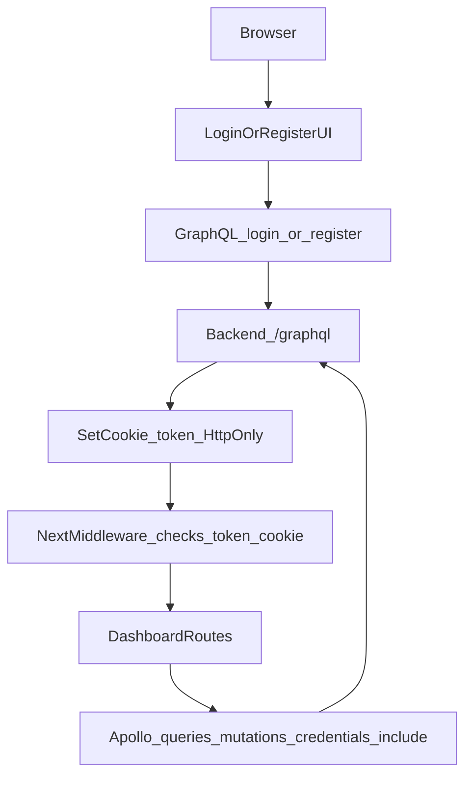

# Frontend Auth (Cookie Session)

This frontend uses **cookie-based auth** backed by the NestJS GraphQL backend.

## Why cookies (enterprise-grade default)
- **HttpOnly** cookies cannot be read by JavaScript, reducing token theft risk (XSS).
- Works cleanly with **Next middleware** for route protection and redirects.
- Keeps the app core ready for **Cognito/external IdP** later (session shape remains).

## How it works
- **Backend** sets an HttpOnly cookie named `token` on successful `login`, `register`, and `signupVerify`.
- **Frontend** never stores access tokens in `localStorage`.
- **Apollo** sends cookies automatically because `credentials: 'include'` is enabled in `apps/frontend/lib/apollo/client.ts`.
- **Next middleware** checks `request.cookies.get('token')` and redirects:
  - `/` → `/dashboard` if authenticated else `/auth/login`
  - any protected route → `/auth/login`

## Data flow

## Files
- **Middleware**: `apps/frontend/_middleware.ts`
- **Apollo client**: `apps/frontend/lib/apollo/client.ts`
- **Auth helpers (user cache + GraphQL docs)**: `apps/frontend/lib/auth/auth-utils.ts`
- **Logout UI**: `apps/frontend/components/layout/Header.tsx` calls backend `logout` and then clears local cached user.

## Notes / limitations
- Provider linking OAuth redirects are handled by the backend (recommended).
  - Frontend redirects browser to:
    - `GET /email-integration/google/start`
    - `GET /email-integration/microsoft/start`
  - Backend handles the callback, stores provider tokens, and redirects back to `/email-providers?success=true`.
- Because the token is HttpOnly, **client JS cannot “check auth” directly**. Prefer server/middleware redirects and/or a backend `me` query (future enhancement).

