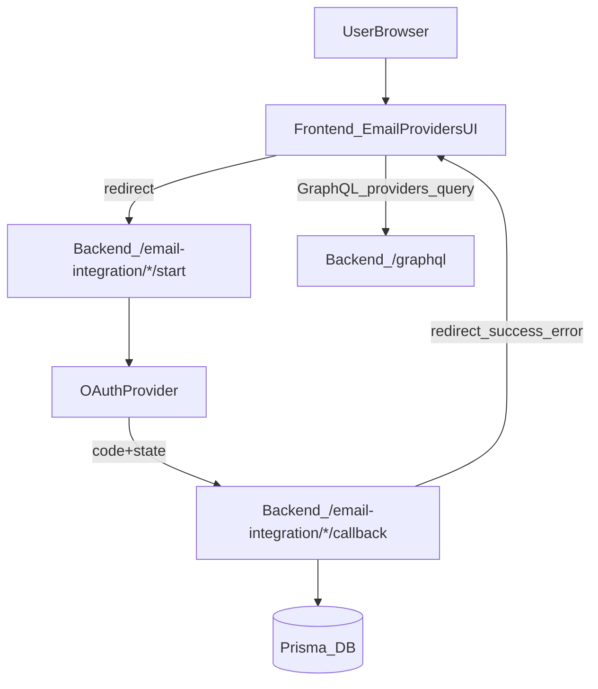

# Frontend Providers (Backend-only OAuth + GraphQL)

## Goal

Keep the Next.js frontend as a **pure UI + GraphQL client**:

- No Prisma / DB code
- No Next.js API routes for OAuth callbacks
- Provider linking (Gmail/Outlook) is handled by the **backend** using redirect-based REST endpoints

## Provider connect flow (OAuth)

## Implementation notes

- **Redirect URLs** are generated in `frontend/lib/providers/provider-utils.ts`:
  - Uses `NEXT_PUBLIC_GRAPHQL_ENDPOINT` to derive backend base URL
  - Redirects to:
    - `/email-integration/google/start?redirect=<frontend_url>`
    - `/email-integration/microsoft/start?redirect=<frontend_url>`
- **Provider list + actions** are GraphQL-only:
  - Operations live in `frontend/lib/apollo/queries/providers.ts` and match backend schema.

## Required backend env (local dev)

- `FRONTEND_URL=http://localhost:3000`
- `GOOGLE_PROVIDER_REDIRECT_URI=http://localhost:4000/email-integration/google/callback`
- `OUTLOOK_PROVIDER_REDIRECT_URI=http://localhost:4000/email-integration/microsoft/callback`

