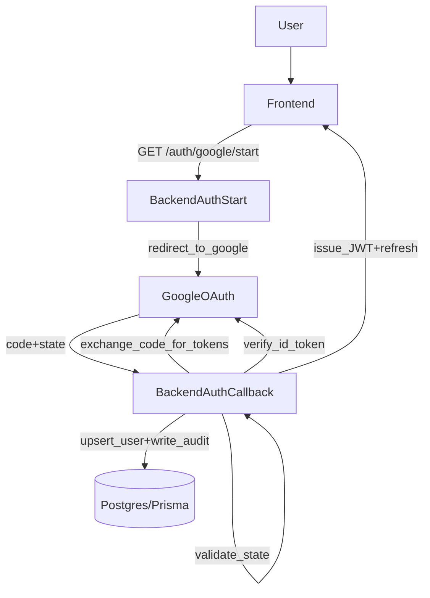

# Auth Module (Backend)

## Google OAuth Login (code flow)

MailZen supports **Google OAuth login** via redirect-based endpoints:

- `GET /auth/google/start`
- `GET /auth/google/callback`

### Environment variables

Required:
- `GOOGLE_CLIENT_ID`
- `GOOGLE_CLIENT_SECRET`
- `GOOGLE_REDIRECT_URI` (must match the Google OAuth app)
- `JWT_SECRET` (used to sign our app JWT)

Recommended:
- `OAUTH_STATE_SECRET` (HMAC secret to sign OAuth `state`)
- `GOOGLE_OAUTH_SCOPES` (defaults to `openid email profile`)

### Flow

### Notes / security

- OAuth `state` is **signed and time-limited** (see `oauth-state.util.ts`) to prevent CSRF and code injection.\n+- Tokens are currently returned to frontend via **redirect query params** for MVP compatibility with the existing localStorage auth pattern.\n+  - For production hardening, prefer **HttpOnly cookies** to avoid token leakage via browser history/logs.\n+
