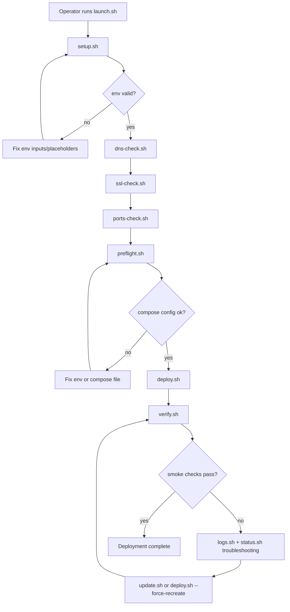
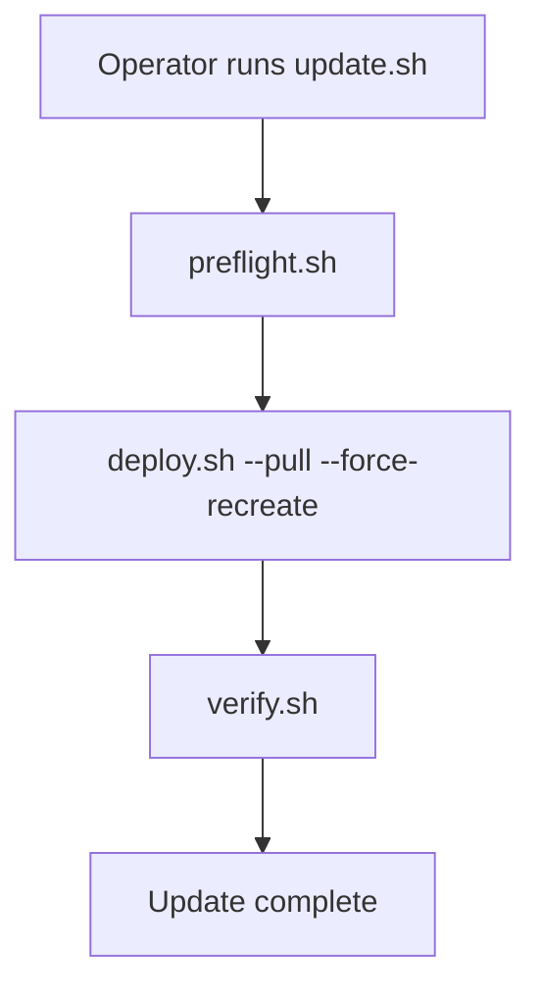
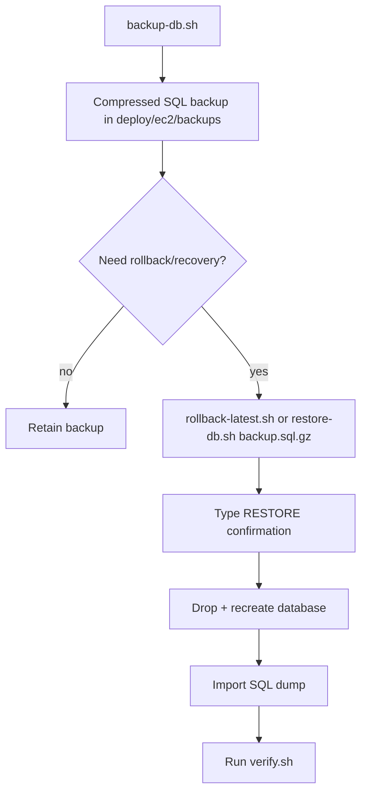

# MailZen EC2 Deployment Flows

This file documents the operational flowcharts for the EC2 Docker deployment
module.

## 1) First launch flow (recommended)

## 2) Update flow

## 3) Database recovery flow

## 4) Operational guardrails

- Always run `preflight.sh` before deploy/update.
- Prefer `verify.sh` immediately after deploy/update.
- Take a fresh `backup-db.sh` before risky changes.
- Periodically run `backup-prune.sh` to enforce backup retention.
- Run `env-audit.sh` whenever secrets/domains are updated.
- Run `doctor.sh` and share report output during incident triage.
- Run `support-bundle.sh` to package diagnostics for escalation/support.
- Use `rotate-app-secrets.sh` for controlled JWT/OAuth/platform key rotation.
- Run `pipeline-check.sh` for CI/config-only deployment validation.
- Use `self-check.sh` after editing deployment scripts.
