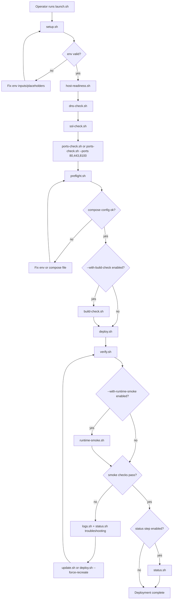

# MailZen EC2 Deployment Flows

This file documents the operational flowcharts for the EC2 Docker deployment
module.

## 1) First launch flow (recommended)



## 2) Update flow

```mermaid
flowchart TD
  UpdateStart[Operator runs update.sh] --> Preflight[preflight.sh (optional runtime checks + ports-check-ports)]
  Preflight --> BuildGate{--with-build-check enabled?}
  BuildGate -- yes --> BuildCheck[build-check.sh]
  BuildGate -- no --> DeployPull[deploy.sh --pull --force-recreate]
  BuildCheck --> DeployPull[deploy.sh --pull --force-recreate]
  DeployPull --> VerifyGate{verify enabled?}
  VerifyGate -- yes --> Verify[verify.sh]
  Verify --> RuntimeGate{--with-runtime-smoke enabled?}
  VerifyGate -- no --> RuntimeGate{--with-runtime-smoke enabled?}
  RuntimeGate -- yes --> RuntimeSmoke[runtime-smoke.sh]
  RuntimeGate -- no --> Status[status.sh (optional --with-runtime-checks --ports-check-ports --skip-dns-check --skip-ssl-check ...)]
  RuntimeSmoke --> Status[status.sh (optional --with-runtime-checks --ports-check-ports --skip-dns-check --skip-ssl-check ...)]
  Status --> UpdateDone[Update complete]
```

## 3) Database recovery flow


## 4) Operational guardrails

- Always run `preflight.sh` before deploy/update.
- Run `build-check.sh` before deploy when validating image-build readiness
  (especially on new hosts/base-image changes).
- Include image-only service pull validation when needed:
  - `build-check.sh --with-image-pull-check --dry-run`
  - `launch.sh --with-build-check --build-check-with-image-pull-check --build-check-dry-run`
  - `update.sh --with-build-check --build-check-with-image-pull-check --build-check-dry-run`
  - `pipeline-check.sh --with-build-check --build-check-with-image-pull-check --build-check-dry-run`
- Prefer `verify.sh` immediately after deploy/update.
- Prefer `runtime-smoke.sh` after deploy/update to validate container-internal service/runtime dependency health.
- For one-command wrappers, use optional chaining:
  - `launch.sh --with-build-check --with-runtime-smoke`
  - `update.sh --with-build-check --with-runtime-smoke`
- For day-2 health snapshots with deeper runtime validation:
  - `status.sh --with-runtime-smoke --runtime-smoke-dry-run`
  - `status.sh --with-runtime-smoke --runtime-smoke-max-retries 15 --runtime-smoke-retry-sleep 4`
- Use `verify.sh --require-oauth-check` when OAuth must be enforced in smoke checks.
- Use `verify.sh --skip-oauth-check --skip-ssl-check` only for controlled break-glass checks.
- Take a fresh labeled backup before risky changes:
  - `backup-db.sh --label <change>`
- Use label-aware recovery/scoping when needed:
  - `backup-list.sh --label <change> --count 5`
  - `backup-prune.sh --label <change> --keep-count 5 --dry-run`
  - `rollback-latest.sh --label <change> --dry-run`
- Use dry-run guards for destructive/data-affecting operations:
  - `backup-db.sh --dry-run`
  - `restore-db.sh --dry-run`
  - `rollback-latest.sh --dry-run`
  - `backup-prune.sh --dry-run`
  - `reports-prune.sh --dry-run`
- Periodically run `backup-prune.sh` and `reports-prune.sh` to enforce
  retention.
- Run `env-audit.sh` whenever secrets/domains are updated.
- Run `doctor.sh` and share report output during incident triage.
- Run `support-bundle.sh` to package diagnostics for escalation/support.
- Use custom ports checks in environments with additional exposed listeners:
  - `ports-check.sh --ports 80,443,8100`
  - `preflight.sh --with-runtime-checks --ports-check-ports 80,443,8100`
  - `status.sh --with-runtime-checks --ports-check-ports 80,443,8100`
- For launch/update runtime checks, scope expensive probes explicitly:
  - `launch.sh --status-runtime-checks --status-skip-dns-check --status-skip-ssl-check`
  - `launch.sh --status-runtime-checks --status-skip-host-readiness --status-skip-ports-check`
  - `update.sh --status-runtime-checks --status-skip-dns-check --status-skip-ssl-check`
- For config-only dry-run rehearsals, skip final status when not needed:
  - `launch.sh --preflight-config-only --deploy-dry-run --skip-verify --skip-status`
  - `launch.sh --preflight-config-only --with-build-check --build-check-dry-run --deploy-dry-run --skip-verify --skip-status`
  - `update.sh --preflight-config-only --deploy-dry-run --skip-verify --skip-status`
  - `update.sh --preflight-config-only --with-build-check --build-check-dry-run --deploy-dry-run --skip-verify --skip-status`
- Use diagnostics custom ports targeting to keep triage aligned with host policy:
  - `doctor.sh --ports-check-ports 80,443,8100`
  - `support-bundle.sh --ports-check-ports 80,443,8100`
  - `pipeline-check.sh --ports-check-ports 80,443,8100`
- Use `rotate-app-secrets.sh --keys <k1,k2> --dry-run` before live secret
  rotations.
- Use seeded diagnostics for CI/offline validation:
  - `doctor.sh --seed-env`
  - `support-bundle.sh --seed-env`
  - `pipeline-check.sh --seed-env`
- Use `rotate-app-secrets.sh` for controlled JWT/OAuth/platform key rotation.
- Run `pipeline-check.sh` for CI/config-only deployment validation.
- Use `pipeline-check.sh --with-runtime-smoke` to chain config checks with
  container-internal runtime validation (optionally `--runtime-smoke-dry-run`
  when daemon/runtime is unavailable).
- Use `pipeline-check.sh --with-build-check` to include image-build readiness
  validation (optionally `--build-check-dry-run` for rehearsal on daemon-offline
  or CI-like runs).
- Run `help.sh` for quick operator command lookup.
- Use `self-check.sh` after editing deployment scripts.
