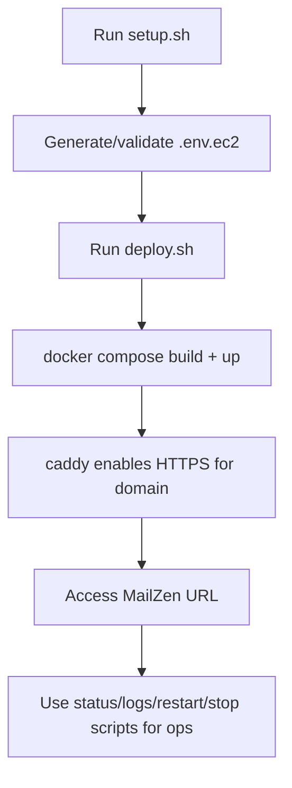

# MailZen EC2 + Docker Deployment Module

This module contains production-oriented deployment assets for running MailZen
on an EC2 instance using Docker Compose, a public domain, and HTTPS.

## What this module includes

- `docker-compose.yml`  
  Full runtime stack:
  - `caddy` (reverse proxy + HTTPS)
  - `frontend` (Next.js)
  - `backend` (NestJS GraphQL API)
  - `ai-agent-platform` (FastAPI service)
  - `postgres`
  - `redis`
- `Caddyfile`  
  TLS termination + routing to frontend/backend by path.
- `.env.ec2.example`  
  Production env template.
- `scripts/`  
  Non-technical-friendly operational scripts:
  - `setup.sh`
  - `deploy.sh`
  - `status.sh`
  - `logs.sh`
  - `restart.sh`
  - `stop.sh`

## Deployment flow



## First-time setup

From repository root:

```bash
./deploy/ec2/scripts/setup.sh
./deploy/ec2/scripts/deploy.sh
```

The setup script:

1. Validates Docker/Compose availability.
2. Creates `deploy/ec2/.env.ec2` if missing.
3. Prompts for:
   - public domain
   - SSL certificate email
4. Derives URL config (`FRONTEND_URL`, OAuth callbacks,
   `NEXT_PUBLIC_GRAPHQL_ENDPOINT`).
5. Auto-generates strong secrets when placeholders are still present.

## Day-2 operations

```bash
# Health/status
./deploy/ec2/scripts/status.sh

# Logs (all services)
./deploy/ec2/scripts/logs.sh

# Logs (specific service)
./deploy/ec2/scripts/logs.sh backend

# Restart full stack
./deploy/ec2/scripts/restart.sh

# Restart one service
./deploy/ec2/scripts/restart.sh frontend

# Stop stack
./deploy/ec2/scripts/stop.sh

# Stop + delete DB/cache data
./deploy/ec2/scripts/stop.sh --purge-data
```

## Domain + HTTPS requirements

1. DNS `A` record for your chosen domain -> EC2 public IP.
2. EC2 security group must allow inbound:
   - TCP 80
   - TCP 443
3. Outbound internet access is required for Let's Encrypt cert issuance.

## Required env values to verify

At minimum, ensure these are correctly set in `deploy/ec2/.env.ec2`:

- `MAILZEN_DOMAIN`
- `ACME_EMAIL`
- `JWT_SECRET` (>=32 chars)
- `POSTGRES_PASSWORD`
- `NEXT_PUBLIC_GRAPHQL_ENDPOINT` (must match your domain)
- `FRONTEND_URL` (must match your domain)

Provider OAuth credentials are optional for first boot, but required for actual
Google/Outlook provider connection flows.

## Troubleshooting

1. **HTTPS certificate not issuing**
   - Confirm DNS points to EC2.
   - Confirm ports 80/443 are open.
   - Check `caddy` logs:
     ```bash
     ./deploy/ec2/scripts/logs.sh caddy
     ```
2. **Frontend loads but API calls fail**
   - Re-check `NEXT_PUBLIC_GRAPHQL_ENDPOINT`.
   - Rebuild/redeploy:
     ```bash
     ./deploy/ec2/scripts/deploy.sh --force-recreate
     ```
3. **Backend exits on startup**
   - Verify `JWT_SECRET` length and `DATABASE_URL`.
   - Check backend logs:
     ```bash
     ./deploy/ec2/scripts/logs.sh backend
     ```
4. **Provider OAuth redirect mismatch**
   - Ensure redirect URIs in env and provider console use HTTPS domain.

## Notes

- The stack includes AI platform by default.
- Backend migrations run automatically on backend container startup.
- Use `stop.sh --purge-data` cautiously; it destroys persistent data volumes.
