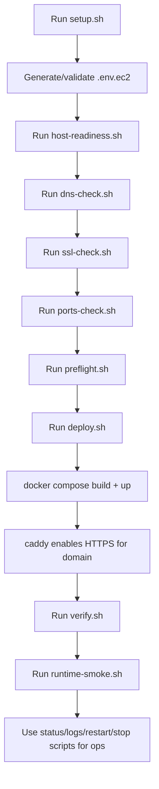

# MailZen EC2 + Docker Deployment Module

This module contains production-oriented deployment assets for running MailZen
on an EC2 instance using Docker Compose, a public domain, and HTTPS.

Additional deployment flowcharts:

- `deploy/ec2/FLOW.md`
- `deploy/ec2/VALIDATION.md` (step-by-step validation runbook)

## What this module includes

- `docker-compose.yml`  
  Full runtime stack:
  - `caddy` (reverse proxy + HTTPS)
  - `frontend` (Next.js)
  - `backend` (NestJS GraphQL API)
  - `ai-agent-platform` (FastAPI service)
  - `postgres`
  - `redis`
- `Caddyfile`  
  TLS termination + routing to frontend/backend by path + security headers.
- `.env.ec2.example`  
  Production env template.
- `scripts/`  
  Non-technical-friendly operational scripts:
  - `bootstrap-ubuntu.sh` (optional, install Docker on Ubuntu)
  - `launch.sh` (one-command full pipeline)
  - `menu.sh` (interactive operator menu)
  - `setup.sh`
  - `preflight.sh`
  - `deploy.sh`
  - `update.sh`
  - `verify.sh` (post-deploy smoke checks)
  - `runtime-smoke.sh` (container-internal runtime checks for core services + dependencies)
  - `dns-check.sh` (domain DNS readiness validation)
  - `ssl-check.sh` (HTTPS certificate validity and expiry check)
  - `host-readiness.sh` (disk/memory/cpu baseline checks)
  - `ports-check.sh` (check host port conflicts; defaults to 80/443)
  - `env-audit.sh` (redacted critical env audit)
  - `doctor.sh` (generate diagnostics report for support)
  - `support-bundle.sh` (collect support-ready diagnostics archive)
  - `rotate-app-secrets.sh` (rotate JWT/OAuth/platform secrets)
  - `pipeline-check.sh` (CI validation sequence with optional runtime-smoke chaining)
  - `reports-prune.sh` (report/support bundle retention cleanup)
  - `help.sh` (command reference quick guide)
  - `self-check.sh` (validate deployment script integrity)
  - `status.sh`
  - `logs.sh`
  - `restart.sh`
  - `stop.sh`
  - `backup-db.sh` (database backup)
  - `backup-list.sh` (list available backups)
  - `backup-prune.sh` (backup retention cleanup)
  - `restore-db.sh` (database restore with confirmation)
  - `rollback-latest.sh` (restore newest backup quickly)
- `backups/`  
  Local backup dump directory (tracked folder; dump files ignored by git).
- `reports/`  
  Generated diagnostics report directory (tracked folder; report files ignored by git).

## Deployment flow



## First-time setup

From repository root:

```bash
# Optional non-technical operator menu
./deploy/ec2/scripts/menu.sh

# Menu includes guided prompts for:
# - launch/update orchestration
# - setup overrides (domain/acme/daemon check)
# - deploy flags (--no-build/--pull/--force-recreate/--dry-run/--config-only)
# - verify checks (retries + oauth/ssl toggles)
# - runtime smoke checks (container-internal retries + dependency toggles)
# - pipeline checks (with optional runtime-smoke chaining)
# - logs filters (service/tail/since/follow)
# - restart/stop operations (service/wait/purge/dry-run/confirmation controls)

# One-command launch
# (setup + host-readiness + dns + ssl + ports + preflight + deploy + verify + status)
./deploy/ec2/scripts/launch.sh

# Non-interactive launch if env already configured
./deploy/ec2/scripts/launch.sh --skip-setup

# Skip selected prechecks during launch
./deploy/ec2/scripts/launch.sh --skip-host-readiness --skip-dns-check --skip-ssl-check --skip-ports-check

# Config-only + dry-run launch for daemon-offline validation
./deploy/ec2/scripts/launch.sh \
  --skip-setup \
  --skip-dns-check \
  --skip-ssl-check \
  --preflight-config-only \
  --deploy-dry-run \
  --skip-verify

# Config-only + dry-run launch without final status step
./deploy/ec2/scripts/launch.sh \
  --skip-setup \
  --preflight-config-only \
  --deploy-dry-run \
  --skip-verify \
  --skip-status

# Launch with custom verify retries and runtime status checks
./deploy/ec2/scripts/launch.sh \
  --verify-max-retries 10 \
  --verify-retry-sleep 8 \
  --status-runtime-checks

# Launch while skipping optional verify OAuth/SSL checks
./deploy/ec2/scripts/launch.sh \
  --verify-skip-oauth-check \
  --verify-skip-ssl-check

# Launch while requiring OAuth verify check (fails when OAuth keys are missing)
./deploy/ec2/scripts/launch.sh --verify-require-oauth-check

# Launch with custom ports-check target list
./deploy/ec2/scripts/launch.sh \
  --ports-check-ports 80,443,8100

# Launch with runtime status checks while skipping DNS/SSL in final status step
./deploy/ec2/scripts/launch.sh \
  --status-runtime-checks \
  --status-skip-dns-check \
  --status-skip-ssl-check

# Launch with runtime status checks while skipping host/ports in final status step
./deploy/ec2/scripts/launch.sh \
  --status-runtime-checks \
  --status-skip-host-readiness \
  --status-skip-ports-check

# Launch with explicit domain/email and skip daemon check during setup
./deploy/ec2/scripts/launch.sh \
  --domain mail.example.com \
  --acme-email ops@example.com \
  --setup-skip-daemon

# Optional (Ubuntu EC2 only): install Docker + Compose
sudo ./deploy/ec2/scripts/bootstrap-ubuntu.sh

./deploy/ec2/scripts/setup.sh
./deploy/ec2/scripts/preflight.sh
./deploy/ec2/scripts/deploy.sh
./deploy/ec2/scripts/verify.sh
```

The setup script:

1. Validates Docker/Compose availability.
2. Creates `deploy/ec2/.env.ec2` if missing.
3. Prompts for:
   - public domain
   - SSL certificate email
4. Derives URL config (`FRONTEND_URL`, OAuth callbacks,
   `NEXT_PUBLIC_GRAPHQL_ENDPOINT`).
5. Auto-generates strong secrets when placeholders are still present.

Useful setup flags:

- `--domain <hostname>`
- `--acme-email <email>`
- `--non-interactive`
- `--skip-daemon` (skip docker daemon reachability check)

Example:

```bash
./deploy/ec2/scripts/setup.sh \
  --domain mail.example.com \
  --acme-email ops@example.com \
  --non-interactive \
  --skip-daemon
```

## Day-2 operations

```bash
# Health/status
./deploy/ec2/scripts/status.sh

# Status with runtime checks (host/dns/ssl/ports)
./deploy/ec2/scripts/status.sh --with-runtime-checks

# Status runtime checks with custom port targets
./deploy/ec2/scripts/status.sh --with-runtime-checks --ports-check-ports 80,443,8100

# Strict status mode (fail if daemon unavailable)
./deploy/ec2/scripts/status.sh --strict

# Validate env + compose config before deploy
./deploy/ec2/scripts/preflight.sh

# Config-only validation (useful when docker daemon is unavailable)
./deploy/ec2/scripts/preflight.sh --config-only

# Extended runtime checks (host + dns + ssl + ports)
./deploy/ec2/scripts/preflight.sh --with-runtime-checks

# Extended runtime checks with custom port targets
./deploy/ec2/scripts/preflight.sh --with-runtime-checks --ports-check-ports 80,443,8100

# Extended runtime checks with selective skips
./deploy/ec2/scripts/preflight.sh --with-runtime-checks --skip-dns-check --skip-ssl-check

# Pull updates, recreate, and run verify checks
./deploy/ec2/scripts/update.sh

# Update with custom verify retries
./deploy/ec2/scripts/update.sh --verify-max-retries 10 --verify-retry-sleep 5

# Update while skipping optional verify checks
./deploy/ec2/scripts/update.sh --verify-skip-ssl-check --verify-skip-oauth-check

# Update while requiring OAuth verify check (fails when OAuth keys are missing)
./deploy/ec2/scripts/update.sh --verify-require-oauth-check

# Update dry-run + runtime status checks
./deploy/ec2/scripts/update.sh --preflight-config-only --deploy-dry-run --skip-verify --status-runtime-checks

# Update with runtime status checks and custom port targets
./deploy/ec2/scripts/update.sh --status-runtime-checks --ports-check-ports 80,443,8100

# Update with runtime status checks and skip expensive DNS/SSL checks
./deploy/ec2/scripts/update.sh --status-runtime-checks --status-skip-dns-check --status-skip-ssl-check

# Update with runtime status checks while skipping host + ports checks
./deploy/ec2/scripts/update.sh --status-runtime-checks --status-skip-host-readiness --status-skip-ports-check

# Config-only preflight + deploy dry-run update simulation
./deploy/ec2/scripts/update.sh --preflight-config-only --deploy-dry-run --skip-verify

# Config-only preflight + deploy dry-run update simulation without final status step
./deploy/ec2/scripts/update.sh --preflight-config-only --deploy-dry-run --skip-verify --skip-status

# Deploy command dry-run (prints command only)
./deploy/ec2/scripts/deploy.sh --dry-run

# Deploy config-only validation (no daemon/up)
./deploy/ec2/scripts/deploy.sh --config-only

# Run post-deploy smoke checks (default retries: 5, sleep: 3s)
./deploy/ec2/scripts/verify.sh

# Custom retries/sleep
./deploy/ec2/scripts/verify.sh 10 5

# Flag-style retries/sleep
./deploy/ec2/scripts/verify.sh --max-retries 10 --retry-sleep 5

# Skip SSL certificate validation in smoke check (not recommended)
./deploy/ec2/scripts/verify.sh --skip-ssl-check

# Skip OAuth smoke check when Google OAuth is intentionally not configured
./deploy/ec2/scripts/verify.sh --skip-oauth-check

# Require OAuth check and fail fast if OAuth env keys are missing
./deploy/ec2/scripts/verify.sh --require-oauth-check

# Run runtime smoke checks from inside containers (no public DNS/TLS dependency)
./deploy/ec2/scripts/runtime-smoke.sh

# Runtime smoke checks with custom retries/sleep
./deploy/ec2/scripts/runtime-smoke.sh --max-retries 15 --retry-sleep 4

# Runtime smoke dry-run for rehearsal
./deploy/ec2/scripts/runtime-smoke.sh --dry-run

# Validate deployment domain DNS (uses MAILZEN_DOMAIN from env)
./deploy/ec2/scripts/dns-check.sh

# Validate DNS points to a specific public IP
./deploy/ec2/scripts/dns-check.sh --expected-ip 203.0.113.10

# Validate TLS certificate visibility and expiry
./deploy/ec2/scripts/ssl-check.sh

# Validate host resource readiness (disk/memory/cpu)
./deploy/ec2/scripts/host-readiness.sh

# Validate host ports 80/443 are available
./deploy/ec2/scripts/ports-check.sh

# Validate custom host port set (comma-separated)
./deploy/ec2/scripts/ports-check.sh --ports 80,443,8100

# Redacted audit of critical env keys
./deploy/ec2/scripts/env-audit.sh
# (also flags INVALID_FORMAT / DOMAIN_MISMATCH issues)

# Generate diagnostics report bundle
./deploy/ec2/scripts/doctor.sh
# (report includes strict/seed flags, active env/compose, and git metadata)

# Fail diagnostics when optional checks fail
./deploy/ec2/scripts/doctor.sh --strict

# Run diagnostics with a temporary seeded env (CI-friendly)
./deploy/ec2/scripts/doctor.sh --seed-env

# Run diagnostics with custom ports-check targets
./deploy/ec2/scripts/doctor.sh --ports-check-ports 80,443,8100

# Generate compressed support bundle archive
./deploy/ec2/scripts/support-bundle.sh

# Generate support bundle with seeded temporary env (CI-friendly)
./deploy/ec2/scripts/support-bundle.sh --seed-env

# Generate support bundle with custom ports-check targets
./deploy/ec2/scripts/support-bundle.sh --ports-check-ports 80,443,8100

# Keep support bundle temp work directory for deep debugging
./deploy/ec2/scripts/support-bundle.sh --seed-env --keep-work-dir
# (bundle includes bundle-manifest.txt with active env/compose + git metadata)

# Keep only latest 20 report artifacts (default)
./deploy/ec2/scripts/reports-prune.sh

# Keep only latest 50 report artifacts
./deploy/ec2/scripts/reports-prune.sh 50

# Note: also removes old extracted support-bundle directories

# Preview report pruning without deleting anything
./deploy/ec2/scripts/reports-prune.sh --keep-count 50 --dry-run

# Rotate app secrets (interactive confirmation)
./deploy/ec2/scripts/rotate-app-secrets.sh

# Rotate app secrets non-interactively
./deploy/ec2/scripts/rotate-app-secrets.sh --yes

# Rotate selected keys only
./deploy/ec2/scripts/rotate-app-secrets.sh --keys JWT_SECRET,OAUTH_STATE_SECRET --yes

# Preview secret rotation without changing env file
./deploy/ec2/scripts/rotate-app-secrets.sh --keys JWT_SECRET --dry-run

# Run config-only deployment pipeline checks
./deploy/ec2/scripts/pipeline-check.sh

# Run pipeline checks with seeded temporary env (CI-friendly)
./deploy/ec2/scripts/pipeline-check.sh --seed-env

# Run pipeline checks with custom ports-check targets
./deploy/ec2/scripts/pipeline-check.sh --ports-check-ports 80,443,8100

# Run pipeline checks plus runtime smoke checks (dry-run)
./deploy/ec2/scripts/pipeline-check.sh --with-runtime-smoke --runtime-smoke-dry-run

# Run pipeline checks plus runtime smoke checks with tuned retries
./deploy/ec2/scripts/pipeline-check.sh \
  --with-runtime-smoke \
  --runtime-smoke-max-retries 15 \
  --runtime-smoke-retry-sleep 4

# Show command quick-reference
./deploy/ec2/scripts/help.sh

# Validate deployment scripts syntax/executable state
./deploy/ec2/scripts/self-check.sh

# Create DB backup
./deploy/ec2/scripts/backup-db.sh
# (script validates generated gzip archive integrity before success)

# Create DB backup with label
./deploy/ec2/scripts/backup-db.sh before-release

# Preview backup command without executing
./deploy/ec2/scripts/backup-db.sh --label before-release --dry-run

# List available backups
./deploy/ec2/scripts/backup-list.sh

# Show only latest backup
./deploy/ec2/scripts/backup-list.sh --latest

# Show latest 5 backups
./deploy/ec2/scripts/backup-list.sh --count 5

# Show latest 5 backups for one label series
./deploy/ec2/scripts/backup-list.sh --label before-release --count 5

# Keep only latest 10 backups (default)
./deploy/ec2/scripts/backup-prune.sh

# Keep only latest 20 backups
./deploy/ec2/scripts/backup-prune.sh 20

# Preview backup prune without deleting files
./deploy/ec2/scripts/backup-prune.sh --keep-count 20 --dry-run

# Preview prune for one label series
./deploy/ec2/scripts/backup-prune.sh --label before-release --keep-count 5 --dry-run

# Restore DB backup (destructive: drops and recreates DB)
./deploy/ec2/scripts/restore-db.sh deploy/ec2/backups/your-backup.sql.gz
# (script verifies gzip integrity before making DB changes)

# Restore DB backup non-interactively (automation)
./deploy/ec2/scripts/restore-db.sh --yes deploy/ec2/backups/your-backup.sql.gz

# Preview restore without executing
./deploy/ec2/scripts/restore-db.sh --dry-run deploy/ec2/backups/your-backup.sql.gz

# Rollback using newest backup automatically
./deploy/ec2/scripts/rollback-latest.sh

# Rollback non-interactively / dry-run
./deploy/ec2/scripts/rollback-latest.sh --yes
./deploy/ec2/scripts/rollback-latest.sh --dry-run

# Rollback using latest backup for a specific label
./deploy/ec2/scripts/rollback-latest.sh --label before-release --dry-run

# Logs (all services)
./deploy/ec2/scripts/logs.sh

# Logs (specific service)
./deploy/ec2/scripts/logs.sh backend

# Logs snapshot (no follow) for a service
./deploy/ec2/scripts/logs.sh --service backend --tail 500 --no-follow

# Logs for last 30 minutes
./deploy/ec2/scripts/logs.sh --since 30m

# Restart full stack
./deploy/ec2/scripts/restart.sh

# Restart one service
./deploy/ec2/scripts/restart.sh frontend

# Restart with dry-run and wait
./deploy/ec2/scripts/restart.sh --service backend --dry-run
./deploy/ec2/scripts/restart.sh --service backend --wait-seconds 5

# Stop stack
./deploy/ec2/scripts/stop.sh

# Stop + delete DB/cache data
./deploy/ec2/scripts/stop.sh --purge-data

# Stop + purge non-interactively
./deploy/ec2/scripts/stop.sh --purge-data --yes

# Stop dry-run
./deploy/ec2/scripts/stop.sh --dry-run
```

Supported service names for `logs.sh` / `restart.sh`:

- `caddy`
- `frontend`
- `backend`
- `ai-agent-platform`
- `postgres`
- `redis`

## Domain + HTTPS requirements

1. DNS `A` record for your chosen domain -> EC2 public IP.
2. EC2 security group must allow inbound:
   - TCP 80
   - TCP 443
3. Outbound internet access is required for Let's Encrypt cert issuance.

## Required env values to verify

At minimum, ensure these are correctly set in `deploy/ec2/.env.ec2`:

- `MAILZEN_DOMAIN`
- `ACME_EMAIL`
- `JWT_SECRET` (>=32 chars)
- `POSTGRES_PASSWORD`
- `NEXT_PUBLIC_GRAPHQL_ENDPOINT` (must match your domain)
- `FRONTEND_URL` (must match your domain)

Provider OAuth credentials are optional for first boot, but required for actual
Google/Outlook provider connection flows.

## Troubleshooting

1. **HTTPS certificate not issuing**
   - Confirm DNS points to EC2.
   - Confirm ports 80/443 are open.
   - Check `caddy` logs:
     ```bash
     ./deploy/ec2/scripts/logs.sh caddy
     ```
2. **Frontend loads but API calls fail**
   - Re-check `NEXT_PUBLIC_GRAPHQL_ENDPOINT`.
   - Rebuild/redeploy:
     ```bash
     ./deploy/ec2/scripts/deploy.sh --force-recreate
     ```
3. **Backend exits on startup**
   - Verify `JWT_SECRET` length and `DATABASE_URL`.
   - Check backend logs:
     ```bash
     ./deploy/ec2/scripts/logs.sh backend
     ```
4. **Provider OAuth redirect mismatch**
   - Ensure redirect URIs in env and provider console use HTTPS domain.
5. **Docker installed but daemon unavailable in preflight**
   - On EC2 Ubuntu:
     ```bash
     sudo systemctl restart docker
     ```
   - Or run config-only checks temporarily:
     ```bash
     ./deploy/ec2/scripts/preflight.sh --config-only
     ```

## Notes

- The stack includes AI platform by default.
- Backend migrations run automatically on backend container startup.
- Use `stop.sh --purge-data` cautiously; it destroys persistent data volumes.
- `restore-db.sh` is intentionally destructive and requires confirmation
  (or explicit `--yes` for automation).
- `rollback-latest.sh` delegates to `restore-db.sh` and is also destructive.
- Use `rollback-latest.sh --label <name>` to target labeled backup series.
- Use `--dry-run` on backup/restore/rollback scripts to validate commands
  safely before running against production data.
- Caddy sets baseline browser hardening headers (HSTS, X-Frame-Options,
  X-Content-Type-Options, Referrer-Policy).
