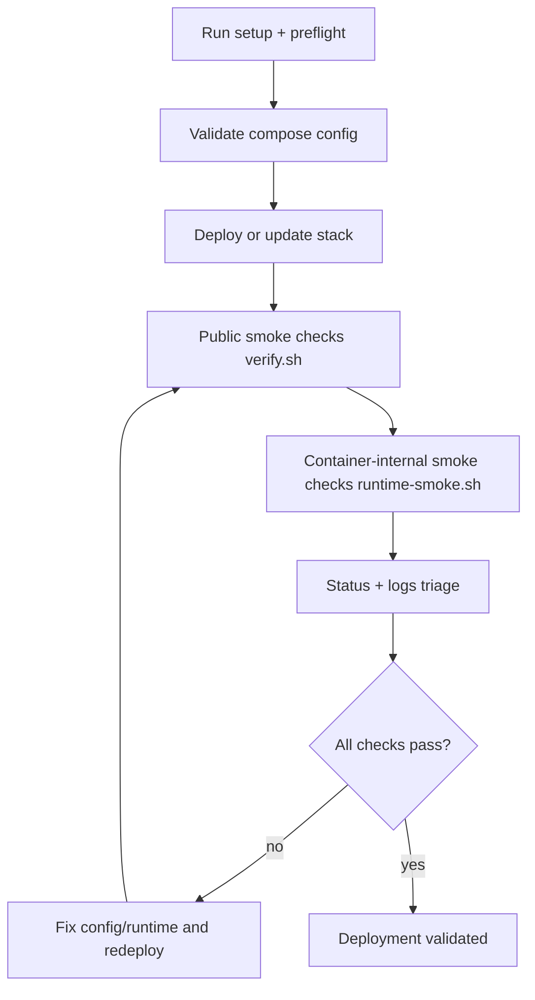

# MailZen EC2 Validation Runbook

This runbook maps directly to deployment readiness checks and gives operators a
repeatable command sequence to confirm the stack is healthy.

## Validation flow



## 1) Config and build validation

Run from repository root:

```bash
# Baseline script integrity
./deploy/ec2/scripts/self-check.sh

# Docs-to-script consistency
./deploy/ec2/scripts/docs-check.sh

# Env + compose structure validation
./deploy/ec2/scripts/preflight.sh

# Optional: config-only validation when daemon is unavailable
./deploy/ec2/scripts/preflight.sh --config-only

# Image build validation for buildable app services
./deploy/ec2/scripts/build-check.sh

# Optional: build-validation rehearsal
./deploy/ec2/scripts/build-check.sh --service backend --service frontend --dry-run

# Optional: build + image pull-check rehearsal for image-only services
./deploy/ec2/scripts/build-check.sh --with-image-pull-check --dry-run

# Optional: chained launch/update/pipeline build-check image pull-check rehearsal
./deploy/ec2/scripts/launch.sh --with-build-check --build-check-with-image-pull-check --build-check-dry-run --skip-setup --skip-host-readiness --skip-dns-check --skip-ssl-check --skip-ports-check --preflight-config-only --deploy-dry-run --skip-verify --skip-status
./deploy/ec2/scripts/update.sh --with-build-check --build-check-with-image-pull-check --build-check-dry-run --preflight-config-only --deploy-dry-run --skip-verify --skip-status
./deploy/ec2/scripts/pipeline-check.sh --with-build-check --build-check-with-image-pull-check --build-check-dry-run

# Optional CI chain (seeded env + config checks)
./deploy/ec2/scripts/pipeline-check.sh --seed-env
```

## 2) Runtime validation (service-level)

After deployment (`deploy.sh` or `update.sh`), run:

```bash
# Public endpoint smoke checks (HTTPS/domain path)
./deploy/ec2/scripts/verify.sh

# Container-internal smoke checks (independent of public DNS/TLS)
./deploy/ec2/scripts/runtime-smoke.sh

# Optional: status snapshot with runtime-smoke rehearsal
./deploy/ec2/scripts/status.sh --with-runtime-smoke --runtime-smoke-dry-run
```

Useful runtime variants:

```bash
# Tune retries for slower cold starts
./deploy/ec2/scripts/runtime-smoke.sh --max-retries 15 --retry-sleep 4

# Rehearse runtime-smoke command path without executing checks
./deploy/ec2/scripts/runtime-smoke.sh --dry-run
```

## 3) Basic app-journey validation

Use both public and container-internal probes:

1. `verify.sh` confirms:
   - frontend home responds over HTTPS
   - login page responds over HTTPS
   - GraphQL endpoint responds over HTTPS
   - GraphQL POST responds
2. `runtime-smoke.sh` confirms:
   - frontend container serves `/`
   - frontend container serves `/login`
   - backend serves GraphQL GET + POST
   - AI platform serves `/health`
   - backend can reach postgres + redis over compose network

## 4) Diagnostics and triage

If any check fails:

```bash
./deploy/ec2/scripts/status.sh
./deploy/ec2/scripts/logs.sh --service backend --tail 500 --no-follow
./deploy/ec2/scripts/logs.sh --service frontend --tail 500 --no-follow
./deploy/ec2/scripts/logs.sh --service ai-agent-platform --tail 500 --no-follow
./deploy/ec2/scripts/doctor.sh
./deploy/ec2/scripts/doctor.sh --docs-strict-coverage
./deploy/ec2/scripts/doctor.sh --skip-docs-check
./deploy/ec2/scripts/support-bundle.sh
./deploy/ec2/scripts/support-bundle.sh --docs-strict-coverage
./deploy/ec2/scripts/support-bundle.sh --skip-docs-check
```

## 5) Pipeline shortcut (config + runtime-smoke chain)

```bash
# Config checks + runtime smoke rehearsal
./deploy/ec2/scripts/pipeline-check.sh --with-runtime-smoke --runtime-smoke-dry-run

# Config checks + build-check rehearsal
./deploy/ec2/scripts/pipeline-check.sh --with-build-check --build-check-dry-run

# Config checks + targeted build checks + runtime-smoke rehearsal
./deploy/ec2/scripts/pipeline-check.sh \
  --with-build-check \
  --build-check-service backend \
  --build-check-service frontend \
  --build-check-dry-run \
  --with-runtime-smoke \
  --runtime-smoke-dry-run

# Config checks + live runtime-smoke checks
./deploy/ec2/scripts/pipeline-check.sh --with-runtime-smoke

# Config checks + verify + status checks
./deploy/ec2/scripts/pipeline-check.sh --with-verify --verify-skip-oauth-check --verify-skip-ssl-check --with-status --status-runtime-checks --status-skip-dns-check --status-skip-ssl-check

# Config checks with strict docs coverage enforcement
./deploy/ec2/scripts/pipeline-check.sh --docs-strict-coverage
```

## 6) One-command wrapper shortcut with chained validation

```bash
# Full launch pipeline with optional build/runtime chained validation
./deploy/ec2/scripts/launch.sh --with-build-check --with-runtime-smoke

# Full launch pipeline with strict docs coverage enforcement
./deploy/ec2/scripts/launch.sh --docs-strict-coverage

# Update pipeline with optional build/runtime chained validation
./deploy/ec2/scripts/update.sh --with-build-check --with-runtime-smoke

# Update pipeline with strict docs coverage enforcement
./deploy/ec2/scripts/update.sh --docs-strict-coverage

# High-level validation profile wrapper (full chain)
./deploy/ec2/scripts/validate.sh

# High-level validation profile with strict docs coverage
./deploy/ec2/scripts/validate.sh --docs-strict-coverage

# High-level validation profile while skipping docs consistency stage
./deploy/ec2/scripts/validate.sh --skip-docs-check

# High-level validation profile with stage-specific dry-run controls
./deploy/ec2/scripts/validate.sh --build-check-dry-run --runtime-smoke-dry-run

# High-level validation profile with targeted build-check services
./deploy/ec2/scripts/validate.sh --build-check-service backend --build-check-service frontend --build-check-pull

# Wrapper rehearsal mode for runtime-smoke stage
./deploy/ec2/scripts/launch.sh --with-runtime-smoke --runtime-smoke-dry-run --skip-setup --skip-host-readiness --skip-dns-check --skip-ssl-check --skip-ports-check --preflight-config-only --with-build-check --build-check-dry-run --deploy-dry-run --skip-verify --skip-status
./deploy/ec2/scripts/update.sh --with-runtime-smoke --runtime-smoke-dry-run --preflight-config-only --with-build-check --build-check-dry-run --deploy-dry-run --skip-verify --skip-status

# High-level validation profile rehearsal mode
./deploy/ec2/scripts/validate.sh --dry-run --seed-env
```

## Success criteria

Deployment can be considered validated when:

- `self-check.sh`, `preflight.sh`, and `pipeline-check.sh` pass.
- `verify.sh` passes for domain HTTPS checks.
- `runtime-smoke.sh` passes for container-internal checks.
- `status.sh` shows expected running/healthy services.
- No unresolved critical errors remain in service logs.
