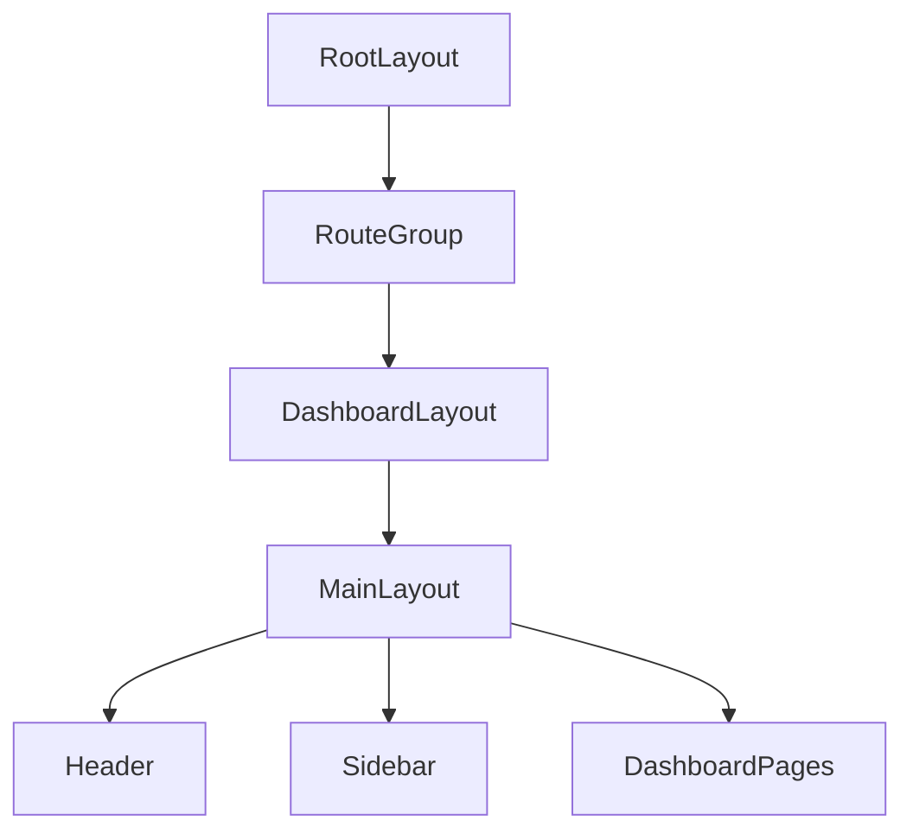

# Dashboard routes (`frontend/app/(dashboard)`)

This route group contains **dashboard pages** that render inside `frontend/components/layout/MainLayout.tsx`.

## Page scaffolding convention

- Prefer a consistent top-level wrapper:\n  - `div.container py-6 space-y-6` for “standard” pages\n  - For full-height apps like inbox, use `h-full` and let `MainLayout` control the viewport.\n
## Key routes

- **`page.tsx`**: Dashboard overview\n- **`inbox/page.tsx`**: Multi-pane inbox experience\n- **`email-providers/page.tsx`**: Provider management\n- **`filters/page.tsx`**: Email filter rules UI\n- **`contacts/page.tsx`**: Contacts manager\n- **`settings/smart-replies/page.tsx`**: Smart replies settings\n- **`design-system/page.tsx`**: Design system showcase\n
## Flowchart (how pages get the shell)

